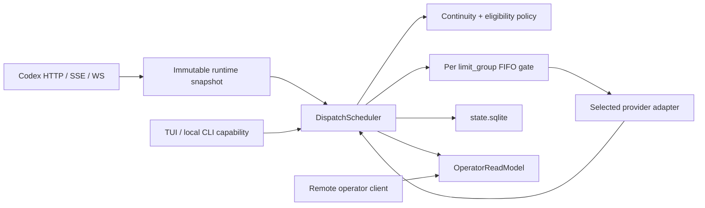
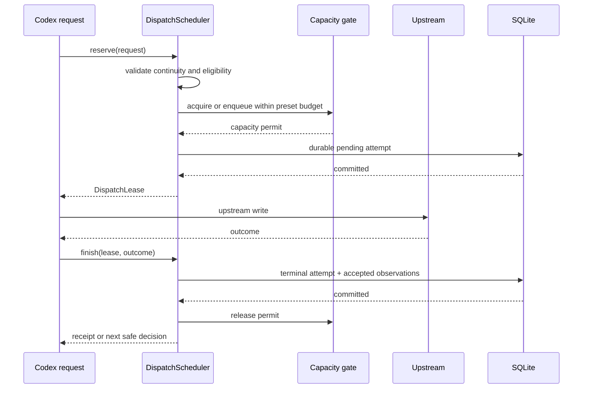

# ADR-0002: Dispatch Scheduling and Local Recovery

**Status:** Accepted for implementation
**Created:** 2026-07-11
**Last updated:** 2026-07-11
**Related plan:** `docs/plans/2026-07-10-002-refactor-canonical-relay-runtime-modernization-plan.md`

## Context

The current relay makes four decisions in different places:

- route priority and session affinity in the route graph executor;
- local concurrency admission in `ConcurrencyLimiter`;
- quota and balance suppression in `usage_providers` and `ProxyState`;
- retries and provider penalties in HTTP, SSE, and WebSocket attempt loops.

This split produces visible failure modes under GPT-5.6 multi-agent fan-out:

- a saturated preferred endpoint is treated as immediately unavailable, so a burst rapidly consumes every fallback instead of waiting for short-lived capacity;
- request-driven balance refresh is delayed by 60 seconds, then may be deferred by the 120-second poll interval or a stale suppression record;
- a session preference, a correctness-critical continuity requirement, and a manual route pin are represented by overlapping affinity behavior;
- a streaming upstream can return HTTP 200 and then remain byte-silent for up to 15 minutes;
- the TUI can request a broad refresh but cannot express which local scheduling fact should be cleared or refreshed.

The reference implementation in `repo-ref/sub2api` separates selection from capacity admission. A sticky target that is only at capacity produces a bounded wait plan, quota-paused accounts are filtered before ranking, and compact SSE emits non-semantic keepalive comments. Its Redis leases, account scoring weights, and long default waits do not fit a provider-opaque local relay and are not adopted.

## Decision

Introduce one deep Module named `DispatchScheduler` at the seam between the immutable compiled route snapshot and all HTTP, SSE, and WebSocket attempt execution.

Its final Interface is intentionally small:

```rust
impl DispatchScheduler {
    pub async fn reserve(
        &self,
        request: DispatchRequest,
    ) -> Result<DispatchLease, DispatchError>;

    pub async fn finish(
        &self,
        lease: DispatchLease,
        outcome: DispatchOutcome,
    ) -> Result<DispatchReceipt, DispatchError>;

    pub async fn observe(
        &self,
        observations: ObservationBatch,
    ) -> Result<ObservationReceipt, DispatchError>;

    pub async fn command_local(
        &self,
        permit: &LocalOperatorPermit,
        command: LocalDispatchCommand,
    ) -> Result<LocalCommandReceipt, DispatchError>;
}
```

`reserve` owns candidate eligibility, continuity, capacity admission, bounded waiting, and the durable pending attempt. `finish` owns terminal attempt persistence, capacity release, accepted evidence, and affinity updates. `observe` owns ordered provider observations. `command_local` is constructible only by the local runtime host; remote HTTP clients never receive this capability.

### Architecture





### Presets

Version 5 configuration gains one user-facing field. No new file schema version is introduced.

```toml
[codex.routing]
scheduling_preset = "balanced"
```

| Preset | Ordinary session preference | Capacity wait | Pending bound per `limit_group` | State-bound request |
| --- | --- | --- | --- | --- |
| `continuity-first` | Prefer the current endpoint until it is known ineligible | Up to 8 seconds | `max(4, 4 * limit)` | Same endpoint or the same explicit continuity domain only |
| `balanced` (default) | Prefer the current endpoint, then safely migrate | Up to 2 seconds | `max(2, 2 * limit)` | Same endpoint or the same explicit continuity domain only |
| `throughput-first` | Immediately use the first eligible endpoint | No waiting | Zero | Same endpoint or the same explicit continuity domain only |

The request deadline always shortens the preset wait. Each session may have at most one pending waiter in a capacity group. Admission is FIFO within a group. Cancellation, timeout, queue rejection, and successful admission release pending accounting exactly once.

The preset never changes these correctness constraints:

- `ProviderStateBound` work cannot cross an endpoint unless both endpoints share an explicit configured `continuity_domain`.
- A successful semantic result is required before affinity is created or migrated.
- A manual disable or drain outranks automatic recovery.
- A candidate is revalidated after leaving a queue and before any upstream write.
- Lowering a concurrency limit lets existing leases finish but admits no new lease until active usage is below the new limit.

### Balance and quota recovery

Balance observations and transport health remain separate facts.

- Background request-driven refresh uses a 10-second debounce and the normal provider poll interval.
- A degraded selection caused only by quota/cooldown queues a targeted recovery probe immediately, with a 10-second per-endpoint singleflight cooldown.
- Recovery probes may bypass a local polling cooldown, but cannot bypass an authoritative daily reset, terminal authentication failure, or a fresh provider-declared reset time.
- An upstream reset timestamp wins over a fixed fallback. When no reset exists, retryable rate/capacity observations use a short seconds-scale fallback instead of a multi-hour quota action.
- Probe failure produces unknown/stale observation state; it cannot fabricate quota exhaustion.

### Streaming liveness

Codex Responses SSE receives a comment keepalive every 15 seconds while upstream is silent. Keepalives are transport bytes only: they do not count as model output, first semantic output, usage, or success. The first upstream byte has a separate 90-second deadline; later byte gaps keep the existing longer stream idle deadline. Timeout produces an explicit `response.failed` terminal event.

### Local operator commands

The provider/endpoint TUI menu exposes precise operations instead of an ambiguous "clear provider" action:

- `Refresh observation`: singleflight force probe for the selected endpoint.
- `Clear local quota pause and refresh`: clear only identity-matched, automatically-derived local quota suppression, then probe. It does not change upstream quota.
- `Clear manual disable`: remove an explicit local operator action with revision checking.
- `Evict session affinity`: affect the next ordinary request only. It is unavailable for an in-flight or state-bound compact request.

These commands travel through the local capability Interface. The remote control plane remains GET/HEAD-only.

## Alternatives considered

### Keep immediate failover and only reduce the 60-second delay

**Advantages:** Small patch and low migration cost.

**Disadvantages:** GPT-5.6 fan-out still drains fallbacks, selection and admission still race, state remains split across callers, and the TUI still mutates shallow state directly.

**Decision:** Rejected. It treats one symptom without fixing admission or ownership.

### Copy the sub2api scheduler and expose all weights

**Advantages:** Mature account scoring, distributed leases, and many tuning controls.

**Disadvantages:** Requires Redis/database account ownership, leaks relay-specific scoring into a provider-opaque helper, creates a large user configuration surface, and makes continuity harder to audit.

**Decision:** Rejected. The wait-plan state machine is reused conceptually; storage and scoring are not.

### Expose only low-level queue and timeout knobs

**Advantages:** Maximum operator flexibility.

**Disadvantages:** Users must understand interactions among affinity, continuity, queue limits, deadlines, and quota reset semantics. Invalid combinations become part of the compatibility contract.

**Decision:** Rejected as the primary interface. Presets remain stable; narrowly scoped advanced overrides may be added only with demonstrated need.

## Success metrics

| Metric | Current behavior | Target | Measurement |
| --- | --- | --- | --- |
| Degraded endpoint recovery probe start | Fixed 60 seconds, often deferred further | At most 2 seconds when not authoritatively suppressed | Deterministic clock tests and integration trace |
| Capacity oversubscription | Protected, but overflow immediately drains fallbacks | Active leases never exceed the configured limit; queue never exceeds the preset bound | Concurrent scheduler tests |
| Capacity wait | No queue | At most 2 seconds for default preset and 8 seconds for continuity-first | Scheduler decision timestamps |
| One-session queue dominance | Unbounded across requests | At most one pending waiter per session and limit group | Fan-out test with cancellation |
| State-bound cross-provider migration | Policy-dependent and distributed | Zero migrations outside an explicit continuity domain | HTTP/WS continuity integration tests |
| Silent Codex SSE connection | Up to 15 minutes without bytes | Keepalive within 15 seconds; first upstream byte failure within 90 seconds | Paused-clock stream test |
| Remote mutation methods | Multiple POST/PUT/DELETE paths | No scheduler or recovery mutation route outside local capability | Method inventory test |

## Risks and mitigations

| Risk | Severity | Likelihood | Mitigation |
| --- | --- | --- | --- |
| Waiting increases latency when a fallback is healthy | Medium | Medium | Default wait is capped at 2 seconds; throughput-first remains available |
| A canceled request leaks a queue slot or permit | High | Medium | RAII cancellation guard plus race and timeout tests |
| Forced probes hammer a provider | High | Medium | Per-endpoint singleflight, 10-second recovery cooldown, and authoritative suppression rules |
| Heartbeats are mistaken for semantic output | High | Low | Emit SSE comments outside response parsing and assert they do not update first-output or usage state |
| Presets accidentally relax compact continuity | Critical | Low | Continuity contract is evaluated before preset policy and has cross-transport tests |
| Transitional state creates two scheduling authorities | High | Medium | Replace caller logic in vertical slices; do not add setters around the old maps |

## Implementation sequence

1. Add characterization tests for refresh delay, saturation overflow, cancellation, state-bound continuity, and silent SSE.
2. Add `SchedulingPreset` to the existing version 5 routing contract and compile it into the immutable route template.
3. Replace the atomic-only concurrency gate with bounded FIFO admission and integrate HTTP plus WebSocket selection.
4. Split background and recovery balance probes, preserving authoritative reset suppression.
5. Add SSE keepalive and first-byte deadline as a transport concern, not a scheduling success signal.
6. Move observations, attempts, affinity, and policy commits behind `DispatchScheduler` using `RuntimeStore`.
7. Expose the four local commands through the attached TUI capability and delete corresponding remote mutation routes.

## Consequences

The route graph remains the source of candidate order, while `DispatchScheduler` becomes the sole authority for whether and when an attempt may start. Users select an intent-level preset instead of tuning implementation details. Short-lived concurrency pressure waits predictably, true quota exhaustion remains respected, stale local state can be recovered explicitly, and correctness-critical continuity is no longer conflated with an availability preference.
