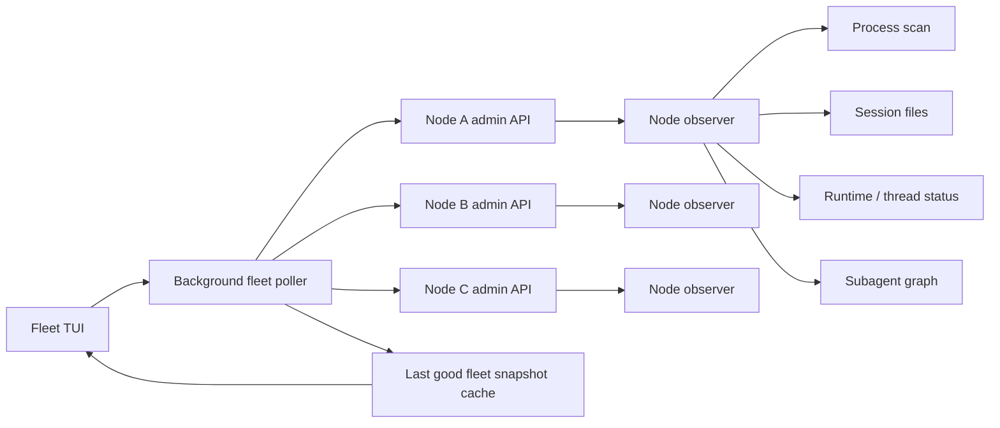
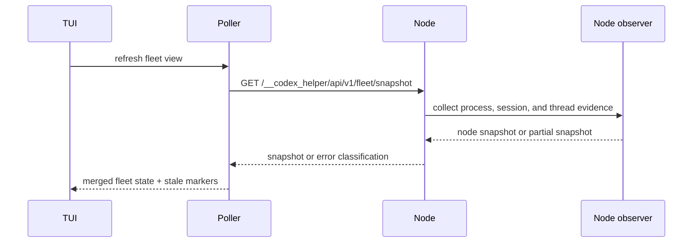
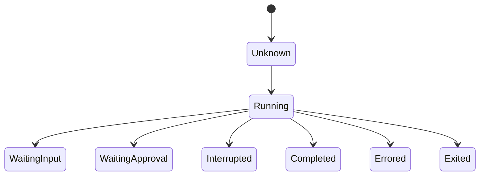
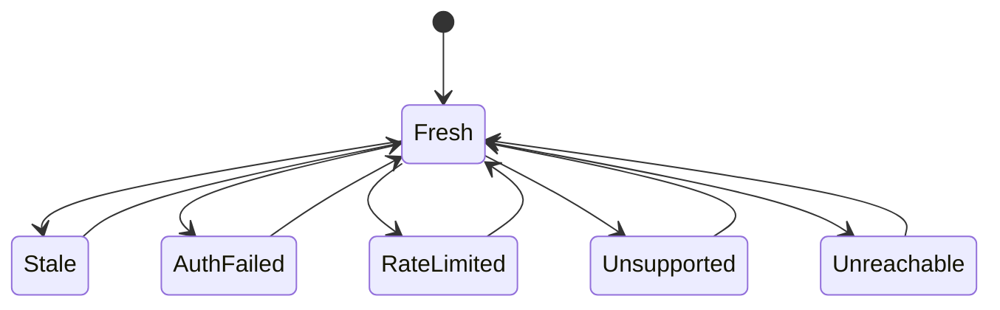

# feat: Add Codex fleet observability

## Summary
Add a Fleet page that can show running Codex activity across multiple machines, including root sessions, subagents, and node health. The first version is read-only, keeps existing routing behavior separate, and treats inferred or stale status as lower-confidence data instead of hard truth.

---

## Problem Frame
codex-helper already has a strong local control plane, attached TUI, session history, request ledger, and provider routing views. That works well for one machine, but it breaks down once the operator is juggling a laptop, a home Mac mini, and a work machine over Tailscale.

The missing piece is a single place to answer: what is running, what is waiting, what errored, and which subagents belong to which parent thread. A plain process list is not enough, because PID liveness does not explain waiting-on-input, approval, or child-agent topology. A routing page is not enough either, because observability should not mutate route selection or inherit its semantics.

---

## Requirements
- R1. The product exposes a dedicated fleet observability model that is separate from relay-target routing and session override state.
- R2. Each node can report local Codex processes, session state, and parent/child subagent relationships, and each row carries a source and confidence marker.
- R3. Remote polling degrades cleanly on timeout, auth failure, unsupported response, rate limit, or transport error, and keeps the last good snapshot visible as stale.
- R4. The model preserves root, child, and grandchild identity, plus open and closed spawned edges, without merging subagent graphs across node boundaries.
- R5. The TUI gains a Fleet page with node summary, node detail, tree and flat views, and token/TPS/last-activity/last-error indicators.
- R6. The first slice is read-only. Remote interrupt, message, approval, and TTY attach stay out of scope.
- R7. Fleet node configuration is explicit and does not reuse the routing relay-target table as its source of truth.
- R8. Non-loopback nodes require token authentication over TLS or a trusted encrypted tunnel, and fleet config references secrets instead of storing raw tokens.

---

## Key Technical Decisions
- Dedicated fleet registry, not relay-target reuse: observability and routing have different lifecycles, and keeping them separate avoids config and UX confusion.
- Background snapshot polling, not render-time I/O: every node refresh runs off the TUI render path so slow hosts never freeze the interface.
- Cross-platform local process scanning through a library such as `sysinfo`, rather than shelling out to platform-specific process commands, so Windows, macOS, and Linux stay aligned.
- Confidence is a first-class field: direct runtime or thread status wins, session-log inference is lower confidence, and stale or unreachable data stays labeled.
- Node reachability and agent execution state stay separate: `stale`, `auth_failed`, `rate_limited`, `unsupported`, and `unreachable` describe node refresh health, while `running`, `waiting_input`, `waiting_approval`, `completed`, `errored`, and `exited` describe work units.
- Subagent topology is preserved as a node-local graph: parent/child edges stay open or closed, and Fleet merge never combines thread graphs from different machines.
- Fleet config uses secret references: examples and persisted config should prefer `admin_token_env` or equivalent indirection instead of embedding bearer tokens.
- Fleet is appended as a new page instead of renumbering existing tabs, so existing 1-8 shortcuts and muscle memory keep working.
- The existing `ControlPlaneClient` is extended for fleet reads instead of adding a second HTTP stack.

---

## High-Level Technical Design






Node refresh health is tracked alongside that work-unit state, not folded into it:



---

## Output Structure
```text
crates/core/src/fleet/
  mod.rs
  model.rs
  registry.rs
  merge.rs
  observer.rs
  poller.rs
  process_scan.rs
  tests.rs
crates/core/Cargo.toml
crates/core/src/lib.rs
crates/core/src/dashboard_core/fleet.rs
crates/core/src/control_plane_client.rs
crates/core/src/proxy/control_plane.rs
crates/core/src/proxy/control_plane_manifest.rs
crates/core/src/proxy/control_plane_routes/fleet.rs
crates/core/src/proxy/tests/api_admin/fleet.rs
crates/tui/src/tui/fleet_refresh.rs
crates/tui/src/tui/types.rs
crates/tui/src/tui/view.rs
crates/tui/src/tui/view/chrome.rs
crates/tui/src/tui/view/pages/fleet.rs
crates/tui/src/tui/view/pages/fleet/tests.rs
```

---

## System-Wide Impact
- Adds a new admin read model on each node that can be queried by the local TUI or by another attached host.
- Extends the TUI navigation model, page titles, help copy, and i18n tables.
- Introduces per-node polling, backoff, and stale-state handling, so network behavior becomes part of the UI contract.
- Makes non-loopback admin exposure more visible, because the Fleet page depends on the same token-protected admin path as attached mode and should use TLS or a trusted encrypted tunnel outside loopback.
- Adds a TUI refresh pipeline from the fleet poller into UI state so integrated and attached modes render cached fleet state instead of performing network work during render.

---

## Scope Boundaries
### Deferred for later
- Remote interrupt, send-input, approve, and reject actions.
- Raw TTY attach or shell takeover.
- Automatic cross-node routing replacement or failover.
- The separate usage tab redesign discussed earlier in the thread.

### Outside this product's identity
- Turning codex-helper into a general distributed process orchestrator.
- Replacing the routing and provider control plane with fleet semantics.
- Shipping OS service installation work in this slice.

---

## Risks & Dependencies
- Status inference can drift if Codex session formats change, so the plan keeps source and confidence visible and never pretends inference is direct observation.
- Network flakiness can produce stale snapshots, so each node refresh needs its own timeout and backoff rather than a shared global failure mode.
- Cross-platform process enumeration can diverge across Windows, macOS, and Linux, so the plan prefers a library-backed scan path over OS-specific shelling.
- Remote admin access must remain token-protected outside loopback, and the Fleet page should not weaken that rule or encourage raw bearer tokens in config files.
- Stale, auth-failed, and unreachable nodes can still have cached agent rows, so the UI must show snapshot age and avoid treating cached rows as current health.
- `repo-ref/codex` thread and agent status semantics are the main prior art, so the adapter boundary should stay narrow in case upstream thread status shapes change again.

---

## Acceptance Examples
- Given three configured nodes and one unreachable host, Fleet still renders the other two nodes and marks the missing one stale with the last known state.
- Given a root agent with two child agents and one grandchild on one node, Fleet shows a tree that preserves parent/child edges, node identity, and open/closed subagent state.
- Given a remote node returns 403, 429, 404, or times out, Fleet classifies the node as auth-failed, rate-limited, unsupported, or unreachable without blanking the rest of the page.
- Given one row is inferred from session logs and another comes from direct runtime status, Fleet exposes different source and confidence markers for those rows.
- Given a node is stale, auth-failed, or unreachable, Fleet shows snapshot age and offline styling rather than counting cached rows as fresh running work.
- Given a remote node is configured, its token is referenced through an environment variable or secret reference, and the docs do not show raw bearer tokens in persisted config.
- Given the user switches to Fleet, existing 1-8 page shortcuts still work and the new page appears as the extra tab instead of renumbering the old ones.

---

## Implementation Units
### U1. Core fleet snapshot and local observer
- **Goal:** Define the single-node fleet snapshot, local process/session/thread collection, and read-only admin response that every node will expose.
- **Requirements:** R1, R2, R4, R7, R8.
- **Dependencies:** None.
- **Files:** `crates/core/Cargo.toml`, `crates/core/src/lib.rs`, `crates/core/src/dashboard_core/fleet.rs`, `crates/core/src/fleet/mod.rs`, `crates/core/src/fleet/model.rs`, `crates/core/src/fleet/process_scan.rs`, `crates/core/src/fleet/observer.rs`, `crates/core/src/proxy/control_plane.rs`, `crates/core/src/proxy/control_plane_manifest.rs`, `crates/core/src/proxy/control_plane_routes/fleet.rs`, `crates/core/src/control_plane_client.rs`, `crates/core/src/fleet/tests.rs`, `crates/core/src/proxy/tests/api_admin/fleet.rs`
- **Approach:** Build a node-local observer that merges process liveness, session files, runtime status, and subagent graph evidence into one snapshot. Expose that snapshot through a read-only admin endpoint, register it in the control-plane route and manifest surface, and deserialize it through the existing control-plane client. Prefer direct status when it exists, then session-log inference, then process liveness, and always carry source, confidence, `node_id`, and local thread/session identity forward.
- **Execution note:** Start from a failing contract test for the snapshot shape before wiring the endpoint.
- **Patterns to follow:** `crates/core/src/dashboard_core/snapshot.rs`, `crates/core/src/state/session_identity.rs`, `crates/core/src/proxy/control_plane_routes/capability_session.rs`, `repo-ref/codex/codex-rs/app-server-protocol/src/protocol/v2/thread.rs`, `repo-ref/codex/codex-rs/agent-graph-store/src/lib.rs`
- **Test scenarios:**
  - Happy path: a node with one running root session and one child subagent returns a snapshot with the expected node, process, source/confidence, and graph sections.
  - Edge case: missing upstream agent graph data still returns node-local sessions and marks topology evidence as unavailable instead of inventing child edges.
  - Edge case: missing session files or unreadable process metadata still returns a partial snapshot with lower confidence instead of failing the whole request.
  - Error path: process scan failure is reported in the node snapshot, but the endpoint still serves other sections that were collected successfully.
  - Integration: `ControlPlaneClient` can fetch and deserialize the fleet snapshot from a live admin endpoint that appears in the control-plane manifest or capability links.
- **Verification:** One node can explain its own running, waiting, and subagent state without blocking the existing runtime or routing endpoints.

### U2. Fleet registry, polling, and degradation
- **Goal:** Add explicit fleet node configuration and a background poller that keeps multiple nodes fresh without letting one slow host stall the rest.
- **Requirements:** R1, R3, R7, R8.
- **Dependencies:** U1.
- **Files:** `crates/core/src/config.rs`, `crates/core/src/config_storage.rs`, `crates/core/src/fleet/registry.rs`, `crates/core/src/fleet/poller.rs`, `crates/core/src/fleet/merge.rs`, `crates/core/src/fleet/tests.rs`
- **Approach:** Introduce a dedicated fleet registry with per-node labels, one or more admin endpoints, and `admin_token_env` or an equivalent secret reference. Poll each node on its own cadence with short bounded timeouts and independent backoff. Classify auth failures, unsupported endpoints, rate limits, parse failures, timeouts, and transport errors through a structured `ControlPlaneClient` error type, then keep the last successful snapshot visible as stale on that node only.
- **Patterns to follow:** `crates/core/src/relay_target.rs`, `crates/core/src/control_plane_client.rs`, `crates/tui/src/tui/session_refresh.rs`, `crates/tui/src/tui/runtime_refresh.rs`, `docs/workstreams/relay-target-workflow/DESIGN.md`
- **Test scenarios:**
  - Happy path: two configured nodes refresh independently and both appear in the merged fleet view.
  - Edge case: a node with a fallback endpoint succeeds on the second URL and records the active endpoint.
  - Failure path: 401/403 produces auth-failed, 429 produces rate-limited backoff, 404/unsupported produces unsupported, and timeout produces unreachable/stale state.
  - Security path: raw bearer tokens in persisted fleet config are rejected or ignored in favor of secret references.
  - Integration: one dead node never blocks another healthy node from refreshing.
- **Verification:** Partial fleet data stays useful when one machine is offline, slow, or misconfigured.

### U3. Fleet TUI page and navigation
- **Goal:** Add the Fleet page, wire it into navigation, and render node summary, detail, and subagent tree views.
- **Requirements:** R2, R3, R4, R5.
- **Dependencies:** U1, U2.
- **Files:** `crates/tui/src/tui/fleet_refresh.rs`, `crates/tui/src/tui/types.rs`, `crates/tui/src/tui/mod.rs`, `crates/tui/src/tui/view.rs`, `crates/tui/src/tui/view/chrome.rs`, `crates/tui/src/tui/view/pages/mod.rs`, `crates/tui/src/tui/view/pages/fleet.rs`, `crates/tui/src/tui/view/pages/fleet/tests.rs`, `crates/tui/src/tui/input/normal.rs`, `crates/tui/src/tui/attached.rs`, `crates/tui/src/tui/view/modals/help.rs`, `crates/tui/src/tui/i18n.rs`
- **Approach:** Append Fleet as a new page instead of renumbering the existing 1-8 layout. Add a background fleet refresh task that feeds cached fleet state into the TUI state for integrated and attached modes, and keep network or process work out of render-time code. Update page titles, page indices, footer/help copy, and render surface keys together. Render a node list, a selected-node detail pane, and a tree/flat toggle that expands subagents only inside the selected node.
- **Execution note:** Add rendering tests before wiring the new page into the tab strip.
- **Patterns to follow:** `crates/tui/src/tui/view/pages/sessions.rs`, `crates/tui/src/tui/view/pages/recent.rs`, `crates/tui/src/tui/view/pages/dashboard.rs`, `crates/tui/src/tui/session_refresh.rs`, `crates/tui/src/tui/attached.rs`, `crates/tui/src/tui/view/modals/help.rs`
- **Test scenarios:**
  - Happy path: Fleet renders a healthy node list with token/TPS/last-activity/source/confidence indicators and a populated detail pane for the selected node.
  - Edge case: empty and loading states render without breaking the rest of the TUI layout.
  - Error path: a node snapshot failure surfaces as an error row with age/offline styling while the rest of the page remains interactive.
  - Refresh path: integrated and attached TUI loops receive fleet refresh results through state updates and do not fetch during render.
  - Integration: page navigation preserves the existing shortcuts and the help modal shows Fleet as the extra page.
- **Verification:** A user can enter Fleet, inspect a node, and return to the existing pages without re-learning the navigation model.

### U4. Docs and regression hardening
- **Goal:** Document the new fleet registry and remote admin expectations, then lock the page order and copy with targeted regressions.
- **Requirements:** R5, R6, R7, R8.
- **Dependencies:** U1, U2, U3.
- **Files:** `docs/CONFIGURATION.md`, `docs/CONFIGURATION.zh.md`, `crates/tui/src/tui/view/modals/help.rs`, `crates/tui/src/tui/i18n.rs`, `crates/tui/src/tui/view/pages/fleet/tests.rs`
- **Approach:** Update the configuration docs with the dedicated fleet node registry, remote admin token expectations, TLS or trusted encrypted tunnel expectations, and the read-only nature of the first slice. Keep the regression coverage focused on tab order, copy, and the failure labels that protect the new status model.
- **Patterns to follow:** `docs/CONFIGURATION.md`, `docs/CONFIGURATION.zh.md`, `docs/workstreams/relay-target-workflow/DESIGN.md`, `docs/workstreams/resident-proxy-attach-first/DESIGN.md`
- **Test scenarios:**
  - Docs path: configuration examples use local, LAN, and Tailscale nodes without storing raw bearer tokens.
  - UI copy path: help and page copy make the first slice read-only and label stale/auth-failed/unreachable rows clearly.
  - Regression path: page-order, footer, help-copy, and failure-label assertions stay covered by `crates/tui/src/tui/view/pages/fleet/tests.rs`.
- **Verification:** The shipped docs explain how to configure fleet nodes, and the UI text matches the behavior that the code exposes.

---

## Documentation / Operational Notes
- The config docs need one clear example for a local node, one for a LAN node over TLS or a trusted encrypted tunnel, and one for a Tailscale node.
- The remote admin token requirement should stay visible in both the English and Chinese docs, and examples should use `admin_token_env` rather than raw token values.
- The Fleet page copy should say that it is read-only in this slice so operators do not expect remote control where none exists.

---

## Sources / Research
- `crates/core/src/control_plane_client.rs` and `crates/core/src/dashboard_core/snapshot.rs` for the existing client and snapshot patterns.
- `crates/core/src/state/session_identity.rs` for session rows, usage, TPS, and source metadata.
- `crates/core/src/proxy/control_plane_routes/capability_session.rs` for the existing read-only admin route shape.
- `crates/core/src/proxy/admin.rs` and `docs/CONFIGURATION.md` for loopback versus token-protected remote admin semantics.
- `crates/tui/src/tui/attached.rs`, `crates/tui/src/tui/session_refresh.rs`, and `crates/tui/src/tui/runtime_refresh.rs` for background refresh and attached-mode patterns.
- `repo-ref/codex/codex-rs/app-server-protocol/src/protocol/v2/thread.rs` for `ThreadStatus` and `ThreadActiveFlag`.
- `repo-ref/codex/codex-rs/agent-graph-store/src/lib.rs` and `repo-ref/codex/codex-rs/agent-graph-store/src/types.rs` for parent/child spawned-agent topology and open/closed edge semantics.
- `repo-ref/codex/codex-rs/app-server/src/thread_status.rs` for resolving active flags and turning runtime facts into user-facing thread status.
- `docs/workstreams/relay-target-workflow/DESIGN.md` for remote target attachment semantics that this feature should not disturb.
- `docs/workstreams/resident-proxy-attach-first/DESIGN.md` and `docs/workstreams/desktop-lifecycle-owner/DESIGN.md` for attach-first and lifecycle boundaries.
