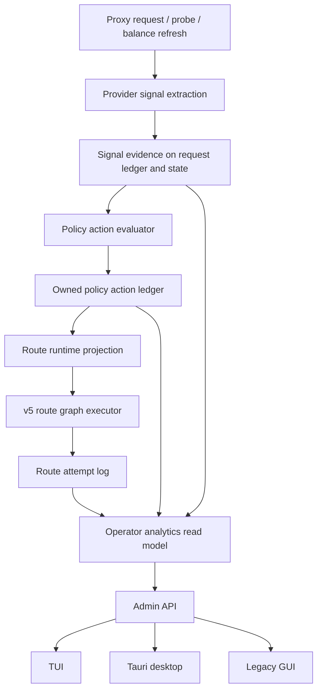
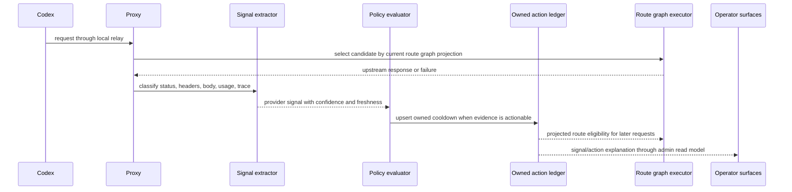
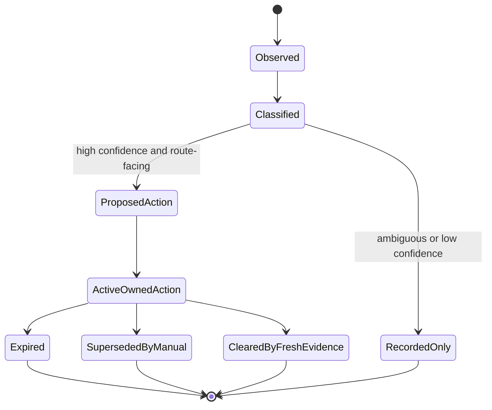
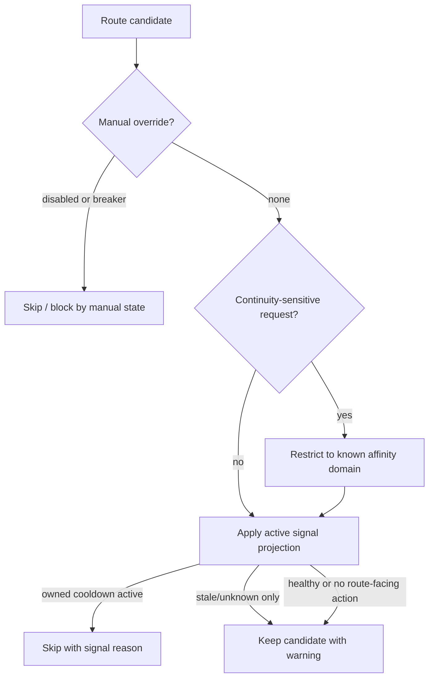

# Provider Signal Control Loop - Plan

## Goal Capsule

| Field | Value |
|---|---|
| Objective | Refactor codex-helper into a route-graph-preserving provider signal control loop that unifies request failures, quota evidence, balance probes, health checks, automatic cooldown ownership, and operator analytics. |
| Authority | The existing v5 route graph, session affinity, compact continuity, and Codex semantic bridge remain the behavioral source of truth. CPA-Manager-Plus is reference prior art for monitoring and action ownership, not a routing model to copy. |
| Execution profile | Deep, breaking internal refactor across core proxy/runtime state, request ledger, admin API, TUI, Tauri desktop, and legacy GUI read models. |
| Stop conditions | Stop if implementation would replace route graph semantics, mutate Codex auth/account files as an automatic quota response, or weaken state-bound remote compaction continuity. |
| Tail ownership | Implementation should land with characterization tests before semantic rewrites, focused nextest coverage for core units, and desktop/TUI contract tests for shared read models. |

---

## Product Contract

### Summary

This plan keeps codex-helper's stronger routing model and adds the missing control loop around it: provider signals are extracted once, policy actions are owned and auditable, route decisions consume projected state, and every operator surface sees the same explanation.
The work absorbs CPA-Manager-Plus ideas around request monitoring, quota inspection, and automatic recovery without adopting CPA's account-file management or gateway assumptions.

### Problem Frame

codex-helper already has strong Codex-specific relay behavior: route graph selection, session affinity, compact continuity, model/capability bridging, balance adapters, request logs, and multiple operator UIs.
The weakness is that several adjacent concepts are interpreted in parallel: response classification, balance exhaustion, load-balancer cooldown, route attempt logs, health probes, dashboard posture, and desktop mappers each carry their own partial truth.

CPA-Manager-Plus shows a mature operational loop: normalize observed request/quota facts, persist ownership for automated disables, recover only the actions the system owns, and present request analytics in a coherent dashboard.
For codex-helper, the correct version is not quota-first routing.
The correct version is a provider signal pipeline that feeds the existing route graph through explicit policy projections.

### Requirements

**Routing and continuity**

- R1. Preserve v5 route graph semantics, provider endpoint ordering, session pins, global pins, retry boundaries, and affinity behavior while changing the internal state model.
- R2. Treat remote compaction, encrypted content, previous response continuity, and state-bound compact requests as continuity-sensitive traffic where provider failover remains constrained by known affinity and continuity domain.
- R3. Keep local concurrency saturation as a scheduler skip and not as an upstream failure.

**Provider signals and policy actions**

- R4. Normalize upstream responses, response headers, balance snapshots, service status probes, capability probes, and local concurrency observations into one provider signal vocabulary.
- R5. Separate signal extraction from routing policy: extraction records what was observed; policy decides whether that observation affects route eligibility.
- R6. Persist automatic cooldown/disable/recovery actions with ownership, reason, source signal, confidence, and expiry so manual runtime overrides always outrank automatic recovery.
- R7. Only automate route-facing actions for explicit, high-confidence quota, rate-limit, capacity, transport, or reset-time evidence; ambiguous errors stay observable but do not disable an endpoint.
- R8. Do not mutate Codex auth files, ChatGPT login state, third-party account files, or provider dashboards as part of automatic quota handling.

**Operator observability**

- R9. Extend request ledger records with structured provider signal, policy action, and route attempt evidence while keeping older JSONL records readable.
- R10. Expose one typed admin read model for provider health, signal/action state, route posture, request analytics, and balance/quota status while preserving existing admin access checks and capability gating.
- R11. Make TUI, Tauri desktop, and legacy GUI consume the same core read model instead of independently deriving provider health, balance, retry, and usage interpretations.
- R12. Support request analytics by provider, endpoint, model, session, path, status class, retry/failover, service tier, cache usage, and signal/action outcome.

**Refactor and safety**

- R13. Allow breaking internal DTO, module, and admin API changes when they remove duplicated state interpretation or legacy compatibility code that no longer serves the v5 route graph model.
- R14. Keep persisted user secrets out of logs, request previews, desktop storage, and export payloads; signal metadata may include public trace IDs and sanitized error classes only.
- R15. Keep JSONL request logs as the canonical durable ledger for this work; SQLite indexing remains a rebuildable follow-up after schema stabilization.
- R16. Provide focused characterization tests before rewriting route execution, balance exhaustion, compact continuity, and UI read model semantics.

### Acceptance Examples

- AE1. Given an upstream returns a high-confidence quota response with a future reset time, when the request finishes, then the matching provider endpoint receives an owned automatic cooldown until that reset and routing explains the skip without changing manual overrides.
- AE2. Given an upstream returns a rate-limit or quota-looking error without a reset horizon, when the request finishes, then the signal is recorded in the request ledger and operator UI but no endpoint is automatically disabled.
- AE3. Given a manual provider runtime disable exists, when an automatic cooldown expires, then the automatic action is removed but the manual disable still blocks routing.
- AE4. Given a state-bound remote compaction request has known endpoint affinity, when another endpoint has fresher quota or health signals, then routing still uses the affinity-compatible endpoint or returns a continuity error instead of guessing.
- AE5. Given stale balance says exhausted and a fresh request signal says ok, when route posture is built, then freshness and confidence choose the route-facing projection and the stale fact remains visible as historical evidence.
- AE6. Given an old request ledger JSONL line lacks provider signal fields, when admin request-ledger APIs read it, then the line still maps to a finished request with empty signal/action evidence.
- AE7. Given TUI and Tauri desktop both show the same provider, when a provider has active automatic cooldown, stale balance, and recent retry failures, then both surfaces present the same status category and source reason.

### Scope Boundaries

In scope:

- Breaking internal Rust module boundaries, DTOs, admin API payloads, desktop TypeScript mapper types, and request-ledger schema.
- New domain modules for provider signals, policy actions, analytics read models, and routing projections.
- Refactoring giant modules only where this work needs ownership or interpretation moved out of them.
- Updating docs and examples that explain balance, health, route eligibility, and automatic cooldown.

Out of scope:

- Replacing the v5 route graph with a quota-first scheduler.
- Copying CPA-Manager-Plus account-file disable/re-enable behavior.
- Introducing a required database for request analytics.
- Shipping a public desktop installer or redesigning the desktop shell.
- Adding a provider preset marketplace.

#### Deferred to Follow-Up Work

- Rebuildable SQLite index over request JSONL once provider signal schema proves stable.
- Richer charting and saved analytics views in Tauri desktop.
- Provider template marketplace and onboarding wizard.
- Distributed fleet aggregation of provider signals across multiple relay nodes.

---

## Planning Contract

### Key Technical Decisions

- KTD1. Provider signal is the new semantic boundary. Response classes, quota headers, balance snapshots, service status samples, capability probes, and concurrency saturation become typed observations before any routing policy is applied.
- KTD2. Policy actions are owned records, not load-balancer booleans. `LbState` should become a runtime projection of active actions and request outcomes, while persistent ownership lives in core state.
- KTD3. Route graph remains the authority. Signal-aware route execution annotates and filters candidates through existing route graph rules; it does not invent a parallel candidate order.
- KTD4. Request ledger stays canonical. The plan extends JSONL request records and readers instead of moving analytics to SQLite during the refactor.
- KTD5. Admin API becomes the UI contract. Tauri desktop should stop treating core payloads as mostly `unknown`, and TUI/GUI should use the same typed summaries where possible.
- KTD6. Automatic recovery must be conservative. The system only recovers actions it owns, only after expiry or fresh counter-evidence, and never clears manual runtime overrides.
- KTD7. CPA is prior art, not a template. Borrow response-header parsing, quota cooldown ownership, inspection scheduling, and analytics shape; reject CPA's external account-file mutation and single-gateway assumptions.
- KTD8. `ProviderEndpointKey` is the canonical identity for route-facing signals and actions. Legacy station/upstream indexes may be used to recover older records, but new state must not key policy actions by route order or display labels.

### High-Level Technical Design

### Delivery Sequence

1. Characterize existing route graph, compact continuity, request ledger compatibility, and UI read-model behavior.
2. Introduce provider signal types and extraction adapters without changing route eligibility.
3. Add owned policy action persistence and projections, keeping manual overrides as higher-precedence input.
4. Integrate projections into route execution, route explain, and attempt logging while preserving candidate order for non-actionable signals.
5. Extend request ledger analytics and typed admin read models, then update TUI, Tauri desktop, and legacy GUI consumers.
6. Remove superseded health/quota/cooldown interpretation paths only after all readers consume the shared model.

### System-Wide Impact

- Core state will gain a durable policy action ledger and lose some direct responsibility for interpreting every balance, health, and retry field inline.
- Proxy execution will emit provider signals alongside route attempts, so tests around failover and compact continuity must become characterization gates before refactor edits.
- Admin API changes are breaking for desktop and attached GUI clients, so Tauri and GUI mappers must be updated in the same delivery train.
- Request logs will carry more structured metadata; readers must remain tolerant of older records.
- Documentation must explain the difference between observed signals, route-facing actions, manual overrides, and route graph policy.

### Risks & Mitigations

| Risk | Mitigation |
|---|---|
| Signal-aware routing accidentally changes route graph ordering. | Add characterization tests around route graph candidate selection before integration and require route explain parity for non-actionable signals. |
| Automatic cooldown blocks a provider on weak evidence. | Gate actions on confidence, freshness, explicit reset/cooldown horizon, and test ambiguous responses as recorded-only. |
| Manual and automatic state collide. | Model ownership explicitly and make manual runtime overrides higher precedence in projection tests. |
| Remote compact continuity regresses under provider failover. | Keep compact continuity tests in the first implementation unit and treat state-bound compact as a hard stop condition. |
| UI surfaces drift after DTO changes. | Move shared summaries into core and add desktop mapper tests plus TUI snapshot-style tests. |
| Request log schema churn creates unreadable history. | Keep tolerant deserialization and add old-record fixtures to request ledger tests. |
| Richer admin diagnostics expose sensitive provider state to unauthenticated clients. | Keep `AdminAccessConfig` and `require_admin_access` on control-plane routes, use capability flags for remote surfaces, and redact secrets in every diagnostics/export path. |

### Sources & Research

- `README.md` defines codex-helper as a Codex-first local relay and control plane with bridge presets, route graph, affinity, usage, and diagnostics.
- `docs/workstreams/codex-routing-scheduler-observability-refactor/README.md` already states the right boundary: routing policy stays stable while scheduler runtime state and observability move through one boundary.
- `docs/workstreams/codex-operator-experience-refactor/GAP_MATRIX.md` identifies request trace, attempt chain, balance/quota, and API DTO alignment as priority gaps.
- `crates/core/src/proxy/classify.rs` already has upstream throttle classification that should feed provider signals.
- `crates/core/src/logging.rs` and `crates/core/src/request_ledger.rs` already carry request IDs, trace IDs, route attempts, usage, retry, and JSONL readers.
- `crates/core/src/balance.rs` and `crates/core/src/usage_providers.rs` already model rich balance snapshots and provider usage windows.
- `crates/core/src/lb.rs` currently keeps cooldown and usage exhaustion as runtime load-balancer arrays, which is the main state boundary to refactor.
- `repo-ref/CPA-Manager-Plus/apps/manager-server/internal/worker/rate_limit_auto_disable.go` is the reference for owned automatic disable/recovery.
- `repo-ref/CPA-Manager-Plus/apps/manager-server/internal/usage/response_headers.go` is the reference for structured quota/error/trace metadata extraction.
- `repo-ref/CPA-Manager-Plus/apps/manager-server/internal/collector/collector.go` is the reference for collector status, backoff, and event handler separation.
- `repo-ref/CPA-Manager-Plus/apps/web/src/utils/quota/codexQuota.ts` is the reference for quota window classification and reset labeling.

---

## Implementation Units

### U1. Characterize Existing Routing, Signal, and Ledger Semantics

- **Goal:** Freeze the current route graph, retry, compact continuity, balance exhaustion, request ledger, and UI summary behavior before introducing new provider signal modules.
- **Requirements:** R1, R2, R3, R9, R16; covers AE4 and AE6.
- **Dependencies:** None.
- **Files:**
  - `crates/core/src/proxy/tests/failover/mod.rs`
  - `crates/core/src/proxy/tests/failover/response_semantics.rs`
  - `crates/core/src/proxy/tests/failover/response_semantics_compact.rs`
  - `crates/core/src/routing_ir.rs`
  - `crates/core/src/request_ledger.rs`
  - `crates/core/src/dashboard_core/routing_posture.rs`
  - `apps/desktop/src/app/App.test.tsx`
- **Approach:** Add focused characterization cases around non-actionable signals, state-bound compact affinity, usage-exhausted skips, old request-log records, route explain outputs, and desktop empty/live usage states.
- **Execution note:** Start here with failing or snapshot-style tests before moving state interpretation out of existing modules.
- **Patterns to follow:** Existing failover tests under `crates/core/src/proxy/tests/failover/`, request ledger fixture tests in `crates/core/src/request_ledger.rs`, and desktop live/mock tests in `apps/desktop/src/app/App.test.tsx`.
- **Test scenarios:**
  - A normal route graph request with no actionable signal selects the same candidate before and after the refactor.
  - A compact request with existing affinity refuses cross-provider guessing even when another candidate is healthy.
  - A local concurrency saturation skip is recorded as scheduler skip and not counted as upstream failure.
  - An old request ledger JSONL record without signal fields still reads into `FinishedRequest`.
  - Desktop usage page renders a live empty state when admin API is connected but request history is empty.
- **Verification:** Existing route behavior is documented by tests that fail if route graph ordering, compact affinity, request ledger compatibility, or desktop live-state assumptions change.

### U2. Introduce Provider Signal Domain Model

- **Goal:** Create a typed provider signal vocabulary that can represent response, header, balance, probe, capability, concurrency, and route-attempt evidence without deciding routing policy inline.
- **Requirements:** R4, R5, R7, R14; covers AE2 and AE5.
- **Dependencies:** U1.
- **Files:**
  - `crates/core/src/provider_signals/mod.rs`
  - `crates/core/src/provider_signals/model.rs`
  - `crates/core/src/provider_signals/response_headers.rs`
  - `crates/core/src/provider_signals/classifier.rs`
  - `crates/core/src/provider_signals/tests.rs`
  - `crates/core/src/lib.rs`
  - `crates/core/src/proxy/classify.rs`
  - `crates/core/src/balance.rs`
  - `crates/core/src/service_status.rs`
- **Approach:** Move reusable classification vocabulary into `provider_signals`: signal kind, source, confidence, freshness, route-facing eligibility, retry/reset horizon, sanitized trace metadata, and target provider endpoint identity. New signals should carry `ProviderEndpointKey`; extraction from old request records may recover it from legacy fields but must mark recovered identity as lower-confidence evidence.
- **Execution note:** Keep extraction pure where possible; policy action creation belongs in U3, not this unit.
- **Patterns to follow:** `crates/core/src/balance.rs` for serializable snapshot types, `crates/core/src/proxy/classify.rs` for existing throttle classification, and CPA's `response_headers.go` for metadata grouping.
- **Test scenarios:**
  - A `usage_limit_reached` response with reset metadata becomes a quota signal with high confidence and reset horizon.
  - A Cloudflare challenge becomes a transport/capacity-style signal without quota exhaustion.
  - Missing or malformed quota headers produce either no signal or low-confidence recorded-only signal.
  - Balance snapshot status `Exhausted`, `Stale`, `Error`, and `Ok` map to distinct signal freshness/confidence combinations.
  - Sanitized trace IDs are preserved while raw auth headers and body previews are excluded.
- **Verification:** Provider signal tests cover response-body, response-header, balance-snapshot, service-status, and no-secret cases.

### U3. Add Owned Policy Action Ledger

- **Goal:** Persist automatic cooldown/disable/recovery actions separately from manual overrides and load-balancer runtime arrays.
- **Requirements:** R6, R7, R8, R13, R14; covers AE1, AE2, and AE3.
- **Dependencies:** U2.
- **Files:**
  - `crates/core/src/policy_actions/mod.rs`
  - `crates/core/src/policy_actions/model.rs`
  - `crates/core/src/policy_actions/evaluator.rs`
  - `crates/core/src/policy_actions/storage.rs`
  - `crates/core/src/policy_actions/tests.rs`
  - `crates/core/src/state.rs`
  - `crates/core/src/state/policy_action_ledger.rs`
  - `crates/core/src/state/runtime_types.rs`
  - `crates/core/src/state/session_route_ledger.rs`
  - `crates/core/src/lb.rs`
- **Approach:** Add an owned action ledger keyed by `ProviderEndpointKey`. Actions carry owner, source signal, reason, confidence, created time, expiry, recovery state, and persistence generation. Store the ledger at the core state boundary so reloads and admin operations see the same ownership records. `LbState` consumes active action projections instead of owning all route-facing cooldown truth.
- **Execution note:** Treat manual runtime override precedence as a hard invariant and test it before replacing direct `usage_exhausted` flows.
- **Patterns to follow:** `crates/core/src/state/session_route_ledger.rs` for persistent ledger style, `crates/core/src/lb.rs` for current cooldown projection, and CPA's auto-disable worker for ownership and rollback mindset.
- **Test scenarios:**
  - High-confidence quota signal with reset time creates one active owned cooldown for the target endpoint.
  - Repeated equivalent signals extend or refresh the owned action without duplicating state.
  - Expired automatic action is removed from route projection.
  - Manual disable remains effective after automatic action expiry.
  - Low-confidence or ambiguous signal records no action.
  - State reload preserves active owned actions and drops expired ones deterministically.
  - Failed ledger persistence does not clear existing manual overrides or apply a half-written automatic action.
- **Verification:** Policy action tests prove ownership, expiry, manual precedence, duplicate handling, and reload behavior.

### U4. Integrate Signal Projections into Route Execution Without Replacing Route Graph

- **Goal:** Feed active policy action projections into route target selection, route explain, and attempt logging while preserving v5 route graph behavior.
- **Requirements:** R1, R2, R3, R5, R7; covers AE1, AE4, and AE5.
- **Dependencies:** U1, U2, U3.
- **Files:**
  - `crates/core/src/proxy/provider_execution.rs`
  - `crates/core/src/proxy/route_target_selection.rs`
  - `crates/core/src/proxy/route_executor_runtime.rs`
  - `crates/core/src/proxy/route_attempts.rs`
  - `crates/core/src/proxy/route_unavailability.rs`
  - `crates/core/src/routing_ir.rs`
  - `crates/core/src/routing_explain.rs`
  - `crates/core/src/dashboard_core/routing_posture.rs`
  - `crates/core/src/proxy/tests/routing_profiles.rs`
- **Approach:** Apply policy action projections as candidate annotations and skip reasons after route graph runtime state is built. Route attempts should say whether a candidate was skipped by manual override, continuity, concurrency, active owned action, stale balance warning, or normal route graph policy.
- **Execution note:** Route graph tests should stay green through this unit; any intentional behavior change must be named as a requirement change before implementation continues.
- **Patterns to follow:** Existing route graph runtime functions in `route_executor_runtime.rs`, continuity functions in `route_target_selection.rs`, and routing posture summaries in `dashboard_core/routing_posture.rs`.
- **Test scenarios:**
  - Active owned quota cooldown skips only the targeted endpoint and leaves other route graph candidates ordered normally.
  - Stale or unknown balance signals appear in explain output but do not skip candidates.
  - Manual global/session pins still take precedence over automatic route preferences.
  - Compact continuity restricts candidates before signal projection can pick a different continuity domain.
  - Route attempt log includes signal/action skip reason without losing provider, endpoint, station, and route path fields.
- **Verification:** Routing profile and failover tests demonstrate parity for normal traffic and expected skip explanations for active owned actions.

### U5. Extend Request Ledger and Analytics Read Models

- **Goal:** Make request JSONL and core analytics carry structured signal/action evidence and support CPA-style request analysis without introducing SQLite.
- **Requirements:** R9, R12, R14, R15; covers AE1, AE2, AE5, and AE6.
- **Dependencies:** U2, U3, U4.
- **Files:**
  - `crates/core/src/logging.rs`
  - `crates/core/src/request_ledger.rs`
  - `crates/core/src/dashboard_core/operator_summary.rs`
  - `crates/core/src/dashboard_core/types.rs`
  - `crates/core/src/dashboard_core/snapshot.rs`
  - `crates/core/src/proxy/runtime_admin_api.rs`
  - `crates/core/src/proxy/control_plane_manifest.rs`
  - `src/commands/usage.rs`
- **Approach:** Add optional `provider_signals`, `policy_actions`, and normalized status class fields to request logs. Extend filters and summary grouping so admin API and CLI can query by provider, endpoint, signal kind, action owner, retry/failover, model, session, path, and status range. Do not persist raw request/response bodies or auth-bearing headers in signal evidence; any existing body-preview behavior must stay separate from provider signals and be excluded from sanitized exports by default.
- **Execution note:** Backward compatibility tests for older JSONL records should be written before adding new fields.
- **Patterns to follow:** Current tolerant JSON parsing in `request_ledger.rs`, cost aggregation in `state/runtime_types.rs`, and admin ledger endpoints in `runtime_admin_api.rs`.
- **Test scenarios:**
  - New request record with multiple signals reads back with all signal/action evidence.
  - Old request record reads back with empty evidence and unchanged usage/cost behavior.
  - Filtering by signal kind returns only matching records.
  - Summary by provider endpoint distinguishes provider-level and endpoint-level rows.
  - Sanitized export omits body previews and secret-bearing headers.
- **Verification:** Request ledger tests cover schema evolution, filters, grouping, and sanitized output.

### U6. Promote Admin API Provider Diagnostics to a Typed Contract

- **Goal:** Expose one core-owned provider diagnostics and operator analytics contract for attached TUI, Tauri desktop, and legacy GUI.
- **Requirements:** R10, R11, R12, R13, R14; covers AE5 and AE7.
- **Dependencies:** U3, U4, U5.
- **Files:**
  - `crates/core/src/dashboard_core/types.rs`
  - `crates/core/src/dashboard_core/operator_summary.rs`
  - `crates/core/src/dashboard_core/station_options.rs`
  - `crates/core/src/proxy/api_responses.rs`
  - `crates/core/src/proxy/control_plane_routes/providers.rs`
  - `crates/core/src/proxy/providers_api.rs`
  - `apps/desktop/src-tauri/src/commands/admin_api.rs`
  - `apps/desktop/src/lib/api/admin-types.ts`
  - `apps/desktop/src/lib/api/types.ts`
- **Approach:** Replace raw `Value`-heavy desktop read models with typed provider diagnostics: health, signal state, owned action state, balance/quota, route posture, concurrency capacity, and recent request analytics links. Keep the existing control-plane admin access boundary intact: typed diagnostics must flow through authenticated admin routes or explicit host-local capability paths, and remote capability payloads must not include raw secrets.
- **Execution note:** This is intentionally breaking for admin clients; update all in-repo clients in the same unit.
- **Patterns to follow:** `dashboard_core/operator_summary.rs` for aggregated summaries, `dashboard_core/types.rs` for serializable admin DTOs, and `providers_api.rs` for provider endpoint catalog construction.
- **Test scenarios:**
  - Admin read model serializes provider diagnostics with signal/action fields when present.
  - Remote admin without new capability still degrades through capability flags.
  - Tauri command deserializes typed payloads instead of passing unknown provider arrays.
  - Provider with multiple endpoints exposes endpoint-specific diagnostics.
  - Provider with only stale evidence is labeled differently from active owned cooldown.
  - Unauthenticated or capability-limited admin clients cannot read provider diagnostics that include sensitive routing or account-state details.
- **Verification:** Core serialization tests and desktop TypeScript tests prove the shared admin contract is typed and stable.

### U7. Update TUI, Tauri Desktop, and Legacy GUI Operator Surfaces

- **Goal:** Render the unified read model across operator surfaces without duplicating health, quota, retry, and signal interpretation.
- **Requirements:** R10, R11, R12; covers AE7.
- **Dependencies:** U6.
- **Files:**
  - `crates/tui/src/tui/view/pages/stations.rs`
  - `crates/tui/src/tui/view/stats.rs`
  - `crates/tui/src/tui/view/stats/tests.rs`
  - `crates/tui/src/tui/view/pages/settings.rs`
  - `crates/gui/src/gui/pages/components/request_details.rs`
  - `crates/gui/src/gui/proxy_control.rs`
  - `apps/desktop/src/lib/api/mappers.ts`
  - `apps/desktop/src/features/providers/ProviderCard.tsx`
  - `apps/desktop/src/features/usage/UsagePage.tsx`
  - `apps/desktop/src/features/usage/UsageTable.tsx`
  - `apps/desktop/src/app/App.test.tsx`
- **Approach:** TUI Stations/Stats should show active action, signal source, freshness, and route-facing effect. Tauri Providers/Usage should use typed diagnostics and add filters/export over request analytics. Legacy GUI request details should show the same route chain and signal/action evidence.
- **Execution note:** Keep UI work utilitarian: the surfaces are operator tools, so dense tables and explainable badges matter more than decorative dashboards.
- **Patterns to follow:** Current TUI Stations routing posture display, TUI stats balance summaries, legacy GUI request detail cards, and Tauri's TanStack Table usage page.
- **Test scenarios:**
  - TUI stations page shows active owned cooldown, stale balance, and manual override as distinct labels.
  - TUI stats page aggregates request analytics without recomputing policy state locally.
  - Desktop provider card renders endpoint diagnostics for active cooldown and stale balance.
  - Desktop usage table filters or maps rows by provider, endpoint, signal, action, retry, and model.
  - Legacy GUI request detail shows signal/action evidence on a request with retry chain.
- **Verification:** TUI focused view tests, desktop Vitest coverage, and legacy GUI request detail tests validate consistent rendering from the shared read model.

### U8. Remove Superseded Interpretations and Update Operator Documentation

- **Goal:** Complete the breaking cleanup by removing duplicate health/quota/cooldown interpretation paths and documenting the new control loop.
- **Requirements:** R5, R8, R13, R14, R15, R16.
- **Dependencies:** U4, U5, U6, U7.
- **Files:**
  - `crates/core/src/state.rs`
  - `crates/core/src/usage_providers.rs`
  - `crates/core/src/service_status.rs`
  - `crates/core/src/dashboard_core/routing_posture.rs`
  - `docs/CONFIGURATION.zh.md`
  - `docs/CONFIGURATION.md`
  - `README.md`
  - `README_EN.md`
  - `docs/workstreams/codex-routing-scheduler-observability-refactor/README.md`
  - `docs/workstreams/codex-operator-experience-refactor/GAP_MATRIX.md`
- **Approach:** Remove or demote old direct interpretations after the shared provider signal and policy action paths are live. Documentation should define observed signal, route-facing action, manual override, balance snapshot, service status, and request analytics as separate concepts.
- **Execution note:** Cleanup should happen after all consumers move to the new read model; do not remove legacy readers that protect old JSONL compatibility.
- **Patterns to follow:** Existing bilingual configuration docs and workstream summaries.
- **Test scenarios:**
  - No core dashboard path derives provider health from raw balance snapshots when typed diagnostics are available.
  - Usage provider refresh still updates balance snapshots, but route-facing exhaustion flows through policy action projection.
  - Service status remains observable even when it does not create policy actions.
  - Documentation examples avoid raw tokens and explain manual override precedence.
- **Verification:** Dead interpretation paths are removed or isolated, docs describe the new model, and old log compatibility tests remain green.

---

## Verification Contract

| Gate | Applies To | Done Signal |
|---|---|---|
| Rust formatting | All Rust units | `cargo fmt --all` produces no diff. |
| Core compile | U1-U6, U8 | `cargo check -p codex-helper-core` succeeds. |
| TUI compile | U7 | `cargo check -p codex-helper-tui` succeeds. |
| GUI compile | U7 | `cargo check -p codex-helper-gui` and `cargo check -p codex-helper --bin codex-helper-gui --features gui` succeed when GUI dependencies are available. |
| Core focused tests | U1-U6, U8 | `cargo nextest run -p codex-helper-core` succeeds, with focused tests for provider signals, policy actions, routing projection, request ledger, and admin DTOs. |
| TUI focused tests | U7 | `cargo nextest run -p codex-helper-tui` succeeds for view/model tests. |
| Desktop tests | U6-U7 | From `apps/desktop`, `pnpm test` and `pnpm build` succeed after typed admin payload updates. |
| Documentation audit | U8 | README and configuration docs distinguish observed signals, owned actions, manual overrides, balance snapshots, and route graph policy. |

---

## Definition of Done

- All requirements R1-R16 are satisfied or explicitly deferred with a non-blocking follow-up.
- Existing route graph, session affinity, compact continuity, and local concurrency semantics are preserved by characterization tests.
- Provider signal extraction is centralized and covered across response, header, balance, service status, and capability sources.
- Automatic policy actions are owned, auditable, expiring, reload-safe, and lower precedence than manual overrides.
- Request ledger readers support old and new JSONL records.
- Admin API, TUI, Tauri desktop, and legacy GUI consume shared provider diagnostics and analytics summaries.
- Documentation explains the new control loop and warns that automatic actions never mutate Codex auth or third-party account files.
- Admin diagnostics remain behind the existing admin access boundary, and remote/shared capability payloads expose only redacted, permission-appropriate fields.
- Abandoned intermediate code paths from the refactor are removed rather than left beside the new implementation.
