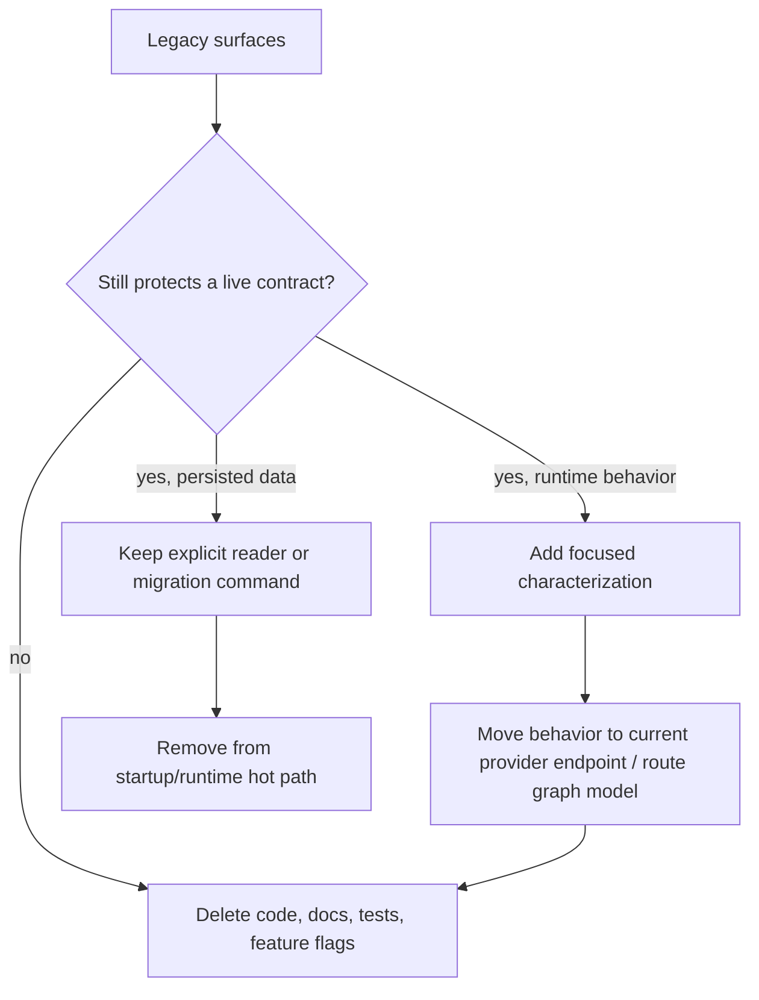
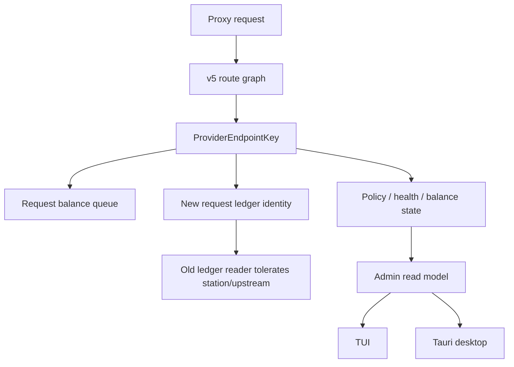

# Fearless Legacy Surface Reduction - Plan

## Goal Capsule

| Field | Value |
|---|---|
| Objective | Remove stale compatibility surfaces that keep codex-helper split across legacy station, legacy GUI, bridge-mode spelling, route executor shadowing, and mixed balance identities. |
| Authority | The v5 route graph, `ProviderEndpointKey`, TUI, Tauri desktop, CLI, request ledger readability, and verified provider balance behavior outrank legacy aliases and migration-era diagnostics. |
| Execution profile | Deep breaking refactor across workspace manifests, core proxy/runtime state, usage provider refresh, config loading, admin DTOs, docs, TUI, and desktop contracts. |
| Stop conditions | Stop if a proposed deletion weakens remote compact continuity, loses readable old request logs, removes the only migration path for user config without a controlled error, or makes a public command disappear without documentation and tests. |
| Tail ownership | Execute in dependency order, keep the branch green after each committed unit, run focused `cargo nextest` gates before full workspace gates, and commit logical slices with conventional messages. |

---

## Product Contract

### Summary

codex-helper should stop maintaining compatibility layers that were useful during the v5 routing and desktop transition but now obscure the runtime model.
The refactor accepts intentional breaks where the old surface keeps duplicated state interpretation alive: the egui GUI fallback, route executor shadow comparison, legacy request-balance upstream queue, bridge-mode aliases, startup-time legacy config auto-migration, and runtime compatibility station projections.

### Problem Frame

The codebase has strong current concepts: v5 route graph, provider endpoints, provider signals, TUI, Tauri desktop, request ledger, and balance refresh suppression.
The remaining legacy surfaces force every balance, route, capability, and UI change to pass through old station/upstream naming and obsolete bridge-mode strings.
That is why recent balance work had to reason about multiple target shapes and why UI/control-plane code still carries migration-era DTOs.

Fearless deletion is appropriate here because the old layers are not independent products.
They are compatibility scaffolding around the current product.
The plan keeps user data safety and observable contracts where they still matter, but removes scaffolding that makes future fixes harder.

### Requirements

**Runtime identity and routing**

- R1. Use `ProviderEndpointKey` as the only route-facing identity for new runtime signals, automatic policy actions, and request-triggered balance refresh.
- R2. Preserve v5 route graph candidate order, affinity, continuity domain behavior, compact state safety, retry boundaries, and route-unavailable responses.
- R3. Delete route executor shadow comparison and replace its confidence role with route graph, failover, response semantics, and route explain tests.
- R4. Remove compatibility station/upstream fields from new runtime DTOs once TUI and desktop consumers read provider endpoint identity.

**Balance and provider usage**

- R5. Keep `repo-ref/new-api` and `repo-ref/sub2api` compatible usage parsing while simplifying codex-helper's own queue identity.
- R6. Keep request-driven balance refresh throttled and suppress refresh for terminal auth/account failures and current-period exhausted subscription targets.
- R7. Manual refresh may proactively refresh active targets, but it must skip known terminal failures and current-period exhausted targets unless the operator has cleared the state.

**Public surface breaks**

- R8. Delete the legacy egui GUI crate, root `gui` feature, `codex-helper-gui` bin, and related docs after Tauri desktop is the declared GUI.
- R9. Stop accepting new `--mode` spelling and `official-*-bridge` input aliases; keep stored switch-state migration only where needed to produce a controlled transition.
- R10. Move v2/v3/v4 TOML and `config.json` auto-migration out of normal startup; old configs should fail with an explicit migration instruction or pass through an explicit `config migrate` path.
- R11. Keep old request ledger records readable even after new records stop emitting compatibility station/upstream identities.

**Verification and contracts**

- R12. Add or preserve focused characterization tests before deleting a legacy surface that previously acted as a safety net.
- R13. Keep admin API authorization and capability checks intact while DTOs change.
- R14. Keep docs aligned with the new public surface so users are not told to run removed commands or rely on removed aliases.

### Acceptance Examples

- AE1. Given a route graph config with multiple provider endpoints, when a request queues a balance refresh, then the queue key is the selected `ProviderEndpointKey` and no legacy upstream queue entry is created.
- AE2. Given a provider target has a known current-period exhausted daily subscription, when a request-triggered or manual balance refresh is requested, then codex-helper skips the HTTP balance call and reports the suppression reason.
- AE3. Given a route graph request that used to emit a route executor shadow mismatch diagnostic, when the same request runs after deletion, then route explain and failover tests still prove selected and skipped candidates without shadow output.
- AE4. Given a user runs `codex-helper switch on --preset official-relay`, then the command succeeds; given the old `--mode official-relay-bridge`, then the command fails with a clear replacement hint.
- AE5. Given startup sees an old v4 config file, then normal serving does not silently rewrite it; it returns a controlled migration error or routes the user to the explicit migration command.
- AE6. Given an old request ledger JSONL entry contains only station/upstream fields, when usage or request history is loaded, then the record remains readable with legacy identity marked as recovered or display-only.
- AE7. Given the workspace no longer contains `crates/gui`, then root workspace checks, Tauri tests, TUI tests, and docs no longer reference `codex-helper-gui`.

### Scope Boundaries

In scope:

- Breaking public CLI aliases, workspace features, admin DTO fields, and docs when the replacement path is documented and tested.
- Deleting entire crates, modules, tests, docs, and compatibility branches whose only purpose is migration-era parity.
- Updating TUI and Tauri desktop to the current provider endpoint and balance semantics.
- Adding focused tests that make deletions safe.

Out of scope:

- Replacing the v5 route graph with a new routing model.
- Removing the ability to read old request ledger files.
- Removing all old config migration code without an explicit migration command or controlled startup error.
- Redesigning the Tauri desktop UI.
- Introducing a database or new telemetry backend.

---

## Planning Contract

### Key Technical Decisions

- KTD1. Provider endpoint identity wins over legacy station identity. Any new route-facing state keyed by station/upstream is a bug unless it is reading old persisted data.
- KTD2. Tauri desktop is the only GUI. The egui crate is a legacy fallback that multiplies DTO and UI maintenance without adding a distinct runtime capability.
- KTD3. Route executor shadow has expired. The v5 executor is no longer a candidate implementation; route graph tests are the confidence mechanism.
- KTD4. Break new inputs before deleting old readers. Reject old CLI/API aliases for new writes, but keep explicit readers/migration paths where existing local state would otherwise become opaque.
- KTD5. Balance refresh suppression is part of provider runtime policy, not UI behavior. TUI, desktop, and CLI should observe the same suppression reason from core.
- KTD6. Verification gates become part of the refactor product. Deleting legacy code is only done when a focused characterization gate replaces the confidence that legacy path provided.

### High-Level Technical Design

### Sequencing

1. Add verification rails that make breakage visible before deleting large surfaces.
2. Remove the egui GUI and root feature so only CLI, TUI, server, and Tauri desktop remain.
3. Delete route executor shadow and its mismatch telemetry after route graph characterization stays green.
4. Collapse request-triggered balance refresh identity to `ProviderEndpointKey`.
5. Break old patch preset input aliases and remove bridge-mode spelling from user-facing docs.
6. Move old config migration out of startup and into an explicit path.
7. Remove compatibility station/upstream projections from new runtime DTOs, keeping old ledger reads tolerant.

### System-Wide Impact

- Workspace manifests and release docs shrink because `crates/gui` and `codex-helper-gui` disappear.
- Core proxy modules lose migration-era shadow diagnostics and must rely on route graph and response semantic tests.
- Balance refresh becomes easier to reason about because every queued target maps to one provider endpoint identity.
- CLI and admin clients that still send legacy bridge-mode spelling break intentionally.
- Old config files stop being silently rewritten during normal startup, which is a user-visible break that needs a clear migration message.
- TUI and Tauri desktop must stop depending on compatibility station fields where provider endpoint identity is available.

### Risks & Mitigations

| Risk | Mitigation |
|---|---|
| Removing egui GUI deletes behavior not yet present in Tauri desktop. | Audit provider edit, sessions, usage/balance, request ledger, and attach/start/stop flows before deletion; keep desktop test/build gates in the closeout contract. |
| Shadow deletion hides a real route graph regression. | Run `routing_ir`, `routing_profiles`, `response_semantics`, `response_semantics_compact`, `routing_explain`, and `route_unavailable` gates before and after removal. |
| Provider balance identity collapse breaks legacy configs. | Ensure config loading compiles legacy inputs to provider endpoints before runtime refresh; test request-balance queue and auto-probe behavior. |
| Alias removal strands old scripts without useful output. | Add explicit CLI tests for rejected old spelling and replacement hints; update docs in the same commit. |
| Startup migration break causes data-loss fear. | Do not delete migration logic before an explicit `config migrate` path or controlled error exists; keep backups only in the explicit migration path. |
| DTO cleanup breaks desktop silently. | Add TypeScript mapper/golden fixture tests before removing runtime fields. |
| Full workspace validation becomes too slow. | Use focused nextest gates per unit, then full `cargo fmt`, `cargo clippy`, nextest, and desktop gates before final landing. |

### Sources & Research

- `Cargo.toml` and `crates/core/Cargo.toml` show the root `gui` feature and optional `codex-helper-gui` dependency.
- `crates/gui` is the legacy egui GUI package targeted for deletion.
- `crates/core/src/proxy/route_executor_shadow.rs` is the migration-era shadow executor comparison layer.
- `crates/core/src/usage_providers.rs` contains request balance queue, auto-probe, Sub2API, New API, RightCode, and OpenAI balance behavior.
- `crates/core/src/routing_ir.rs`, `crates/core/src/proxy/tests/routing_profiles.rs`, and `crates/core/src/proxy/tests/failover` are the route graph characterization surface.
- `docs/plans/2026-07-03-001-refactor-provider-signal-control-loop-plan.md` establishes `ProviderEndpointKey` as canonical for route-facing signals.

---

## Implementation Units

### U1. Add deletion-grade verification rails

- **Goal:** Make the later breaking deletions observable through focused tests and repeatable commands.
- **Requirements:** R2, R3, R11, R12, R13.
- **Files:** `nextest.toml`, `crates/core/src/proxy/control_plane_manifest.rs`, `crates/core/src/proxy/tests/api_admin`, `apps/desktop/src/lib/api`, `apps/desktop/src/app`.
- **Approach:** Add a minimal nextest profile or documented command grouping for env-sensitive and high-risk gates; add an admin manifest-vs-router contract test if router metadata is accessible; add desktop mapper fixtures for provider endpoint identity and removed compatibility fields.
- **Patterns:** Follow existing tests in `crates/core/src/proxy/tests/api_admin/capabilities.rs`, `crates/core/src/proxy/tests/api_admin/routing_explain.rs`, and `apps/desktop/src/lib/api/*.test.ts`.
- **Test Scenarios:** Manifest paths have matching router methods; desktop mapper reads provider endpoint identity without station fallback; old ledger fixture remains readable; focused nextest filters select the intended test groups.
- **Verification:** `cargo nextest run -p codex-helper-core capabilities routing_explain --no-fail-fast`; `pnpm --dir apps/desktop test -- --run`; `cargo fmt --all --check`.

### U2. Delete the legacy egui GUI package

- **Goal:** Remove the deprecated Rust GUI surface so all GUI work lands in Tauri desktop.
- **Requirements:** R8, R12, R14.
- **Files:** `Cargo.toml`, `Cargo.lock`, `crates/core/Cargo.toml`, `crates/gui`, `src/bin/codex-helper-gui.rs`, `README.md`, `README_EN.md`, `docs/CONFIGURATION.md`, `docs/CONFIGURATION.zh.md`, `docs/DESKTOP_RELEASE.md`, `docs/GUI_PROGRESS.md`, `docs/GUI_REFACTOR_PLAN.md`.
- **Approach:** Remove the workspace member, optional dependency, root `gui` feature, GUI bin, and crate directory; delete or rewrite docs that present egui as an installable fallback; make Tauri desktop the only documented GUI.
- **Patterns:** Keep root CLI/TUI bin layout from `src/main.rs`, `src/bin/ch.rs`, and Tauri layout under `apps/desktop`.
- **Test Scenarios:** Workspace metadata no longer includes `codex-helper-gui`; docs do not instruct users to run `codex-helper-gui`; Tauri desktop tests cover the GUI replacement; core no longer needs the empty `gui` feature unless another consumer requires it.
- **Verification:** `cargo check --workspace --all-targets`; `cargo nextest run --workspace --no-fail-fast`; `pnpm --dir apps/desktop test -- --run`; `pnpm --dir apps/desktop build`.

### U3. Remove route executor shadow diagnostics

- **Goal:** Delete `route_executor_shadow` and shadow mismatch telemetry now that route graph execution is canonical.
- **Requirements:** R2, R3, R12, R13.
- **Files:** `crates/core/src/proxy/mod.rs`, `crates/core/src/proxy/route_executor_shadow.rs`, `crates/core/src/proxy/request_routing.rs`, `crates/core/src/proxy/request_context.rs`, `crates/core/src/logging/control_trace.rs`, `crates/tui/src`, `apps/desktop/src`, `docs/workstreams/codex-routing-runtime-ir-refactor`.
- **Approach:** Remove the module, its call sites, shadow-specific control trace variants, UI summaries, docs references, and tests that only compare legacy and executor attempts; replace any remaining confidence need with route graph characterization tests.
- **Patterns:** Follow route graph selection and explain tests in `crates/core/src/routing_ir.rs`, `crates/core/src/proxy/tests/routing_profiles.rs`, and `crates/core/src/proxy/tests/api_admin/routing_explain.rs`.
- **Test Scenarios:** Model skip and failover order remain covered; cooldown and usage-exhausted candidates stay skipped for the same reasons; control trace readers tolerate absence of shadow mismatch events; docs no longer reference shadow runtime diagnostics as active behavior.
- **Verification:** `cargo nextest run -p codex-helper-core routing_ir routing_profiles response_semantics response_semantics_compact routing_explain route_unavailable --no-fail-fast`; `cargo clippy -p codex-helper-core --all-targets -- -D warnings`.

### U4. Collapse request balance queue to provider endpoint identity

- **Goal:** Remove `RequestBalanceQueueKey::LegacyUpstream` and make request-triggered refresh target only `ProviderEndpointKey`.
- **Requirements:** R1, R5, R6, R7, R12.
- **Files:** `crates/core/src/usage_providers.rs`, `crates/core/src/proxy/attempt_response.rs`, `crates/core/src/proxy/stream.rs`, `crates/core/src/proxy/attempt_target.rs`, `crates/core/src/proxy/route_unavailability.rs`, `crates/core/src/runtime_identity.rs`.
- **Approach:** Require runtime route selections to provide provider endpoint identity before queueing refresh; compile legacy config into provider endpoints before runtime; keep display-only legacy labels outside the queue key.
- **Patterns:** Follow `ProviderEndpointKey` usage in `crates/core/src/proxy/route_executor_runtime.rs` and prior signal-control-loop decisions in `docs/plans/2026-07-03-001-refactor-provider-signal-control-loop-plan.md`.
- **Test Scenarios:** Route graph request queues one endpoint key; legacy config migrated to v5 still queues endpoint key; exhausted Sub2API daily target suppresses request and manual refresh; terminal auth failure suppresses repeated HTTP calls; unknown balance does not mark exhausted.
- **Verification:** `cargo nextest run -p codex-helper-core request_balance_queue remaining_poll_cooldown effective_poll_interval auto_probe usage_exhaustion provider_missing_token --no-fail-fast`; `cargo clippy -p codex-helper-core --all-targets -- -D warnings`.

### U5. Break legacy patch preset input aliases

- **Goal:** Stop accepting new bridge-mode spelling while keeping controlled transition for stored switch state.
- **Requirements:** R9, R12, R14.
- **Files:** `src/cli_types.rs`, `src/cli_app.rs`, `crates/core/src/codex_patch_plan.rs`, `crates/core/src/codex_integration.rs`, `crates/core/src/codex_capability_profile.rs`, `crates/core/src/proxy/codex_relay_capabilities.rs`, `crates/core/src/proxy/tests/api_admin/capabilities.rs`, `docs/CONFIGURATION.md`, `docs/CONFIGURATION.zh.md`, `README.md`, `README_EN.md`.
- **Approach:** Remove clap aliases for `official-relay-bridge` and `official-imagegen-bridge`; rename public JSON request fields toward `patch_preset` where feasible; keep old stored `patch_mode` values readable only to produce current preset output or a controlled warning.
- **Patterns:** Follow current `CodexPatchMode` parsing and switch status tests in `crates/core/src/codex_integration.rs`.
- **Test Scenarios:** `--preset official-relay` succeeds; `--mode official-relay-bridge` fails with replacement hint; admin request using `patch_preset` succeeds; old stored switch state with bridge string reads without panic; docs do not advertise removed aliases.
- **Verification:** `cargo nextest run -p codex-helper cli_types relay_cli daemon_cli --no-fail-fast`; `cargo nextest run -p codex-helper-core codex_capability_profile capabilities --no-fail-fast`.

### U6. Move legacy config migration out of startup

- **Goal:** Remove silent v2/v3/v4 TOML and `config.json` auto-migration from normal serve startup.
- **Requirements:** R10, R12, R14.
- **Files:** `crates/core/src/config_storage.rs`, `crates/core/src/config.rs`, `crates/core/src/config_v2.rs`, `crates/core/src/config_v4.rs`, `crates/core/src/config/tests/v2_schema.rs`, `crates/core/src/config/tests/v4_schema.rs`, `crates/core/src/config/tests/io_bootstrap.rs`, `src/cli_types.rs`, `src/cli_app.rs`, `src/commands/provider.rs`, `docs/CONFIGURATION.md`, `docs/CONFIGURATION.zh.md`.
- **Approach:** Add or keep an explicit config migration command, then change normal load to accept v5 only or return a controlled migration-required error; keep backup writes inside explicit migration only.
- **Patterns:** Follow existing config storage tests and provider config command patterns.
- **Test Scenarios:** v5 load/save still works; v2/v3/v4/config.json normal startup returns migration-required error; explicit migration writes v5 and backup; corrupt legacy config reports clear failure without deleting source.
- **Verification:** `cargo nextest run -p codex-helper-core v2_schema v4_schema io_bootstrap route_graph_ops retry_profiles --no-fail-fast`; `cargo nextest run -p codex-helper cli_types --no-fail-fast`.

### U7. Remove compatibility station/upstream from new runtime DTOs

- **Goal:** Stop emitting station/upstream compatibility fields in new runtime route, balance, and explain DTOs while preserving old ledger reads.
- **Requirements:** R1, R4, R11, R12, R13.
- **Files:** `crates/core/src/routing_ir.rs`, `crates/core/src/routing_explain.rs`, `crates/core/src/runtime_candidate_state.rs`, `crates/core/src/proxy/attempt_target.rs`, `crates/core/src/proxy/route_attempts.rs`, `crates/core/src/request_ledger.rs`, `crates/core/src/usage_balance.rs`, `crates/tui/src`, `apps/desktop/src/lib/api`, `docs/CONFIGURATION.md`, `docs/CONFIGURATION.zh.md`.
- **Approach:** Make provider endpoint identity mandatory in new DTOs; keep legacy station/upstream parsing only in old ledger readers; update TUI and desktop filters/labels to provider and endpoint identifiers.
- **Patterns:** Follow provider endpoint route references in `src/commands/route_view.rs` and admin routing explain tests.
- **Test Scenarios:** New route explain selected/candidate payloads carry provider endpoint identity; station filters are removed or documented as legacy ledger-only; old JSONL request records remain readable; TUI and desktop route/usage views render provider endpoint labels without compatibility fields.
- **Verification:** `cargo nextest run -p codex-helper-core routing_explain request_ledger usage_balance routing_profiles --no-fail-fast`; `cargo nextest run -p codex-helper-tui stats requests stations --no-fail-fast`; `pnpm --dir apps/desktop test -- --run`.

---

## Verification Contract

| Gate | Command | Applies To | Done Signal |
|---|---|---|---|
| Format | `cargo fmt --all --check` | All Rust units | No formatting drift. |
| Diff hygiene | `git diff --check` | Every commit | No whitespace errors. |
| Core lint | `cargo clippy --workspace --all-targets -- -D warnings` | All Rust units after GUI deletion | No clippy warnings. |
| Core focused routing | `cargo nextest run -p codex-helper-core routing_ir routing_profiles response_semantics response_semantics_compact responses_websocket route_affinity route_unavailable remote_compaction_v2 --no-fail-fast` | U3, U7 | Route graph and compact behavior stay green. |
| Balance focused | `cargo nextest run -p codex-helper-core request_balance_queue remaining_poll_cooldown effective_poll_interval auto_probe usage_exhaustion provider_missing_token --no-fail-fast` | U4 | Balance queue and suppression behavior stay green. |
| Config focused | `cargo nextest run -p codex-helper-core v2_schema v4_schema io_bootstrap route_graph_ops retry_profiles --no-fail-fast` | U6 | Config migration/read behavior is intentional. |
| Admin focused | `cargo nextest run -p codex-helper-core capabilities persisted_crud runtime_overrides routing_explain runtime_lifecycle sessions --no-fail-fast` | U1, U5, U7 | Admin API contract changes are covered. |
| CLI/server/TUI | `cargo nextest run -p codex-helper cli_types relay_cli daemon_cli --no-fail-fast`; `cargo nextest run -p codex-helper-server --no-fail-fast`; `cargo nextest run -p codex-helper-tui attached stats requests recent history stations input modals --no-fail-fast` | Public surface units | CLI and TUI stay green. |
| Desktop | `cargo nextest run -p codex-helper-desktop --lib`; `pnpm --dir apps/desktop test -- --run`; `pnpm --dir apps/desktop build` | U1, U2, U7 | Tauri contract and frontend build pass. |
| Workspace | `cargo nextest run --workspace --no-fail-fast` | Final closeout | Workspace tests pass after intentional deletions. |

---

## Definition of Done

- D1. The plan's committed implementation removes or rewrites every selected legacy surface rather than leaving unused compatibility code behind.
- D2. `crates/gui`, the root `gui` feature, and `codex-helper-gui` bin are gone or explicitly deferred with a documented blocker.
- D3. Route executor shadow code and shadow mismatch telemetry are gone or explicitly deferred with a failing characterization gap.
- D4. Request-triggered balance refresh uses provider endpoint identity only.
- D5. Legacy bridge-mode input aliases are rejected for new commands, with replacement guidance.
- D6. Legacy config auto-migration no longer runs silently during normal startup.
- D7. New runtime DTOs prefer provider endpoint identity and do not require station/upstream compatibility fields.
- D8. Old request ledger records remain readable.
- D9. Documentation no longer advertises removed commands, features, aliases, or diagnostics.
- D10. Focused verification gates for each completed unit pass before its commit, and final workspace gates pass or any remaining failure is tied to an explicit blocker.
- D11. Abandoned experimental code, dead docs, and unused tests introduced during the refactor are removed before final landing.
