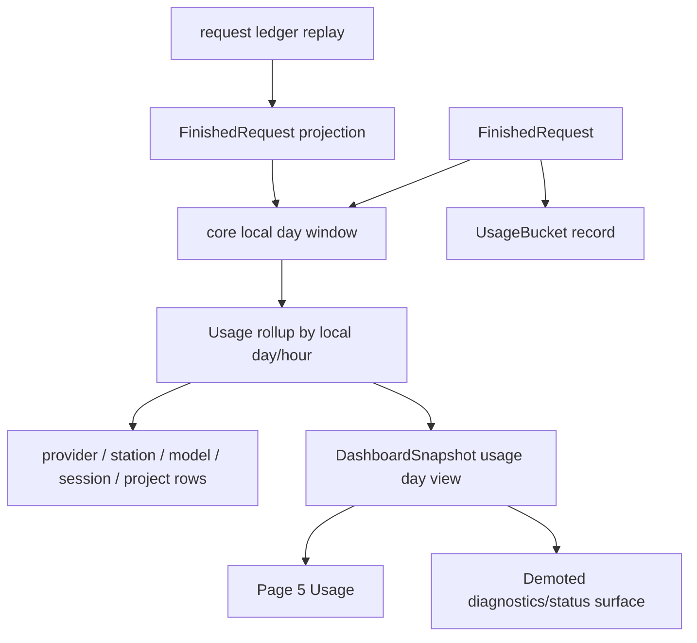

# TUI Usage Day Panel - Plan

## Goal Capsule

| Field | Value |
|---|---|
| Objective | Replace the current mixed TUI usage/status experience with a local-day usage panel that answers "what did I use today?" before balance, routing, or service diagnostics. |
| Authority | Local-day correctness, request-ledger coverage honesty, TUI scanability, existing request ledger compatibility, and current balance-refresh safeguards outrank cloning aio-coding-hub's longer history UI. |
| Execution profile | Deep refactor across core usage day semantics, startup replay, dashboard snapshot shape, TUI navigation, stats rendering, tests, and user docs. |
| Stop conditions | Stop if the design implies 7/15/30-day history from rolling JSONL alone, hides partial coverage, breaks old request ledger readability, or makes balance/service diagnostics unreachable. |
| Tail ownership | Land in dependency order, keep each unit reviewable, run focused nextest gates before workspace gates, and commit logical slices with conventional commit messages. |

---

## Product Contract

### Summary

codex-helper should make the TUI's primary usage surface a "today" dashboard instead of a diagnostics mashup.
The first version should promote usage to the page 5 slot, demote service status behind it, use local-day boundaries, show provider/station/model/session/project drivers for the current day, and state when local log coverage is partial.
Long-range heatmaps and 15-day panels are deferred until codex-helper has a durable usage store rather than only rolling JSONL and runtime rollups.

### Problem Frame

The current TUI already has a `6 用量` page, but it mixes today's usage, rolling window stats, balance refresh state, forecast/pacing, provider balance tables, and recent request hints.
That makes the page useful for debugging but weak as a daily usage panel.
It also computes day keys with `timestamp_ms / 86_400_000`, so "today" is a UTC day rather than the user's local day.

aio-coding-hub's useful lesson is not its 15-day history shape.
Its useful lesson is product priority: summary cards, provider leaderboard, cache/cost/speed columns, and local-day grouping make a daily panel immediately understandable.
codex-helper cannot honestly promise the same history horizon from `~/.codex-helper/logs/requests.jsonl`, because request logs are size-rotated and startup replay is bounded by bytes and lines.

### Requirements

**Daily usage surface**

- R1. The TUI should make the daily usage panel easier to reach than the service-status page.
- R2. The daily panel should show today's requests, success/error count, tokens, cache behavior, estimated cost, latency, and generation speed.
- R3. The daily panel should show top drivers for the selected day by provider, station, model, session, and project/folder when the source data exists.
- R4. The panel should include a 24-hour local-day activity shape for requests and tokens without implying multi-day retention.
- R5. The panel should keep balance/quota pacing visible as context but not let balance diagnostics dominate the primary screen.

**Data correctness and coverage**

- R6. Day buckets should use a single core local-day/window implementation shared by runtime rollup, startup replay, dashboard snapshots, and TUI rendering.
- R7. Existing rolling-window data should not be presented as complete history when replay byte, line, memory, or log-retention limits can truncate it.
- R8. Old request ledger entries should remain readable, with missing dimensions shown as unknown rather than dropped.
- R9. The usage panel should deduplicate live runtime data and replayed/request-ledger data by trace id where both are available.

**Navigation and diagnostics**

- R10. The TUI should promote usage to page 5 and move service status after usage, while preserving a route to service-status diagnostics.
- R11. The old stats/balance diagnostic affordances should either move into a secondary diagnostics mode or remain on the demoted status/diagnostics page.
- R12. Keyboard help and bilingual labels should match the new page responsibilities.

**Verification and docs**

- R13. Tests should cover local-day boundaries, replay grouping, partial coverage display, table ranking, and narrow-terminal rendering.
- R14. User docs/changelog should describe the TUI usage page as today/short-window analytics, not a long-term usage history product.

### Acceptance Examples

- AE1. Given a request ended at 23:30 UTC and the user's local day is UTC+08:00, when the TUI renders "today", then the request belongs to the next local day rather than the UTC date.
- AE2. Given startup replay loaded only the last request-log segment, when the daily panel renders, then it shows the loaded coverage and does not present a 15-day or complete-history chart.
- AE3. Given requests today used three providers and two models, when the usage page opens, then the primary table can rank the providers and models by token or cost without switching to balance diagnostics.
- AE4. Given a request has no model or cwd in an old ledger record, when daily aggregation runs, then the record still contributes to request/token totals and appears under an unknown bucket for missing dimensions.
- AE5. Given the user presses `5`, when the TUI is in normal navigation mode, then the usage panel opens; given the user needs service diagnostics, then the demoted status page remains reachable.
- AE6. Given a narrow terminal, when the usage page renders, then KPI text, hourly shape, and leaderboard rows fit without overlapping or making the layout jump.

### Scope Boundaries

In scope:

- Replacing the TUI usage page's primary composition with today-first analytics.
- Swapping or renaming TUI navigation so usage is page 5 and service status is demoted.
- Adding core local-day helpers and using them in usage rollup and replay.
- Extending core usage aggregation with hourly and dimension-specific daily rows where current request data already has the fields.
- Showing coverage/partial-history metadata rather than pretending the JSONL log is a durable analytics store.
- Updating tests and docs for the new behavior.

Deferred to follow-up work:

- A 7/15/30-day heatmap or calendar panel.
- A durable SQLite usage warehouse or background aggregate table.
- Importing rotated request-log files as a complete historical backfill.
- Replacing balance-refresh policy or provider usage parsing.
- Redesigning the Tauri desktop usage UI.

---

## Planning Contract

### Key Technical Decisions

- KTD1. Local-day semantics move into core. TUI should not compute day keys with its own `DAY_MS` constant; core should expose day keys and day windows so realtime rollup, replay, CLI, and TUI agree. The usage day is the host-local calendar day, not the quota reset window from `usage_forecast.reset_utc_offset`.
- KTD2. The first release is a today/short-window product. Aio's 15-day visualization is deferred because rolling JSONL plus bounded replay cannot prove complete retention.
- KTD3. Usage analytics and diagnostics split. The daily panel owns KPIs, hourly shape, and leaderboards; balance refresh details and service probes move to a diagnostics surface.
- KTD4. Existing logs stay readable before the schema gets richer. New dimensions can be added to rollups, but old records with missing model/session/cwd should contribute to totals under an unknown label.
- KTD5. Aggregation should operate on `FinishedRequest` projections where possible. Replaying raw JSON tuples repeats parsing logic and loses fields such as cost, model, session, and cwd.
- KTD6. Cost is contextual, not authoritative billing. The UI should label estimated cost and cost coverage so missing pricing does not look like zero spend.

### High-Level Technical Design

The core model should expose a day-view DTO rather than forcing TUI to reconstruct analytics from many low-level maps.
A practical shape is a `UsageDayView` or equivalent nested under `DashboardSnapshot`, containing the selected local day, start/end timestamps, coverage metadata, summary bucket, hourly rows, and ranked dimensions.
The older `UsageRollupView` can remain during migration for reports and existing stats helpers, but the new usage page should read the day-view shape.

### Sequencing

1. Add core local-day primitives and migrate existing usage rollup day keys away from UTC division.
2. Refactor startup replay to project log records into `FinishedRequest` and record through the same aggregation path as live requests.
3. Add a daily usage view DTO with hourly rows, dimension leaderboards, and coverage metadata.
4. Redesign the TUI usage page around the daily view and demote the old diagnostics-heavy content.
5. Swap TUI navigation labels/keys so usage becomes page 5 and service status moves after it.
6. Update tests, docs, changelog wording, and CLI/report compatibility where labels or assumptions changed.

### System-Wide Impact

- Core usage day grouping changes from UTC to local-day semantics, affecting dashboard snapshots, reports, and any test that asserted raw day integers.
- Startup replay becomes a higher-fidelity usage source because it can reuse request-ledger projection instead of duplicating partial parsing.
- Dashboard snapshot payload grows with a new day-view DTO, but the shape should be bounded to one day and top-N rows to avoid heavy admin API responses.
- TUI page numbering changes in a user-visible way: usage becomes easier to access and service status remains reachable after it.
- Existing balance/forecast code remains in place, but its rendering is no longer the dominant content of the primary usage page.

### Risks & Mitigations

| Risk | Mitigation |
|---|---|
| Local timezone behavior is hard to test across machines. | Implement the core day helper with testable fixed-offset inputs and use host-local conversion only at the boundary; if a timezone crate is added, declare it directly in `crates/core/Cargo.toml`. |
| Existing UTC day buckets in runtime state conflict with new local-day buckets after upgrade. | Recompute rollups from replay on startup and use the new helper for all newly finished requests; do not persist old in-memory day keys. |
| The daily panel undercounts when the request log rotated during the same day. | Surface coverage metadata and avoid claims like "all today" unless the loaded window starts before local day start. |
| Adding many dimensions makes the snapshot too large. | Bound each leaderboard by top-N and keep hourly data fixed to 24 rows. |
| Moving diagnostics hides an operator tool. | Keep service status and balance diagnostics reachable by numeric page and help text, and preserve `g` refresh where it already makes sense. |
| Cost estimates look like exact billing. | Reuse cost coverage labels and display unknown/partial pricing distinctly from zero. |

### Sources & Research

- `crates/tui/src/tui/i18n.rs` currently maps `5 状态` and `6 用量`.
- `crates/tui/src/tui/types.rs` currently orders `Page::ServiceStatus` before `Page::Stats`.
- `crates/tui/src/tui/view/stats.rs` computes today's day with `now_ms / 86_400_000` and renders mixed KPIs, coverage, runtime health, balance, and tables.
- `crates/core/src/state.rs` uses the same UTC-style day division in live finish, startup replay, view windows, and rollup pruning.
- `crates/core/src/logging.rs` sets request-log retention by size and file count, defaulting to 50 MB and 10 rotated files.
- `crates/core/src/state.rs` limits startup usage replay by `CODEX_HELPER_USAGE_REPLAY_MAX_BYTES` and `CODEX_HELPER_USAGE_REPLAY_MAX_LINES`, defaulting to 8 MB and 20,000 lines.
- `crates/core/src/request_ledger.rs` can project log records into `FinishedRequest` and summarize station/provider/model/session usage, but current summaries do not model local-day hourly views or cost.
- `repo-ref/aio-coding-hub/src-tauri/src/domain/usage_stats/bounds.rs` uses local-day SQL bounds for daily/weekly/monthly ranges.
- `repo-ref/aio-coding-hub/src/components/home/HomeTodayProviderUsageOverview.tsx` prioritizes today summary cards and provider rows with a 60-second refresh interval.
- `repo-ref/aio-coding-hub/src/components/usage/UsageTableColumns.ts` shows useful leaderboard columns: requests, success rate, tokens, cache, cost, cost share, cost per 1K, latency, TTFB, and speed.

---

## Implementation Units

### U1. Add core local-day usage primitives

- **Goal:** Replace ad hoc UTC day math with one core helper for local day keys, day windows, and hourly slots.
- **Requirements:** R4, R6, R13.
- **Files:** `crates/core/Cargo.toml`, `Cargo.lock`, `crates/core/src/usage_day.rs`, `crates/core/src/lib.rs`, `crates/core/src/state.rs`, `crates/tui/src/tui/view/stats.rs`.
- **Approach:** Add a small core module that can derive a day key, start/end timestamp, date label, and hour index from an event timestamp. Use a testable fixed-offset path for unit tests and a host-local path for normal runtime. Add a direct timezone dependency if needed because Rust `std` does not expose enough local calendar conversion. Replace direct `86_400_000` day division in usage rollup, usage view windowing, pruning, and TUI today selection.
- **Patterns:** Follow `usage_forecast.rs` for fixed-offset time arithmetic where it fits; keep the public helper small and independent of TUI.
- **Test Scenarios:** UTC midnight-adjacent requests map to the expected UTC+08 day; negative/early timestamps do not panic; pruning keeps the expected local-day range; TUI no longer computes today with a local constant.
- **Verification:** `cargo nextest run -p codex-helper-core usage_day --no-fail-fast`; `cargo nextest run -p codex-helper-core usage_rollup --no-fail-fast`.

### U2. Make usage rollup record richer `FinishedRequest` facts

- **Goal:** Give the daily panel enough source data for provider, station, model, session, project, cost, and hourly views.
- **Requirements:** R2, R3, R4, R6, R8, R9.
- **Files:** `crates/core/src/state/runtime_types.rs`, `crates/core/src/state.rs`, `crates/core/src/state/session_identity.rs`, `crates/core/src/request_ledger.rs`.
- **Approach:** Add a single rollup-recording path that accepts `FinishedRequest` or a lightweight reference to it and updates total, by-day, by-day-hour, by-provider-day, by-station-day, by-model-day, by-session-day, and by-project-day maps. Use unknown labels for missing dimensions. Prefer trace id for dedupe when a request appears through both runtime and replay paths.
- **Patterns:** Extend `UsageBucket::record` and current rollup maps rather than creating a separate aggregation engine with duplicate token/cost math.
- **Test Scenarios:** A request with model/session/cwd updates each matching dimension; an old ledger projection missing model/cwd still contributes to total and unknown rows; duplicated trace ids are counted once; cost coverage survives when a request has usage but unknown price.
- **Verification:** `cargo nextest run -p codex-helper-core state_usage_rollup request_ledger --no-fail-fast`.

### U3. Refactor startup replay through request-ledger projection

- **Goal:** Stop replay from manually parsing a narrow JSON tuple and make startup rollups use the same fields as live requests.
- **Requirements:** R6, R7, R8, R9, R13.
- **Files:** `crates/core/src/state.rs`, `crates/core/src/request_ledger.rs`, `crates/core/src/proxy/service_core.rs`, `crates/core/src/logging.rs`.
- **Approach:** Add a bounded replay reader that returns `FinishedRequest` projections plus coverage metadata: loaded first/last timestamp, byte/line truncation, and whether the requested day might be partial. Keep environment controls for max bytes and max lines. Reuse the rollup-recording path from U2.
- **Patterns:** Preserve `CODEX_HELPER_USAGE_REPLAY_ON_STARTUP`, `CODEX_HELPER_USAGE_REPLAY_MAX_BYTES`, and `CODEX_HELPER_USAGE_REPLAY_MAX_LINES`; avoid reading all rotated logs in this plan.
- **Test Scenarios:** Replay ignores other services; replay records model/session/cwd/cost when present; replay marks coverage partial when the scan starts after local day start; malformed lines are skipped without failing startup.
- **Verification:** `cargo nextest run -p codex-helper-core replay_usage request_ledger --no-fail-fast`.

### U4. Add a bounded daily usage snapshot view

- **Goal:** Expose one coherent day-view DTO for TUI and reports without requiring UI code to join low-level maps.
- **Requirements:** R2, R3, R4, R5, R7, R8, R13.
- **Files:** `crates/core/src/state/runtime_types.rs`, `crates/core/src/dashboard_core/snapshot.rs`, `crates/core/src/proxy/api_responses.rs`, `crates/tui/src/tui/model.rs`, `crates/tui/src/tui/report.rs`.
- **Approach:** Add `UsageDayView` with local date label, start/end timestamps, summary bucket, 24 hourly buckets, top-N rows by provider/station/model/session/project, and coverage status. Include cost coverage and pricing confidence. Mark the new snapshot field with serde defaults so newer TUI builds can tolerate older attached daemons during mixed-version use. Keep response size bounded and keep `UsageRollupView` available for existing consumers during the migration.
- **Patterns:** Follow `DashboardSnapshot` assembly in `dashboard_core/snapshot.rs` and TUI model conversion in `crates/tui/src/tui/model.rs`.
- **Test Scenarios:** Snapshot includes 24 hourly rows; top rows sort by cost when available and by tokens/request count as fallback; coverage warns when loaded data starts after day start; old snapshots without the field deserialize with default empty view in attached TUI tests.
- **Verification:** `cargo nextest run -p codex-helper-core dashboard_snapshot usage_day --no-fail-fast`; `cargo nextest run -p codex-helper-tui model --no-fail-fast`.

### U5. Redesign the TUI usage page around the day view

- **Goal:** Make the main usage page read as a daily analytics surface rather than a balance/status diagnostic surface.
- **Requirements:** R1, R2, R3, R4, R5, R7, R11, R12, R13.
- **Files:** `crates/tui/src/tui/view/stats.rs`, `crates/tui/src/tui/view/stats/summary.rs`, `crates/tui/src/tui/view/stats/tests.rs`, `crates/tui/src/tui/types.rs`, `crates/tui/src/tui/state.rs`, `crates/tui/src/tui/input/normal.rs`, `crates/tui/src/tui/attached.rs`, `crates/tui/src/tui/i18n.rs`.
- **Approach:** Rename the user-facing stats surface to usage/day where helpful, render top KPI blocks first, render a compact 24-hour activity row, and put leaderboards in the main lower region. Let `Tab` cycle dimensions instead of only station/provider. Move provider balance diagnostics, quota details, and service-status prose into a secondary diagnostics mode or the demoted status page.
- **Patterns:** Keep ratatui table state and narrow-layout handling from the current stats page; reuse `summary.rs` format helpers for cache, cost, TTFB, and speed labels.
- **Test Scenarios:** Rendered text contains today's totals and coverage warning; provider/model/session leaderboards are selectable; narrow terminal output does not overlap; balance diagnostics remain reachable; `g` refresh help appears only where balance refresh is available.
- **Verification:** `cargo nextest run -p codex-helper-tui stats --no-fail-fast`.

### U6. Promote usage to page 5 and demote service status

- **Goal:** Align navigation with the new product priority while keeping diagnostics reachable.
- **Requirements:** R1, R10, R11, R12, R13.
- **Files:** `crates/tui/src/tui/types.rs`, `crates/tui/src/tui/i18n.rs`, `crates/tui/src/tui/input/normal.rs`, `crates/tui/src/tui/attached.rs`, `crates/tui/src/tui/view/pages/mod.rs`, `crates/tui/src/tui/view/chrome.rs`, `crates/tui/src/tui/state.rs`.
- **Approach:** Swap the page order so `5 用量` opens the daily panel and service status moves after usage. Update footer/help labels, selection reset behavior, attached TUI key handling, and tests that assert page navigation.
- **Patterns:** Follow current numeric page mapping in `page_titles`, `page_index`, `attached.rs`, and `input/normal.rs`.
- **Test Scenarios:** Pressing `5` opens usage; pressing the new status key opens service status; footer labels match page order in Chinese and English; status refresh key still works on the status page.
- **Verification:** `cargo nextest run -p codex-helper-tui attached navigation state --no-fail-fast`.

### U7. Update docs, reports, and release wording

- **Goal:** Make user-facing wording match the new capability without promising long-term analytics.
- **Requirements:** R7, R12, R14.
- **Files:** `README.md`, `README_EN.md`, `CHANGELOG.md`, `docs/CONFIGURATION.md`, `docs/CONFIGURATION.zh.md`, `crates/tui/src/tui/report.rs`, `src/commands/usage.rs`.
- **Approach:** Describe TUI usage as local-day and short-window analytics. Mention that request-log retention is size-based and that long-range history needs a future durable store. Keep CLI `usage` commands compatible, and update report labels if they still imply UTC days or complete history.
- **Patterns:** Keep changelog concise and user-facing; do not document internal DTO names unless users configure them.
- **Test Scenarios:** Docs do not mention a 15-day heatmap as shipped; report output names partial coverage; CLI usage summary still works with old logs.
- **Verification:** `cargo nextest run -p codex-helper request_ledger usage --no-fail-fast`; manual doc scan for duplicated or overpromised wording.

---

## Verification Contract

| Gate | Command | Proves |
|---|---|---|
| Core local-day and rollup tests | `cargo nextest run -p codex-helper-core usage_day usage_rollup replay_usage request_ledger --no-fail-fast` | Local-day grouping, replay, dedupe, old log compatibility, and coverage metadata work. |
| Dashboard snapshot tests | `cargo nextest run -p codex-helper-core dashboard_snapshot --no-fail-fast` | The bounded day-view DTO is present and stable for admin/TUI consumers. |
| TUI usage/navigation tests | `cargo nextest run -p codex-helper-tui stats attached navigation state --no-fail-fast` | Page 5 opens usage, status remains reachable, and rendering survives compact layouts. |
| CLI/report compatibility | `cargo nextest run -p codex-helper usage request_ledger --no-fail-fast` | Existing usage commands and request-ledger readers continue to work. |
| Formatting | `cargo fmt --all --check` | Workspace formatting stays stable. |
| Lints | `cargo clippy --workspace --all-targets -- -D warnings` | Refactor does not introduce clippy warnings. |
| Full Rust suite | `cargo nextest run --workspace --no-fail-fast` | Cross-crate regressions are caught before release. |

---

## Definition of Done

| Scope | Done Signal |
|---|---|
| Local-day correctness | No production usage-day path computes day keys with raw UTC `timestamp / 86_400_000`; tests cover a timezone boundary case. |
| Daily usage DTO | Dashboard snapshots contain a bounded day-view with summary, 24 hourly buckets, dimension rows, and coverage metadata. |
| TUI product shape | Page 5 is the daily usage panel; service status is demoted but reachable; help/footer labels match the new navigation. |
| Coverage honesty | The UI distinguishes complete local-day coverage from partial replay/log coverage and does not render a 15-day history panel. |
| Compatibility | Old request ledger records remain readable and missing dimensions aggregate under unknown labels. |
| Diagnostics preservation | Balance and service diagnostics still have a discoverable route and keep their existing refresh behavior. |
| Docs | README/changelog/config docs describe today/short-window analytics and do not overpromise durable history. |
| Cleanup | Abandoned helper functions, duplicate UTC day constants, and dead stats rendering branches from the old layout are removed before final validation. |
