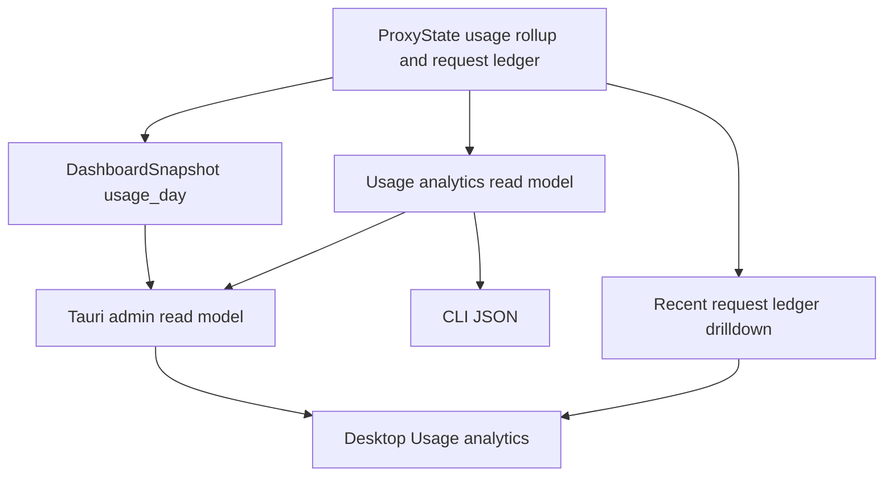
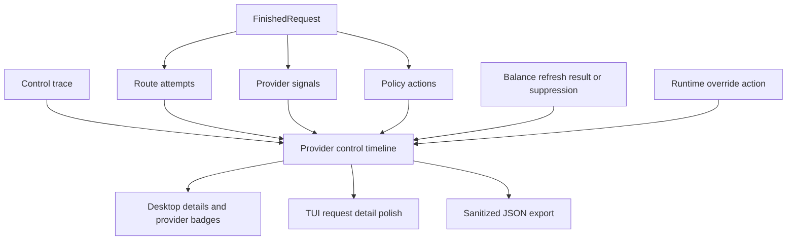
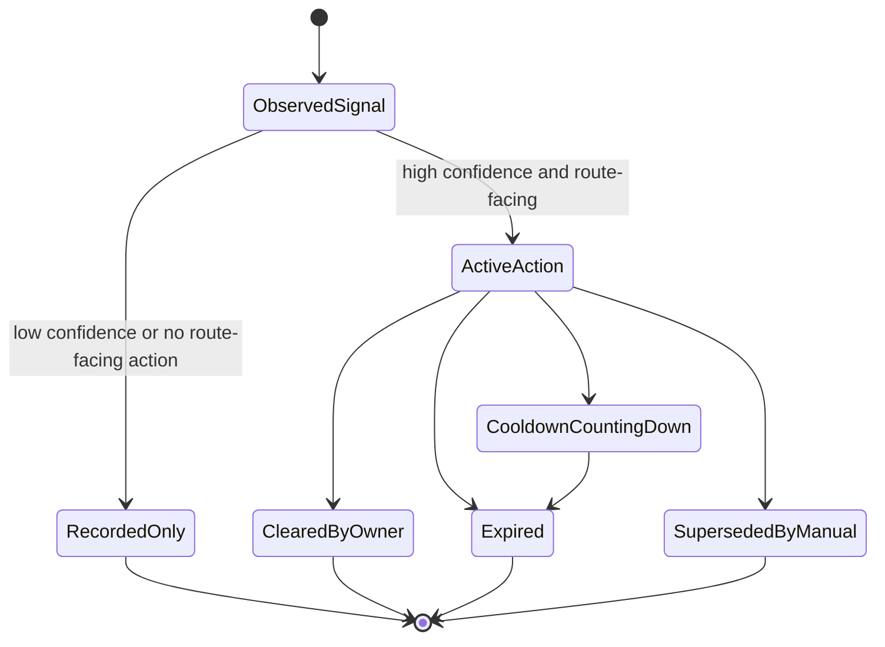
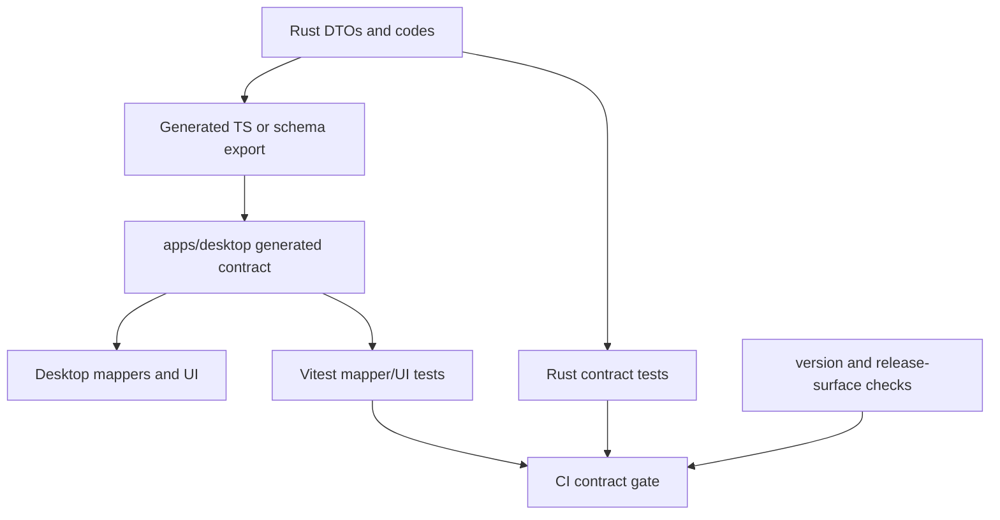

# Operator Analytics Contracts - Plan

## Goal Capsule

| Field | Value |
|---|---|
| Objective | Turn the existing core/TUI usage and provider-control foundations into stable desktop, Admin API, CLI, and CI contracts for daily usage analytics, request-chain diagnostics, provider control state, and release-surface validation. |
| Authority | Existing `UsageDayView`, request ledger compatibility, provider signal/policy action semantics, admin access safety, desktop operator ergonomics, and cargo-dist CLI release boundaries outrank copying aio-coding-hub wholesale. |
| Execution profile | Deep refactor across core read models, Admin API links, Tauri bridge DTOs, desktop Usage/Providers UI, TUI request evidence polish, generated type contracts, CI checks, and docs. |
| Stop conditions | Stop if implementation creates a second usage ledger, claims complete multi-day history from rolling JSONL, exposes secrets/raw headers by default, silently runs live upstream smoke tests, or publishes desktop installers through the public release path. |
| Tail ownership | Execute in dependency order, prefer proof-first or characterization-first changes for behavior-bearing units, run focused Rust/desktop gates before full workspace gates, and commit logical slices with conventional commit messages. |

---

## Product Contract

### Summary

codex-helper already has the core daily usage and TUI today panel that aio-coding-hub inspired.
This plan carries that foundation outward: desktop should consume the same usage-day truth, provider control evidence should become a readable and exportable timeline, stable codes should replace string-only contracts, and CI should enforce the desktop/API/release surfaces users rely on.

### Problem Frame

The current operator experience is uneven.
Core and TUI now have local-day usage rollups, coverage metadata, cache/cost accounting, retry-gate counts, provider signals, policy actions, and route attempts.
The desktop still builds its Usage page from recent request-ledger rows and a provider summary, which makes "today" depend on the last few rows rather than the canonical `UsageDayView`.

Provider control evidence has the opposite problem.
The data exists in request logs, route attempts, provider signals, policy actions, control trace, and routing explain, but desktop surfaces it as compact health labels and one-line request summaries.
Operators need to answer "why was this provider skipped, how long is the cooldown, what evidence caused it, and can I export the chain safely?" without reading raw JSONL.

The release and desktop contracts are also still too manual.
Tauri command and Admin API types are hand-written in TypeScript, CI does not run the desktop build/test gate, and version/release-surface drift has already caused release friction.
aio-coding-hub's useful lesson here is not its multi-CLI platform or plugin market; it is the executable contract discipline around usage APIs, generated bindings, support matrices, and user-readable diagnostics.

### Requirements

**Usage analytics**

- R1. Desktop Usage must use the core daily usage read model as the canonical source for today, hourly rows, dimensions, retry-gate counts, coverage, cache behavior, cost, latency, and token speed.
- R2. Request ledger recent rows must remain available for drilldown, but they must not be used to claim day totals.
- R3. Usage analytics must expose local-day, bounded-window, provider, station, model, session, project, status, cache, and cost-confidence dimensions through a typed read model.
- R4. Cache hit-rate and effective-input calculations must be owned by core semantics, not re-derived differently in React.
- R5. Partial coverage, replay disabled, byte/line truncation, and mixed-version missing fields must be shown as explicit coverage states.

**Provider control and diagnostics**

- R6. Request-chain diagnostics must show route attempts, decisions, stable codes, status/error class, provider endpoint identity, signals, policy actions, cooldown/reset hints, and final outcome.
- R7. Provider control badges must distinguish recorded-only signals from active route-facing policy actions.
- R8. Provider control timeline/export must merge request evidence, policy action state, balance refresh suppression/results, runtime overrides, and control trace when evidence is available.
- R9. Request-chain export must be sanitized by default and must not include provider secrets, auth headers, raw prompts, raw response bodies, or unredacted private payloads.
- R10. Provider refresh/reset actions must return typed, auditable results and must not silently clear broad state outside the targeted action.

**Cross-surface contracts**

- R11. Stable error/control codes must exist for route skip/control decisions, provider action failures, admin HTTP failures, desktop command failures, and live-smoke acknowledgement failures.
- R12. Human-readable desktop text may be localized, but tests and agents must assert stable code fields instead of matching prose.
- R13. Desktop-visible analytics, diagnostics, export, and provider actions must have Admin API or CLI JSON parity unless the plan marks the action human-only.
- R14. Tauri command and desktop Admin API DTOs must be generated or checked by a deterministic contract gate so Rust/TypeScript drift fails CI.

**Release and operations**

- R15. CI must run Rust format/clippy/nextest plus desktop install/build/test/type gates for the affected surface.
- R16. Version and release-surface checks must catch Cargo/package/Tauri/README/CHANGELOG drift and must keep public cargo-dist release artifacts CLI-only until desktop release gates are intentionally opened.
- R17. User docs and changelog must explain daily usage analytics, partial-history limits, control timeline export, stable codes, and the unchanged desktop public-release boundary.

### Acceptance Examples

- AE1. Given the daemon has a `UsageDayView` with 24 hourly rows and provider/model/project rows, when the desktop Usage page opens, then summary cards and charts use that view even if the recent request list is empty.
- AE2. Given request-log replay was truncated after local day start, when desktop and TUI show today's usage, then both show a partial-coverage warning instead of implying complete history.
- AE3. Given a provider returns a high-confidence rate-limit response with a reset horizon, when a later operator inspects the failed request, then the route attempt shows the stable rate-limit/control code, active cooldown action, provider endpoint, and remaining/reset information.
- AE4. Given a provider has one endpoint in active automatic cooldown and another endpoint normal, when the Providers page renders, then the badge identifies the controlled endpoint and does not mark the whole provider as uniformly blocked.
- AE5. Given a request chain is exported by trace id, then the JSON contains route attempts, sanitized signals/actions, stable codes, and evidence references, while raw secrets, auth headers, prompts, and response bodies are absent.
- AE6. Given an old daemon lacks the new usage analytics or typed error fields, when desktop connects, then it degrades with capability banners and defaults instead of crashing or showing false zeros.
- AE7. Given Cargo and desktop package versions drift, when CI runs, then the version-sync check fails before a tag/release can be cut.
- AE8. Given a desktop installer artifact appears in the public release surface without enabling the documented desktop release gate, when release-surface validation runs, then CI fails.

### Scope Boundaries

In scope:

- Reusing existing core `UsageDayView`, `UsageRollupView`, request ledger, provider signal, policy action, route attempt, and control trace data.
- Adding typed Admin API/CLI read models where desktop needs stable analytics or diagnostics.
- Redesigning desktop Usage around daily analytics and request drilldown.
- Adding desktop provider control badges/timeline panels and sanitized request-chain export.
- Adding stable code fields while keeping legacy string fields readable.
- Adding generated or drift-checked Rust/TypeScript contracts and CI/release checks.
- Updating TUI request detail only where stable codes or clearer control evidence need to surface.

Deferred to follow-up work:

- Durable SQLite or other indexed analytics warehouse.
- Complete 7/15/30-day heatmap with retention guarantees.
- Saved analytics views, custom SQL, or fleet-wide distributed usage aggregation.
- Full plugin runtime, extension host, marketplace, or aio-style multi-CLI workspace manager.
- General Codex MCP/Skills marketplace management; a focused doctor can be planned separately.
- Public desktop installer release, updater, Homebrew Cask, or `latest.json`.

Outside this product's identity:

- Mutating OAuth/MFA/CAPTCHA/password/token entry flows automatically.
- Revealing raw provider secrets or raw prompt/response payloads through desktop export.
- Running real upstream live smoke or model validation silently from CI, background refresh, or an autonomous agent.
- Replacing the v5 route graph with a quota-first scheduler.

---

## Planning Contract

### Assumptions

- The user pre-authorized full-scope planning and goal execution in this prompt, so the solo scoping confirmation is skipped; these assumptions are intentionally visible for review.
- The existing TUI daily usage work from `docs/plans/2026-07-07-002-refactor-tui-usage-day-panel-plan.md` is treated as implemented baseline, not new active scope.
- The first implementation should not introduce SQLite because current core rollups and request ledger already support the daily and recent-window surfaces this plan needs.
- Provider reset means targeted clearing of one explicit state kind: runtime override, owned automatic policy cooldown, or balance-refresh suppression. A broad "reset everything" action is outside this plan.
- Type generation may use `specta`, `ts-rs`, or a repo-local schema generator after implementation discovery, but the contract gate must be deterministic and CI-enforced.

### Key Technical Decisions

- KTD1. Core read models are authoritative; React mappers are presentation-only. Usage/cost/cache/control calculations should be produced or normalized by core/Admin API before desktop renders them.
- KTD2. JSONL request ledger remains canonical durable evidence for this plan. The plan adds typed projections and bounded exports, not a second durable ledger.
- KTD3. Use `snapshot.usage_day` immediately and add a smaller usage analytics endpoint only where desktop/CLI parity or payload size requires it. This keeps implementation grounded in the already-working daily rollup.
- KTD4. Provider control timeline is a shared read model. TUI, desktop, CLI JSON, and export should consume the same route attempt/signal/action interpretation instead of each rebuilding it from strings.
- KTD5. Stable codes are additive. Keep `reason`, `decision`, and `error_class` for log compatibility, but add `code` fields that tests, CI, desktop, and agents can rely on.
- KTD6. Tauri is a local host bridge, not the semantic contract. Admin API DTOs and capability flags define what exists; Tauri commands should fetch typed data and preserve section-level load errors instead of defaulting failures to empty arrays.
- KTD7. Live smoke remains acknowledgement-gated. Capability diagnostics can be read-only and agent-safe, but any action that sends a real upstream request must require explicit acknowledgement and return auditable evidence.
- KTD8. Release automation protects current product policy. CLI cargo-dist release remains public; desktop packaging remains internal/source-tree until signing, artifact hosting, updater, and rollback gates are explicitly enabled.

### High-Level Technical Design

### System-Wide Impact

- Admin API grows from mostly dashboard summary links into a typed operator contract that desktop, CLI JSON, and agents can share.
- Desktop changes from a recent-log viewer to a daily operator analytics surface while retaining request-ledger drilldown.
- TUI request details may gain stable code labels, but the already-implemented TUI daily usage page remains baseline.
- Provider action semantics become more visible, so mistaken cooldown, reset, or balance-suppression behavior will be easier to spot and more important to test.
- CI becomes stricter for desktop and release metadata, which may require local developer setup for `pnpm` and Tauri dependency checks.
- Release workflows remain CLI-focused; desktop artifacts are validated locally/CI but not publicly attached unless a later plan opens that gate.

### Risks & Mitigations

| Risk | Mitigation |
|---|---|
| Desktop keeps showing wrong totals because it falls back to recent request rows. | Make `UsageDayView` or the usage analytics endpoint the only source for day totals; use recent rows only in drilldown. |
| New timeline export leaks sensitive data. | Redact in core/export DTOs by default and test with secret-like headers/body fields. |
| Stable codes become another parallel taxonomy. | Reuse existing enum/code patterns such as routing explain skip reasons and map old strings into additive code fields. |
| Mixed daemon/desktop versions crash on missing fields. | Use serde/TS defaults, capability flags, section-level load states, and mapper tests with old fixtures. |
| Type generation becomes too invasive across core structs. | Generate only desktop-facing bridge/read-model DTOs first; keep internal core types free to evolve unless they are public contract. |
| Provider reset accidentally clears manual/operator state. | Split targeted reset actions by state kind and require typed result summaries that say exactly what changed. |
| CI becomes noisy or slow. | Add focused desktop build/test and contract checks first; keep high coverage thresholds and heavy release signing out of this plan. |
| Desktop release policy drifts during automation work. | Add release-surface checks and keep public installer/updater work deferred. |

### Sources & Research

- `docs/plans/2026-07-07-002-refactor-tui-usage-day-panel-plan.md` established the local-day usage panel and explicitly deferred desktop and long-history work.
- `crates/core/src/usage_day.rs` already owns local-day and fixed-offset helpers.
- `crates/core/src/state/runtime_types.rs` already defines `UsageDayView`, hourly rows, dimension rows, coverage, and retry-gate summary.
- `crates/core/src/dashboard_core/snapshot.rs` already includes `usage_day` and `usage_rollup` in `DashboardSnapshot`.
- `crates/tui/src/tui/view/stats.rs` already renders the TUI today usage panel.
- `apps/desktop/src-tauri/src/commands/admin_api.rs` currently fetches operator summary, providers, recent requests, and request-ledger summary into `serde_json::Value`.
- `apps/desktop/src/features/usage/UsagePage.tsx` and `apps/desktop/src/lib/api/mappers.ts` currently map desktop usage from recent requests and request-ledger summary.
- `crates/tui/src/tui/view/pages/requests.rs` already renders route attempts and provider control evidence for request details.
- `crates/core/src/routing_explain.rs` provides an existing stable-code pattern through code-bearing skip reasons.
- `repo-ref/aio-coding-hub/src/components/UsageHeatmap15d.tsx`, `repo-ref/aio-coding-hub/src/components/UsageProviderCacheRateTrendChart.tsx`, and `repo-ref/aio-coding-hub/src-tauri/src/domain/usage_stats/types.rs` informed the analytics shape, but this plan rejects AIO's SQLite warehouse for now.
- `repo-ref/aio-coding-hub/src/components/ProviderChainView.tsx` and `repo-ref/aio-coding-hub/src/components/ProviderCircuitBadge.tsx` informed request-chain and control-badge presentation.
- `repo-ref/aio-coding-hub/src-tauri/src/commands/registry.rs`, `repo-ref/aio-coding-hub/scripts/check-generated-bindings.mjs`, and `repo-ref/aio-coding-hub/scripts/support-matrix.mjs` informed type and release contract checks.

---

## Implementation Units

### U1. Promote daily usage into the desktop contract

- **Goal:** Make desktop read the existing daily usage model through typed DTOs with section-level load status.
- **Requirements:** R1, R2, R3, R5, R13.
- **Dependencies:** None.
- **Files:** `apps/desktop/src-tauri/src/commands/admin_api.rs`, `apps/desktop/src/lib/tauri/commands.ts`, `apps/desktop/src/lib/api/admin-read-model.ts`, `apps/desktop/src/lib/api/admin-types.ts`, `apps/desktop/src/lib/api/mappers.ts`, `apps/desktop/src/lib/api/mappers.test.ts`, `apps/desktop/src/app/App.test.tsx`.
- **Approach:** Extend `AdminReadModel` to fetch typed snapshot or a smaller usage analytics endpoint that includes `UsageDayView`, while preserving old-daemon tolerance. Replace silent `unwrap_or_default()` section failures with explicit section status so empty data and fetch failures are distinguishable.
- **Execution note:** Start with mapper/fixture tests proving recent request rows no longer define today totals.
- **Patterns to follow:** Use `DashboardSnapshot` assembly from `crates/core/src/dashboard_core/snapshot.rs` and desktop mapper tests in `apps/desktop/src/lib/api/mappers.test.ts`.
- **Test scenarios:** Given `usage_day.summary.requests_total=12` and no recent rows, mapper returns 12 day requests; given old payload missing `usage_day`, mapper degrades to empty daily analytics with a capability warning; given providers fetch fails but usage succeeds, Usage page still renders daily data and a section warning; given replay partial coverage, mapper preserves `partial_reason`.
- **Verification:** Desktop mapper and app tests prove typed daily usage survives empty recent rows, old payloads, and section errors.

### U2. Redesign desktop Usage around daily analytics

- **Goal:** Replace the desktop Usage page's recent-ledger-first layout with a daily analytics workbench backed by `UsageDayView`.
- **Requirements:** R1, R2, R3, R4, R5, R17.
- **Dependencies:** U1.
- **Files:** `apps/desktop/src/features/usage/UsagePage.tsx`, `apps/desktop/src/features/usage/UsageTable.tsx`, `apps/desktop/src/features/usage/hooks.ts`, `apps/desktop/src/lib/api/types.ts`, `apps/desktop/src/lib/api/mappers.ts`, `apps/desktop/src/lib/api/mappers.test.ts`, `apps/desktop/src/app/App.test.tsx`.
- **Approach:** Add summary cards, a 24-hour activity chart, provider/model/session/project leaderboards, coverage banner, retry-gate panel, and request drilldown table. Keep the design dense and operator-focused; use existing `MetricCard`, `DataStateBanner`, table, and Recharts dependency rather than introducing a new visual system.
- **Execution note:** Browser or component-level responsive inspection should verify desktop and narrow widths because this is user-visible UI.
- **Patterns to follow:** Mirror the TUI information hierarchy in `crates/tui/src/tui/view/stats.rs` and desktop component style in `apps/desktop/src/features/dashboard/DashboardPage.tsx`.
- **Test scenarios:** Usage page shows daily totals from `usage_day`; coverage partial banner appears when `day_may_be_partial` is true; hourly chart handles all-zero rows; provider/model/project rows sort by cost/tokens according to mapper rules; recent request table remains available as drilldown; empty state distinguishes "no usage today" from "admin API failed".
- **Verification:** Desktop tests and build show the Usage page renders daily analytics without relying on request-ledger summary as the source of truth.

### U3. Add shared request-chain and control timeline read models

- **Goal:** Expose a sanitized request-chain/timeline model that desktop, CLI JSON, export, and TUI can share.
- **Requirements:** R6, R8, R9, R13, R17.
- **Dependencies:** U1.
- **Files:** `crates/core/src/logging.rs`, `crates/core/src/logging/control_trace.rs`, `crates/core/src/request_ledger.rs`, `crates/core/src/proxy/runtime_admin_api.rs`, `crates/core/src/proxy/control_plane_manifest.rs`, `src/commands/usage.rs`, `apps/desktop/src/lib/api/admin-types.ts`, `apps/desktop/src/lib/api/mappers.ts`, `apps/desktop/src/lib/api/mappers.test.ts`, `apps/desktop/src/features/usage/UsageTable.tsx`, `crates/tui/src/tui/view/pages/requests.rs`.
- **Approach:** Build a timeline DTO from `FinishedRequest.retry.route_attempts_or_derived`, top-level provider signals/actions, and matching control trace entries when available. Add sanitized export by trace/request/session identity with stable ordering and redaction.
- **Execution note:** Add characterization coverage around current route attempt rendering/export before changing DTO shape.
- **Patterns to follow:** Use `request_route_attempt_line` in `crates/tui/src/tui/view/pages/requests.rs` as the current evidence inventory and keep `request_ledger.rs` legacy readers tolerant.
- **Test scenarios:** Single successful request exports one final attempt; 429 with reset exports signal/action/cooldown evidence; route-unavailable exports skipped candidates and final failure; old ledger with only upstream chain derives attempts; export omits auth headers, raw prompt, raw body, and provider secrets; session export orders multiple requests by time.
- **Verification:** Core request-ledger/runtime-admin tests and desktop mapper tests prove request-chain export is complete, ordered, and redacted.

### U4. Add provider control badges and targeted actions

- **Goal:** Make provider control state visible and actionable without conflating signals, cooldowns, manual overrides, balance exhaustion, and breaker state.
- **Requirements:** R7, R8, R10, R13.
- **Dependencies:** U3.
- **Files:** `crates/core/src/policy_actions/model.rs`, `crates/core/src/state/policy_action_store.rs`, `crates/core/src/dashboard_core/operator_summary.rs`, `crates/core/src/dashboard_core/types.rs`, `crates/core/src/proxy/runtime_admin_api.rs`, `crates/core/src/proxy/control_plane_manifest.rs`, `apps/desktop/src/features/providers/ProviderCard.tsx`, `apps/desktop/src/features/providers/ProvidersPage.tsx`, `apps/desktop/src/features/runtime/actions.ts`, `apps/desktop/src/lib/api/mappers.ts`, `apps/desktop/src/lib/api/mappers.test.ts`, `crates/tui/src/tui/view/provider_control.rs`, `crates/tui/src/tui/view/pages/stations.rs`.
- **Approach:** Add a provider/endpoint control summary with active action counts, top reason, max remaining cooldown, source kind, and endpoint identity. Add targeted action results for clearing owned cooldowns or runtime overrides while preserving manual state boundaries.
- **Execution note:** Treat mutation tests as safety-critical because an overly broad reset could alter routing.
- **Patterns to follow:** Extend existing runtime override and policy action projection patterns; do not add a separate circuit-breaker state machine.
- **Test scenarios:** Provider with only recorded signal shows evidence but no active-control badge; one endpoint cooldown shows endpoint-specific badge and countdown; manual disable plus automatic cooldown shows both states and clearing owned cooldown preserves manual disable; targeted reset returns typed changed/unchanged counts; old providers without policy actions render normally.
- **Verification:** Core policy/action tests, runtime-admin tests, and desktop provider tests prove badge semantics and targeted action boundaries.

### U5. Introduce stable error and control codes

- **Goal:** Add stable machine-readable codes across route decisions, provider control, admin failures, and desktop command failures while retaining legacy text fields.
- **Requirements:** R6, R11, R12, R14.
- **Dependencies:** U3.
- **Files:** `crates/core/src/routing_explain.rs`, `crates/core/src/logging.rs`, `crates/core/src/provider_signals/model.rs`, `crates/core/src/policy_actions/model.rs`, `crates/core/src/proxy/runtime_admin_api.rs`, `apps/desktop/src-tauri/src/error.rs`, `apps/desktop/src-tauri/src/commands/admin_api.rs`, `apps/desktop/src/lib/tauri/commands.ts`, `apps/desktop/src/lib/api/admin-types.ts`, `apps/desktop/src/lib/api/mappers.ts`, `apps/desktop/src/lib/api/mappers.test.ts`, `crates/tui/src/tui/i18n.rs`, `crates/tui/src/tui/view/pages/requests.rs`.
- **Approach:** Define additive `code` fields for existing decision/error/control categories, map current strings into those codes, and convert desktop command errors into structured envelopes containing code, message, retryability, and optional hint/details.
- **Execution note:** Characterize current string-only behavior first so compatibility fields are not accidentally removed.
- **Patterns to follow:** Follow `RoutingExplainSkipReason::code()` style and preserve serde defaults for older logs.
- **Test scenarios:** Known route skip reasons produce stable codes; unknown legacy reason maps to an `unknown` or `legacy` code without data loss; admin connection refused produces a desktop code instead of only a message; provider not found and live-smoke missing acknowledgement return distinct codes; UI tests assert code-derived categories rather than prose.
- **Verification:** Core serialization tests, desktop command tests, and mapper tests prove stable codes are present and backward compatible.

### U6. Add generated or drift-checked desktop API contracts

- **Goal:** Stop relying on hand-maintained TypeScript DTOs for the desktop contract.
- **Requirements:** R14, R15, R16.
- **Dependencies:** U1, U5.
- **Files:** `apps/desktop/src-tauri/Cargo.toml`, `apps/desktop/src-tauri/src/lib.rs`, `apps/desktop/src-tauri/src/commands/mod.rs`, `apps/desktop/src-tauri/src/commands/admin_api.rs`, `apps/desktop/src/lib/api/admin-types.ts`, `apps/desktop/src/lib/tauri/commands.ts`, `apps/desktop/src/generated/`, `apps/desktop/scripts/`, `apps/desktop/package.json`, `.github/workflows/ci.yml`.
- **Approach:** Introduce a deterministic binding/schema export for Tauri command payloads and desktop-facing Admin read model DTOs. Keep generated files under a dedicated generated directory and keep hand-written view models/mappers separate.
- **Execution note:** This is mostly contract/tooling work; prefer generation-drift and build/test verification over broad behavioral tests.
- **Patterns to follow:** Borrow the contract-gate shape from `repo-ref/aio-coding-hub/scripts/check-generated-bindings.mjs`, but keep the dependency surface smaller than AIO's full command registry if implementation discovery supports it.
- **Test scenarios:** Running the generator twice is stable; changing a Rust DTO without regenerating fails the contract check; generated TS imports do not replace hand-written UI view models; CI fails if generated contract output drifts; old mock data compiles against the generated contract.
- **Verification:** Desktop generation check, Vitest, TypeScript build, and CI workflow changes prove Rust/TS contract drift is caught.

### U7. Add CI, version, and release-surface checks

- **Goal:** Make the repo's release and desktop gates executable instead of relying on manual release discipline.
- **Requirements:** R15, R16, R17.
- **Dependencies:** U6.
- **Files:** `.github/workflows/ci.yml`, `.github/workflows/release.yml`, `.github/workflows/docker-publish.yml`, `Cargo.toml`, `crates/core/Cargo.toml`, `crates/tui/Cargo.toml`, `crates/server/Cargo.toml`, `apps/desktop/package.json`, `apps/desktop/src-tauri/Cargo.toml`, `apps/desktop/src-tauri/tauri.conf.json`, `dist-workspace.toml`, `scripts/`, `README.md`, `CHANGELOG.md`, `docs/DESKTOP_RELEASE.md`.
- **Approach:** Add repo-local check scripts for version sync, release-surface policy, and desktop CI gates. CI should install desktop dependencies, run desktop tests/build, and validate that public release artifacts stay CLI/server-scoped according to current docs.
- **Execution note:** Keep checks deterministic and local; do not introduce a public desktop updater or installer release in this unit.
- **Patterns to follow:** Adapt the contract philosophy from `repo-ref/aio-coding-hub/scripts/run-checks.mjs` and `repo-ref/aio-coding-hub/scripts/support-matrix.mjs` without copying AIO's Tauri public release matrix.
- **Test scenarios:** Version mismatch across Cargo/package/Tauri config fails; README/CHANGELOG current version mismatch fails; CI runs desktop test/build path; release-surface check fails when a desktop installer is listed for public release; Docker workflow remains independent and does not require desktop packaging.
- **Verification:** Local scripts and CI workflow syntax prove desktop/build/version/release gates run in the expected jobs.

### U8. Update documentation and operator guidance

- **Goal:** Make user-facing docs match the new analytics, diagnostics, contracts, and release boundaries.
- **Requirements:** R5, R9, R10, R11, R16, R17.
- **Dependencies:** U2, U3, U4, U5, U7.
- **Files:** `README.md`, `README_EN.md`, `CHANGELOG.md`, `docs/CONFIGURATION.md`, `docs/DESKTOP_RELEASE.md`, `docs/workstreams/tauri-desktop-client/`, `docs/plans/2026-07-08-001-refactor-operator-analytics-contracts-plan.md`.
- **Approach:** Update docs to describe daily usage as today/short-window analytics with coverage warnings, explain request-chain export redaction, document provider control badge/action semantics, list stable code usage for troubleshooting, and reaffirm that desktop public release remains gated.
- **Execution note:** Keep changelog user-facing and concise; do not expose implementation-only details unless users need them to operate the tool.
- **Patterns to follow:** Match the bilingual release-note style already present in `CHANGELOG.md` and the desktop release policy wording in `docs/DESKTOP_RELEASE.md`.
- **Test scenarios:** README does not claim complete multi-day analytics; docs mention partial coverage and export redaction; changelog does not repeat internal implementation bullets; desktop release docs still say public installers are not shipped; code examples avoid secrets.
- **Verification:** Documentation review confirms the new user-visible behavior is clear, non-duplicative, and aligned with current release policy.

---

## Verification Contract

| Gate | Applies to | Done signal |
|---|---|---|
| Core focused nextest | U3, U4, U5 | Request ledger, routing explain, provider signal, policy action, runtime admin, and export tests pass. |
| TUI focused nextest | U3, U5 | Request detail and provider-control rendering tests pass with stable code/evidence fixtures. |
| Desktop Rust nextest | U1, U5, U6 | Tauri command DTO/error tests pass. |
| Desktop Vitest | U1, U2, U3, U4, U5, U6 | Mapper, page, provider badge, and generated-contract tests pass. |
| Desktop build | U2, U6, U7 | TypeScript and Vite build succeeds with generated contracts. |
| Workspace Rust quality | All Rust units | `cargo fmt`, clippy, and workspace nextest remain green. |
| Contract drift | U6, U7 | Generated bindings/schema check reports no uncommitted diff. |
| Version/release checks | U7, U8 | Version sync and release-surface policy checks pass. |
| Docs review | U8 | README/CHANGELOG/desktop release docs match implemented behavior and do not claim deferred surfaces. |

---

## Definition of Done

- Desktop Usage uses core daily usage analytics for day totals and uses request-ledger rows only for drilldown.
- Desktop and CLI/API can expose sanitized request-chain diagnostics with stable codes and no secret leakage.
- Provider cards distinguish active route-facing control from recorded-only evidence and targeted actions return typed audited results.
- Stable code fields are additive, documented, tested, and used by desktop/TUI where machine checks matter.
- Desktop-facing Rust/TypeScript contracts are generated or drift-checked in CI.
- CI runs desktop build/test and release/version checks alongside existing Rust gates.
- Public release workflows remain CLI/server scoped; desktop public installers remain gated and documented as not released.
- User-facing docs and changelog are concise, non-duplicative, and aligned with the shipped behavior.
- Abandoned experimental code and duplicate mappers/read models introduced during implementation are removed before final landing.
