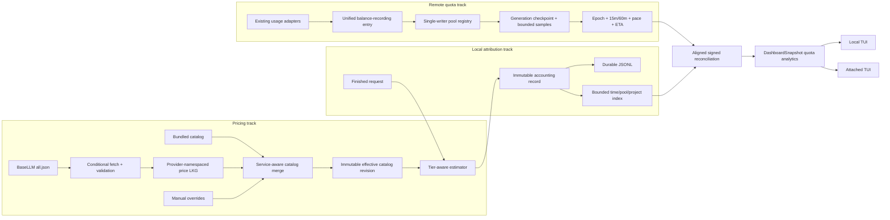

# Remote Quota Pace and BaseLLM Pricing - Plan

## Goal Capsule

| Field | Value |
|---|---|
| Objective | Make the TUI answer how much shared remote quota was consumed, whether the current 15/60-minute pace will exhaust it before its real reset, and how much locally observed usage belongs to each project, while making BaseLLM-backed cost estimates tier-aware and automatically refreshed. |
| Authority | Remote quota-pool counters are authoritative for shared total burn. The local request ledger is authoritative only for local request and project attribution. Manual pricing overrides outrank validated remote prices, and no inferred identity may be presented as an exact shared pool. |
| Execution profile | Deep cross-cutting feature work across atomic persistence, provider usage adapters, pricing, request-ledger provenance, proxy lifecycle sampling, core analytics DTOs, attached TUI compatibility, TUI rendering, CLI status, tests, and bilingual documentation. |
| Stop conditions | Stop if an implementation scales local request prices from shared remote burn, distributes external usage across local projects, persists raw credentials, sums pools whose shared identity is unproven, overwrites a valid cache with an invalid candidate, or labels a rolling/reset-unknown window as a calendar day. |
| Tail ownership | Land dependency-ordered units with focused nextest gates, preserve old JSONL and attached-daemon readability, remove superseded calibration and cache-writing paths, and finish with workspace formatting, lint, and test gates. |

---

## Product Contract

### Summary

codex-helper should treat remote relay counters and local request records as two complementary products.
The remote side should report shared quota-pool burn, 15/60-minute rates, reset-aware pace, remaining balance, and exhaustion ETA even when another computer uses the same key.
The local side should report estimated cost by Git project and preserve an explicit external/unattributed remainder instead of pretending every remote dollar came through this proxy.

Cost estimates should load a validated BaseLLM last-known-good catalog automatically, select the canonical provider for the active service, honor context tiers, and keep `pricing_overrides.toml` as the highest-priority manual layer.
The relay's remote billed counters remain the financial source of truth; BaseLLM remains a third-party estimate catalog.

### Problem Frame

The current Page 5 Usage view already provides a local-day `UsageDayView`, 24 hourly buckets, and provider/station/model/session/project summaries.
That earlier work should remain the local analytics baseline rather than being planned again.
Its project key is still the raw `cwd`, its project list is a short side summary, and its fourth KPI block is Retry Gate rather than a user-facing quota pace answer.

Remote balance adapters already expose `today_used_usd`, cumulative usage, remaining quota, limits, and reset timestamps for common relays.
Their history is grouped by station/upstream/provider in a process-local 64-point deque, refresh is mainly startup/request/manual driven, and duplicate routing/station observations can represent the same remote pool.
This cannot observe another computer during local idle time, survive a restart, or justify an exact combined total.

The current pricing importer fetches BaseLLM only on an explicit CLI command, flattens every provider by bare model ID, imports base prices only, and writes the result into the manual override file.
The background BaseLLM metadata job fetches the same JSON with validators but does not update pricing.
For `gpt-5.6-sol`, this misses the strict `> 272000` context tier and underprices the affected requests.

### Actors

- A1. A local operator uses the interactive or attached TUI to monitor daily package consumption and decide whether the current pace is sustainable.
- A2. The proxy daemon owns remote sampling, persistence, cost capture, project attribution, and the snapshot contract.
- A3. An attached TUI reads daemon-owned state and must distinguish unsupported old-daemon payloads from real zero usage.
- A4. A maintainer uses pricing CLI commands to inspect, refresh, or explicitly promote remote rows into manual overrides.

### Requirements

**Remote quota pools and sampling**

- R1. Remote key, wallet, or subscription counters must be the total-burn source for their declared scope, including consumption produced by other computers or keys when the scope says they share the pool.
- R2. Every remote observation must carry a secret-free pool identity, scope, source, counter semantics, capability set, identity confidence, and aggregation eligibility before snapshots are deduplicated or summed.
- R3. Pool identity precedence must be remote stable pool ID, then explicit `quota_pool_id`, then endpoint origin plus scope plus a keyed local credential fingerprint; ambiguous identities must stay separate and must not produce a trusted combined total.
- R4. A single proxy-runtime-owned sampler must refresh supported pools while local request traffic and the TUI are idle, reuse provider throttling/suppression, honor shutdown, and avoid duplicate samplers in attached clients.
- R5. A versioned bounded store under `~/.codex-helper/state/` must retain the current period anchor, recent dense samples, last successful observation, adjustment/epoch markers, and enough cross-restart state for 15/60-minute analysis without becoming a per-request usage warehouse.
- R6. Reset, top-up, refund, counter rollback, plan/limit change, out-of-order response, stale carry-forward, and settlement delay must segment or invalidate a rate window rather than become negative or fabricated spend.
- R7. New API quota-unit conversion must prefer the relay's per-origin `quota_per_unit`, then an explicit configured divisor, and otherwise expose raw/estimated units with reduced confidence rather than silently claiming the default divisor is exact USD.

**Rate, pacing, and attribution**

- R8. Core analytics may display a fresh authoritative remote daily/window total from one valid observation. It must calculate 15-minute and 60-minute burn rates, required rate until the explicit reset, pace ratio, exhaustion ETA, and projected reset balance only from enough fresh samples in one continuous epoch; low-sample state must suppress those derived values without hiding the direct total.
- R9. Calendar day, rolling 24-hour, custom subscription window, and reset-less wallet semantics must remain distinct; the UI may say "today" or "midnight" only when the source contract proves that meaning.
- R10. Local project attribution must normalize new requests to a Git root when possible, retain a canonical path fallback and unknown bucket, and intersect requests with their provider endpoint/pool instead of comparing every local request with every remote pool.
- R11. Reconciliation must expose local priced projects, local unknown project, external/unattributed positive remainder, and a signed negative reconciliation gap; remote deltas must never multiply local request prices or be proportionally assigned to projects.
- R12. When the remote and local windows, pool identity, pricing coverage, or request-log coverage do not align, the snapshot must lower confidence and show the observed start/coverage rather than invent a full-day allocation.

**Pricing and request cost provenance**

- R13. BaseLLM imports must remain provider-namespaced and choose a deterministic canonical provider for the active service, with `codex -> openai` as the first required mapping; bare-model deduplication across unrelated providers is not allowed.
- R14. `ModelPrice`, remote cache rows, local override rows, snapshots, and cost calculation must support context tiers as per-field overlays on the base price.
- R15. A context tier must use billable ordinary input plus cache-read input for threshold selection, use a strict greater-than comparison, apply the selected tier to the whole request, and apply service/provider multipliers only after component costs.
- R16. Automatic BaseLLM synchronization must use conditional HTTP requests, hard response limits, semantic validation, last-known-good promotion, source metadata, bounded retry/backoff, and failure retention without writing `pricing_overrides.toml`.
- R17. Effective catalog precedence must be `bundled < validated remote LKG < local manual override`; a manual row replaces the whole model, including remote tiers, and its effective shadowing must be visible in status output.
- R18. Each new request-log record must preserve its calculated cost, selected tier, effective pricing source/generation, stable project root, and provider endpoint/pool attribution key so restart replay does not silently reprice it; old records remain readable and are explicitly marked as reconstructed estimates.

**TUI, compatibility, and operations**

- R19. Core must expose a bounded quota-pool analytics DTO beside `UsageDayView`; the TUI must not independently deduplicate pools, calculate slopes, infer resets, or reconcile projects.
- R20. Page 5 must make pool consumption and pace first-viewport signals, provide scrollable pool and project views, preserve local-day provider/station/model/session context, and cover fresh, syncing, stale, offline, unsupported, ambiguous, unlimited, exhausted, just-reset, and low-sample states.
- R21. New snapshot fields must use explicit capabilities and serde defaults so a new attached TUI labels an old daemon as unsupported rather than showing missing values as zero.
- R22. No raw key, bearer token, console credential, full credential hash, or unsanitized provider error may appear in persisted samples, admin snapshots, TUI output, reports, or tests.
- R23. CLI status, configuration docs, README, and changelog must explain remote source/scope, sampling age, price source/generation, tier behavior, override precedence, coverage limits, and the difference between remote billed usage and local estimated attribution.

### Key Flows

- F1. On daemon startup, load valid quota and BaseLLM LKG state first, expose it with age/confidence, then start one background price sync and one shutdown-aware provider sampler. Invalid state fails open to bundled/no-history behavior without deleting the last readable file.
- F2. On the Usage page, select a quota pool and read its remote settled/observed usage, remaining quota, 15/60-minute rate, required rate, reset, pace, ETA, freshness, source, scope, and confidence. Low-sample or stale pools terminate in an explicit unavailable/frozen prediction state.
- F3. Switch to Projects to inspect all locally observed Git-root rows matched to the selected pool, followed by local unknown, external/unattributed, and signed reconciliation status for the same aligned window.
- F4. During BaseLLM sync, send stored weak ETag and Last-Modified validators, promote a valid canonical-provider catalog on 200, retain body and validators on 304, and retain the prior LKG on any transport, HTTP, body, schema, semantic, sanity, or pre-commit replacement failure. If replacement may already have committed before reporting an error, reread and validate the destination, adopt whichever complete old/new LKG is present, and rebuild the effective catalog from that recovered state.
- F5. When attached to an older daemon, continue rendering the existing local-day view and label remote quota analytics as unsupported; do not start local polling or interpret default DTO values as a real empty pool list.

### Acceptance Examples

- AE1. Given two computers consume the same key and the remote pool burns `$100` while this daemon records `$60` of aligned priced requests, the pool shows `$100` total, `$60` local projects, and `$40` external/unattributed without changing any local request price.
- AE2. Given two station/routing observations carry the same authoritative pool key, they collapse to one pool; given two keys might share a wallet but have no authoritative or explicit shared ID, they remain separate and no trusted grand total is shown.
- AE3. Given sampling first starts at 10:00 with no remote today field or retained reset anchor, the UI says "observed since 10:00" and does not backfill midnight-to-10:00 usage.
- AE4. Given a counter resets near its declared boundary, the next valid observation opens a new epoch; given the same decrease occurs away from a boundary, the interval is marked adjustment/inconsistent and excluded from the rate.
- AE5. Given exactly 272,000 ordinary-plus-cache-read input tokens, base prices apply; given 272,001, the selected context tier prices the entire request and no second long-context multiplier is applied.
- AE6. Given a valid BaseLLM LKG and a later 304 without validators, the body and previous validators remain unchanged while `last_checked_at` advances; given malformed 200 or 500, the old LKG remains effective.
- AE7. Given BaseLLM has the same model ID under `openai` and `routing-run` with different prices, Codex selects the namespaced `openai` row and status exposes that provenance.
- AE8. Given a manual override supplies base prices without tiers for a model that has remote tiers, the manual whole-model row wins, the remote tiers do not leak through, and status reports that the manual row shadows them.
- AE9. Given requests originate from two subdirectories of one Git repository, the project table combines them under the Git root; missing or deleted paths remain in explicit fallback/unknown coverage.
- AE10. Given a new TUI reads a legacy snapshot without quota analytics fields, local day usage remains usable and remote analytics render unsupported instead of `$0`.
- AE11. Given the supplied 8,405-row `gpt-5.6-sol` audit data, the tier-aware estimator reproduces `$501.493510` for 2026-07-11, `$500.108175` for 2026-07-12, and `$1,001.601685` total with zero row residual.

### Scope Boundaries

In scope:

- Shared-pool analytics for the existing common relay balance/usage adapter family.
- Secret-free pool identity, capability discovery, New API unit conversion, and explicit operator pool IDs.
- Daemon-owned bounded JSON state for quota samples and last-known-good BaseLLM pricing.
- Context-tier pricing, canonical provider selection, automatic BaseLLM refresh, and deterministic manual override precedence.
- Stable request cost/project/pool provenance for new JSONL records and tolerant replay of old records.
- Core dashboard snapshot, local and attached TUI behavior, TUI report/export, CLI pricing status/refresh, focused tests, and bilingual documentation.

Out of scope:

- A durable SQLite usage warehouse, long-range per-request analytics, or rotated-log backfill guarantees.
- Tauri desktop redesign or other GUI surface work.
- Arbitrary new relay protocols, generic user-console JWT login flows, or administrator-only upstream-account capacity APIs.
- Automatic changes to routing, provider accounts, keys, subscriptions, or third-party dashboards.
- Exact invoice claims for BaseLLM-derived local costs or exact project attribution for usage not observed by this daemon.
- Cross-machine event ingestion beyond what the remote pool counter already includes.

---

## Planning Contract

### Key Technical Decisions

- KTD1. Keep local-day and remote-period analytics as separate core contracts. `UsageDayView` continues to describe locally observed calendar-day requests; a new quota-pool view owns remote scope, epoch, rate, reset, prediction, confidence, and aligned reconciliation.
- KTD2. Pool identity is evidence-ranked, issuer-namespaced, and revisioned. A remote ID is scoped by origin/issuer plus remote scope before it may merge endpoints; explicit `quota_pool_id` is next; a domain-separated credential digest keyed by a persistent per-install identity key may merge repeated local views of the same key. Every request always captures `ProviderEndpointKey` and captures a pool-membership revision only when evidence already exists. Identity upgrades or credential/key rotation start a new revision and never retroactively merge overlapping history.
- KTD3. `ProxyRuntime` owns both long-lived background tracks. Runtime construction loads valid price/quota LKG state before serving snapshots; `ProxyRuntime::start` starts exactly one BaseLLM sync task and one quota sampler, retains their shutdown-aware handles, and joins them on shutdown. CLI and server entry points stop spawning ad hoc refresh tasks, and attached TUI processes remain read-only.
- KTD4. `QuotaPoolRegistry` is the only in-memory quota state machine and writer. All startup, request-triggered, manual, and scheduled balance results converge through `ProxyState::record_provider_balance_snapshot`, which normalizes a fresh observation, serializes ingestion, advances a monotonic generation, and checkpoints that generation. Disk replacement supplies atomic bytes only; it does not provide compare-and-swap or prevent a stale writer. Error, unknown, and stale carry-forward results update attempt state without appending an amount point.
- KTD5. A rate epoch is defined by a complete normalization signature: pool identity revision, counter kind, quantity unit and conversion generation, scope, window/reset semantics, limit/plan identity, and continuity markers. Any signature change opens a new epoch. Rate math then uses at least three fresh points and positive adjacent deltas within one epoch; 60 minutes drives ETA/reset projection, 15 minutes shows acceleration, and insufficient span, stale data, gaps, or adjustments produce unavailable rather than extrapolation.
- KTD6. Quota quantity and reconciliation are type-safe. Raw quota units remain a unit-tagged fixed-point quantity and cannot enter USD arithmetic until a sourced conversion produces a USD normalization generation. Eligible USD reconciliation computes one checked `SignedUsdDelta` in femto-USD, derives nonnegative `external_unattributed`, and retains a negative inconsistency gap; `UsdAmount` remains nonnegative and is never reused for signed values. Incompatible units or incomplete windows show the two sides separately with reconciliation unavailable.
- KTD7. Atomic replacement and logical concurrency are separate contracts. The shared helper uses unique same-directory `create_new` staging, validates and syncs staged bytes, replaces without deleting the destination, and defines replacement as its linearization point. Pre-commit failure preserves the old file; a post-replace uncertainty is recovered by rereading a complete old-or-new file. Store-level locks, generations, and single-writer rules prevent stale commits.
- KTD8. BaseLLM and overrides remain keyed by `(canonical_provider, normalized_model)`. Runtime lookup overlays only the active service's canonical provider, explicit CLI import is provider-filtered, and a versioned manual schema preserves legacy Codex/OpenAI rows without allowing aliases or identical model IDs to collide across providers.
- KTD9. Runtime pricing is one immutable `EffectivePricingCatalogSnapshot`, not merely a remote-cache generation. Its content revision hashes the normalized bundled catalog, canonical mapping, validated remote LKG, and manual overrides. A coordinated refresh validates outside the commit lock, then under a cross-process advisory lock rereads generation/hash and commits only a current candidate; 304 may update check metadata only when its validators still describe the current content and never changes content revision. Manual-file changes rebuild the effective snapshot through bounded metadata/hash detection rather than per-request disk parsing.
- KTD10. Context tiers are ordered per-field overlays. Select the greatest known context threshold strictly below the request's ordinary-input-plus-cache-read count, overlay its supplied component prices on the base row, and charge nonzero token categories only when the effective price exists. Unknown tier types are skipped with warnings; malformed known context tiers reject the candidate rather than silently reverting to base pricing.
- KTD11. Request completion creates one immutable accounting record. It fixes `ended_at`, captured `CostBreakdown`, effective catalog revision, project identity, endpoint, and optional pool-membership revision once; both live state and durable JSONL consume that record. A bounded sparse time-by-endpoint/pool-by-project attribution index supports arbitrary remote epochs, and replay merges idempotently with live traffic while exposing replay, truncation, append-failure, reconstructed-price, and unmatched coverage.
- KTD12. Capability state distinguishes absent data from unsupported protocol versions. The snapshot includes explicit analytics support and pool capabilities with serde defaults, so local and attached clients share one interpretation while mixed versions degrade safely.

### High-Level Technical Design

The two tracks intentionally meet only after both have explicit time and identity coverage.
Remote counters answer total pool burn.
Captured local request facts answer project attribution.
The core reconciliation builder produces the only DTO consumed by the TUI.

### Sequencing

1. Fix shared atomic file replacement and its concurrency/failure tests.
2. Build provider-aware tiered pricing while quota identity/store work starts independently.
3. Add the validated BaseLLM LKG and deterministic three-layer catalog merge.
4. Add the revisioned pool identity registry, typed quota quantities, and semantic sample store.
5. Capture stable cost, project root, endpoint, and optional pool-membership facts in new request records and build the bounded attribution index.
6. Start one shutdown-aware daemon sampler through the existing refresh/suppression path.
7. Replace shared-balance calibration with pool burn, reset-aware pacing, and aligned project reconciliation.
8. Add the snapshot capability contract and redesign Page 5 around quota pools plus full project ranking.
9. Finish CLI status/force refresh, docs, cleanup, and full verification.

### System-Wide Impact

- Persistent state gains a BaseLLM catalog LKG, quota generation checkpoint, and restricted per-install identity key under `~/.codex-helper/`. Atomic replacement protects complete bytes, while the price coordinator and quota registry separately own logical generations and stale-writer rejection.
- `ProviderBalanceSnapshot` gains pool scope/capability/identity evidence, while routing-facing balance behavior remains unchanged.
- `ProxyRuntime` gains ownership of long-lived sampling and price-sync tasks plus their shutdown handles. Server and interactive modes inherit the same lifecycle; attached clients and state-only test construction start neither task.
- `FinishedRequest`, minimal accounting JSONL, replay projection, a bounded sparse attribution index, dashboard snapshot, and TUI model gain optional provenance fields while remaining tolerant of old records and payloads. Full request-body logging policy no longer decides whether minimal accounting facts survive restart.
- Price lookup becomes service-aware and reads one immutable effective catalog revision instead of rebuilding or reparsing disk state per request. Pricing and model-compatibility consumers switch generations together.
- `usage_forecast.rs` loses the remote-balance multiplier semantics. Useful reset and pacing primitives move behind the pool analytics contract; dead calibration DTOs and fields are removed.
- Page 5 changes interaction state because pools and projects become first-class selectable tables. Existing provider/station/local-day analytics remain reachable.
- Quota DTOs gain unit-tagged quantities, conversion generation, and a separate signed USD delta. New API dollar display may change when a relay advertises a non-default `quota_per_unit`; conversion changes open a new epoch and the UI exposes source/confidence instead of joining incompatible generations.

### Risks & Dependencies

| Risk | Mitigation |
|---|---|
| Remote caches settle in steps or lag by several minutes. | Require multiple valid points, expose observation age/span, prefer the adapter's more responsive counter, and freeze forecasts when stale. |
| Duplicate endpoint views inflate a shared pool. | Deduplicate only with evidence-ranked pool identity and make ambiguous pools ineligible for a trusted aggregate. |
| A reset, refund, or top-up contaminates burn rate. | Create explicit epochs/adjustments and calculate rates only inside an uninterrupted segment. |
| A corrupt or concurrent cache write destroys the last valid state. | Land U1 first, use singleflight/generation checks at each cache, and test injected replace/sync failures plus Windows replacement. |
| A complete but stale writer overwrites a newer catalog or quota checkpoint. | Use a cross-process locked compare-before-commit protocol for BaseLLM and one runtime-owned serialized ingestion/flush coordinator for quota state; deliberately interleave old/new responses in tests. |
| An older binary reads a future state schema and overwrites it with an empty legacy shape. | Distinguish missing, corrupt, and unsupported versions; unsupported state enters persistence read-only/version-isolated mode and retains the original bytes. |
| BaseLLM schema or upstream provider set changes. | Parse defensively, retain provider namespace and provenance, validate canonical provider/model/tier counts, and keep the prior LKG on suspicious 200 responses. |
| Automatic or manual prices make historical project costs jump during the day. | Capture cost and the full effective catalog revision in new request records, reload manual changes into a new immutable snapshot, and display mixed/reconstructed coverage instead of repricing captured rows. |
| Continuous polling hammers a relay or amplifies 429s. | Preserve the two-minute hard floor, use a five-minute analytics default unless explicitly slower/faster within safeguards, honor `Retry-After`, jitter schedules, and reuse terminal suppression. |
| Project-to-pool matching is incomplete for old logs. | Add endpoint/pool facts to new records, best-effort map old records, and keep unmatched requests in coverage rather than forcing attribution. |
| Live requests arrive while startup replay is still loading, or accounting append fails. | Merge immutable completion records idempotently by trace ID, expose replay/append/truncation coverage, and never skip the historical batch merely because live rollup is nonempty. |
| Raw quota units or a changed divisor create a false USD slope or reconciliation. | Persist original unit and conversion generation, split epochs on normalization changes, and disable USD reconciliation unless both sides share a compatible generation. |
| TUI density hides data or overlaps on small terminals. | Use contextual KPI rows and focusable full tables, shorten labels without losing state, and retain 128x26 plus 76x22 render tests for every state class. |
| Mixed daemon/TUI versions confuse missing values with zero. | Add explicit support/capability fields with defaults and compatibility fixtures that remove the new fields before deserialization. |
| Secret-derived identity leaks credentials. | Use a per-install keyed one-way fingerprint, persist only a short opaque pool key, sanitize errors, and add negative serialization tests. |
| The installation identity key is lost, corrupted, or shared between installations. | Create it once with restricted permissions, never auto-rotate it, produce different digests per installation, and treat replacement as a new identity revision without merging old history. |

### Sources & Research

- Load-bearing internal research: `docs/research/2026-07-12-upstream-usage-balance-apis.md` defines remote scopes, New API/Sub2API endpoints, shared-device coverage, reset semantics, and sampling limits.
- Load-bearing billing research: `docs/research/2026-07-12-sub2api-billing-and-basellm-pricing.md` proves cache normalization, the strict 272,000 boundary, BaseLLM source/provenance, and the supplied CSV totals.
- Implemented baseline: `docs/plans/2026-07-07-002-refactor-tui-usage-day-panel-plan.md`, `crates/core/src/state/runtime_types.rs`, and `crates/tui/src/tui/view/stats.rs` show that local-day analytics and Page 5 already exist.
- Current remote path: `crates/core/src/usage_providers.rs`, `crates/core/src/balance.rs`, `crates/core/src/state.rs`, `crates/core/src/proxy/service_core.rs`, and `crates/core/src/dashboard_core/snapshot.rs` show adapter parsing, in-memory history, startup refresh, and snapshot delivery.
- Current pricing path: `crates/core/src/pricing.rs`, `crates/core/src/basellm_metadata.rs`, `src/commands/pricing.rs`, and `src/cli_app.rs` show base-only import, metadata-only background sync, manual override writes, and per-request catalog rebuild.
- Local attribution path: `crates/core/src/sessions.rs`, `crates/core/src/request_ledger.rs`, `crates/core/src/logging.rs`, and `crates/core/src/proxy/request_observer.rs` provide Git-root inference, tolerant replay, JSONL publication, and the request-completion boundary.
- Persistence patterns: `crates/core/src/state/policy_action_store.rs`, `crates/core/src/state/session_route_ledger.rs`, and `crates/core/src/file_replace.rs` provide versioned state and identify the replacement behavior that U1 must strengthen.
- Load-bearing upstream contracts: `repo-ref/new-api/controller/token.go`, `repo-ref/new-api/model/token.go`, `repo-ref/new-api/controller/misc.go`, `repo-ref/sub2api/backend/internal/handler/gateway_handler.go`, and `repo-ref/sub2api/backend/internal/service/gateway_usage_billing.go` establish remote counter scope, update order, and quota-unit/reset behavior.
- UI and sync prior art: `repo-ref/aio-coding-hub/src/components/home/HomeOAuthQuotaPanel.tsx`, `repo-ref/aio-coding-hub/src/components/usage/UsageLeaderboardTable.tsx`, `repo-ref/aio-coding-hub/src/pages/UsagePage.tsx`, and `repo-ref/aio-coding-hub/src-tauri/src/infra/model_prices_sync.rs` support stale-data display, leaderboard share, canonical provider mapping, and conditional price sync.
- External contracts: BaseLLM `https://basellm.github.io/llm-metadata/api/all.json`, RFC 9110/9111 conditional request semantics, reqwest 0.13.4 timeout/stream behavior, and serde default/unknown-field behavior. These are load-bearing for U2, U3, and U8.

---

## Implementation Units

### U1. Harden Cross-Platform Atomic State Replacement

- **Goal:** Provide one cross-platform atomic byte-replacement primitive with explicit commit and recovery semantics; logical store concurrency remains the responsibility of U3 and U5.
- **Requirements:** R5, R16, R22; supports F1 and F4.
- **Dependencies:** None.
- **Files:**
  - `crates/core/src/file_replace.rs`
  - `crates/core/src/state/policy_action_store.rs`
  - `crates/core/src/state/session_route_ledger.rs`
  - `crates/core/Cargo.toml`
  - `Cargo.lock`
- **Approach:** Replace the fixed temp filename and Windows copy/truncate fallback with unique same-directory `create_new` staging, file flush/sync, staged-byte validation hooks, platform-correct destination replacement, and best-effort parent-directory sync. The successful replacement call is the linearization point. Never remove the destination before replacement, including legacy policy/session-ledger fallbacks. A pre-commit failure guarantees old bytes; an error after the replacement may yield complete old or new bytes and must be resolved by rereading and validating the destination. Add a per-writer cleanup guard and prune only stale files matching this module's naming and age policy.
- **Patterns to follow:** Keep the small API surface of `file_replace.rs`; preserve versioned/fail-open loading while removing delete-before-rename behavior from existing stores; use `windows-sys` only for the filesystem replacement feature when the standard API cannot replace an existing file atomically.
- **Test scenarios:**
  - Two concurrent writers use distinct temp files and the destination always deserializes to one complete payload.
  - Injected staging write, file sync, validation, or pre-replace failure leaves the prior destination bytes unchanged and readable; a post-replace uncertainty reloads one complete valid old-or-new payload.
  - Replacing an existing destination works on Windows without exposing a truncated intermediate file.
  - A stale temp file from a crashed writer does not block a later successful write and is cleaned only when it matches the safe naming/age policy.
  - Policy and session-ledger writers no longer delete a valid destination before retrying replacement.
- **Verification:** Focused file replacement tests prove complete old-or-new visibility and recovery semantics on the host platform; Windows CI covers existing-destination replacement. Store-level tests, not this helper, prove stale-writer rejection.

### U2. Add Provider-Aware Context-Tier Pricing

- **Goal:** Make the shared price schema and estimator represent deterministic provider provenance and BaseLLM context tiers end to end.
- **Requirements:** R13, R14, R15, R17, R18; covers AE5, AE7, AE8, and AE11.
- **Dependencies:** None.
- **Files:**
  - `crates/core/src/pricing.rs`
  - `src/cli_types.rs`
  - `src/commands/pricing.rs`
  - `crates/core/tests/pricing_tier_regression.rs`
  - `crates/core/tests/fixtures/pricing/gpt-5.6-sol-audit.json`
- **Approach:** Change catalog identity to `(canonical_provider, normalized_model)` before adding provider/source namespace and ordered context-tier overlays to `ModelPrice`, `ModelPriceView`, `LocalModelPriceOverride`, snapshots, validation, and explicit BaseLLM import. Use a versioned nested provider map or equivalently unambiguous serialized key while reading legacy `[models.<id>]` rows as Codex/OpenAI and preserving round-trip compatibility. Make price lookup service-aware before model/alias lookup, and default explicit Codex BaseLLM import to `openai` unless the operator names another provider. Centralize threshold selection after `BillableTokenUsage` normalization and before component charging; record the matched tier and effective source in `CostBreakdown`. Keep manual rows whole-model replacements so missing manual tiers intentionally shadow only the corresponding provider row.
- **Patterns to follow:** Preserve fixed-point `UsdAmount`, `BillableTokenUsage`, `CacheInputAccounting`, and the single `estimate_usage_cost_with_accounting` calculation boundary. Follow the canonical provider mapping in `repo-ref/aio-coding-hub/src-tauri/src/infra/model_prices_sync.rs` without copying its database layer.
- **Test scenarios:**
  - `gpt-5.6-sol` at 272,000 input-side tokens uses `$5/$30/$0.5/$6.25`; 272,001 uses `$10/$45/$1/$12.5` for the entire request.
  - Cache-heavy input counts once toward the threshold and once in component billing; cache creation uses the tier overlay when present.
  - Unsorted tiers select the greatest satisfied threshold; duplicate or malformed known-context thresholds fail validation; an unknown tier type produces a warning and does not affect context pricing.
  - A partial valid tier overlays only supplied fields, and a nonzero component with no effective price yields partial/unpriced rather than free.
  - Service/provider multipliers apply once after tiered component totals.
  - Same model IDs under `openai` and `routing-run` remain distinct and Codex chooses `openai`.
  - A legacy manual TOML fixture loads as Codex/OpenAI, round-trips without semantic loss, and aliases collide only within one provider namespace.
  - A manual row shadows only the same provider/model; an identically named model under another provider remains available.
  - A privacy-scrubbed fixture with only timestamp/day, token components, multiplier, and expected cost reproduces the supplied 8,405-row daily and total audit values exactly.
- **Verification:** Core price tests prove boundaries, overlay behavior, provider selection, fixed-point totals, and the CSV regression; root CLI tests prove deterministic provider filtering and tier-preserving manual import.

### U3. Promote BaseLLM Metadata Sync into a Validated Catalog LKG

- **Goal:** Load and refresh a compact provider-namespaced BaseLLM price catalog automatically without mutating manual overrides or losing a valid prior cache.
- **Requirements:** R13, R16, R17, R23; covers AE6, AE7, and AE8.
- **Dependencies:** U1, U2.
- **Files:**
  - `crates/core/src/basellm_metadata.rs`
  - `crates/core/src/basellm_catalog.rs`
  - `crates/core/src/pricing.rs`
  - `crates/core/src/proxy/models_compat.rs`
  - `crates/core/src/runtime_host.rs`
  - `crates/core/src/lib.rs`
  - `src/cli_app.rs`
  - `src/cli_types.rs`
  - `src/commands/pricing.rs`
- **Approach:** Refactor the metadata-only downloader into a coordinated BaseLLM catalog sync that projects metadata and provider-namespaced prices from one bounded response, then migrate `models_compat` and pricing lookup to the same immutable in-process catalog snapshot. Load the compact remote LKG before serving requests, merge `bundled < remote LKG < manual`, and identify the effective catalog by normalized content revision rather than fetch count. Detect manual-file metadata/hash changes with bounded polling plus explicit in-process invalidation, rebuild once, and atomically swap the shared snapshot; each request retains one `Arc` generation through calculation. Store source URL, weak ETag, Last-Modified, fetch/check/validate timestamps, manifest/schema generation, content hash, provider/model/tier counts, and warnings. Use explicit connect/read/total timeouts, same-origin HTTPS redirect policy for the built-in source, streaming decompressed-byte limits, `Retry-After`, bounded exponential backoff with jitter, and a cross-process advisory commit lock. Validate outside the lock, then reread generation/hash inside it; stale 200/304 results cannot overwrite or retag newer content. A 304 retains body and validators and leaves content revision unchanged; a missing/corrupt local LKG forces an unconditional fetch. Missing and corrupt state may fall back, but a future unsupported schema enters read-only/version-isolated persistence mode rather than being overwritten.
- **Patterns to follow:** Reuse the current BaseLLM parser's tolerant metadata fields, reqwest streaming already enabled in `crates/core/Cargo.toml`, and U1 for durable replacement. Preserve the CLI's explicit manual-import path as a separate operator action; automatic refresh never calls it.
- **Test scenarios:**
  - Valid 200 promotes a complete canonical-provider catalog; a second request sends weak ETag plus Last-Modified and a validator-free 304 changes only the check timestamp.
  - DNS/connect/read/total timeout, 404/429/500/206, cross-origin redirect, early disconnect, invalid UTF-8/JSON, chunked or decompressed-body overflow, missing `openai.models`, invalid decimal/tier, suspicious model-count collapse, or pre-commit replacement failure leaves the prior LKG bytes and effective catalog unchanged.
  - A post-replace uncertainty rereads and validates the destination, then consistently adopts one complete old/new LKG for both persisted metadata and the effective in-memory catalog; it never continues with a catalog that disagrees with the recovered file.
  - A 304 with no valid local body retries unconditionally rather than accepting an empty catalog.
  - Interleaved old-200/new-200 and old-304/new-200 responses, including daemon and standalone CLI processes, cannot let stale validators, check metadata, or content overwrite the newer generation.
  - A corrupt manual override falls back to bundled plus remote LKG, while a valid manual row still wins.
  - A manual price change becomes a new effective content revision without restart; 304 changes only check metadata; a request concurrent with catalog swap observes exactly one revision.
  - Pricing lookup and `models_compat` switch to the same generation, and neither reparses BaseLLM state per request/model-list conversion.
  - Loading a future unsupported LKG schema leaves its original bytes untouched after refresh attempts.
  - `pricing status` reports generation, age, provider/model/tier counts, warnings, last error category, and manual-shadowed rows without exposing secrets.
- **Verification:** Hermetic local HTTP fixture tests cover the fetch state machine and hard limits; catalog tests prove three-layer precedence and process-level cache replacement.

### U5. Introduce Quota Pool Identity and the Semantic Sample Store

- **Goal:** Convert balance responses into deduplicable, secret-free pool observations and retain only the state needed for cross-restart pace analysis.
- **Requirements:** R1, R2, R3, R5, R6, R7, R22; covers AE2, AE3, and AE4.
- **Dependencies:** U1.
- **Files:**
  - `crates/core/Cargo.toml`
  - `Cargo.lock`
  - `crates/core/src/balance.rs`
  - `crates/core/src/runtime_identity.rs`
  - `crates/core/src/usage_providers.rs`
  - `crates/core/src/quota_pool.rs`
  - `crates/core/src/lib.rs`
  - `crates/core/src/state/quota_identity_store.rs`
  - `crates/core/src/state/quota_sample_store.rs`
  - `crates/core/src/state.rs`
- **Approach:** Define and register the new top-level `quota_pool` module in `crates/core/src/lib.rs`, then add pool scope, counter kind, reset/window semantics, capability flags, identity evidence/confidence, aggregation eligibility, and a unit-tagged fixed-point `QuotaQuantity`. Persist each observation's original unit plus conversion source/divisor/generation; never rewrite old raw samples after conversion discovery. Namespace remote stable IDs by origin/issuer and scope. Add optional `quota_pool_id` and reset timezone/divisor hints to `usage_providers.json`; generate one restricted per-install identity key with `create_new` and use a domain-separated keyed digest of origin, scope, and credential for fallback identity. Key loss or corruption creates a new identity revision and leaves old history inactive. Extend existing Sub2API/New API/common adapters to populate evidence and probe New API's public status `quota_per_unit` per origin before claiming USD.

  Make a runtime-owned `QuotaPoolRegistry` the only writer and membership timeline. All refresh paths converge at `ProxyState::record_provider_balance_snapshot`; normalization checks the raw response freshness before existing carry-forward logic and serializes valid observation ingestion. Persist a schema-versioned generation checkpoint containing active epoch anchors, recent valid observations, last success/attempt, adjustment and membership revisions, and bounded inactive history. Flush generations in order so an older snapshot cannot overwrite a newer one. Load results distinguish missing, corrupt, valid, and unsupported; unsupported future state remains read-only/version-isolated and is never replaced by an empty legacy file.
- **Patterns to follow:** Use `ProviderEndpointKey` for request association but not as proof of a shared pool. Follow `state/policy_action_store.rs` only for version-state vocabulary, U1 for complete-byte replacement, and the existing `record_provider_balance_snapshot` convergence point for all adapter triggers. Keep the semantic store independent from the full `ProviderBalanceSnapshot` schema.
- **Test scenarios:**
  - An issuer-namespaced remote stable ID outranks explicit ID, explicit ID outranks digest fallback, repeated routing/station views of one fallback key merge, and identical remote IDs from different origins/scopes remain distinct.
  - The install identity is stable across restart, differs across installations, has restricted permissions, and on missing/corrupt replacement starts a new revision without merging old pool history.
  - Raw credentials, the full digest input/output, and the installation identity key do not appear in serialized samples, snapshots, logs, or fixtures.
  - Valid `used`, `remaining`, direct today, limit, window start, and reset values round-trip; stale/error carry-forward does not append a new amount sample.
  - New API custom `quota_per_unit`, explicit divisor fallback, missing/invalid status, raw-unit fallback, and HTTP 200 business failure receive the correct unit, conversion generation, and confidence.
  - Raw-to-USD discovery, configured-to-remote divisor promotion, and divisor changes across restart open a new normalization epoch and never create a synthetic delta.
  - Startup, request-triggered, manual, and scheduled refreshes produce the same registry delta; concurrent completions retain every valid point, reject duplicate/out-of-order data, and cannot commit an older checkpoint generation.
  - Missing/corrupt state fails open, while unsupported future schema remains byte-identical and persistence read-only after new observations arrive.
  - Current epoch anchor and recent two-hour density survive restart while old inactive pools and redundant points are pruned by both age and count.
- **Verification:** Pool identity, adapter parsing, privacy, and persisted-store tests pass without network or user configuration.

### U4. Capture Stable Request Cost, Project, and Pool Facts

- **Goal:** Make local project attribution stable across replay and queryable for arbitrary remote quota periods without creating a long-range usage warehouse.
- **Requirements:** R10, R11, R12, R18, R22; supports F3 and covers AE1, AE9, and AE11.
- **Dependencies:** U2, U3, U5.
- **Files:**
  - `crates/core/src/state/session_identity.rs`
  - `crates/core/src/state/runtime_types.rs`
  - `crates/core/src/state/attribution_index.rs`
  - `crates/core/src/state.rs`
  - `crates/core/src/sessions.rs`
  - `crates/core/src/proxy/request_observer.rs`
  - `crates/core/src/proxy/service_core.rs`
  - `crates/core/src/logging.rs`
  - `crates/core/src/request_ledger.rs`
- **Approach:** At request completion, retain one immutable accounting record containing one `ended_at`, strictly serialized captured component costs/total, selected tier, effective catalog revision, normalized project root/fallback, `ProviderEndpointKey`, and optional pool-membership key/revision/confidence from the registry at that instant. State ingestion and durable minimal accounting JSONL consume the same record instead of reconstructing parallel values. Full request-payload logging filters such as only-errors do not suppress the minimal accounting row; append failures update explicit coverage. Missing pool evidence leaves endpoint-only attribution, and a later identity revision never silently rewrites prior membership.

  Add a sparse time-bounded and count-bounded attribution index keyed by time bucket, endpoint/eligible pool revision, project, and price coverage. It retains enough recent coverage for active/custom quota periods and exposes first-loaded, last-loaded, truncation, and unmatched boundaries. Startup replay merges idempotently by trace ID while live traffic continues and exposes replay-in-progress rather than skipping history when live state is nonempty. Replay prefers valid captured facts; strict cost mismatch/parse failures become invalid-captured coverage, and old rows are reconstructed best-effort from the active catalog without masquerading as captured historical cost.
- **Patterns to follow:** Keep `FinishedRequest` serde defaults, trace-ID dedupe, and tolerant `finished_request_from_request_log_record` behavior. Reuse `infer_project_root_from_cwd` and extend the current coverage vocabulary rather than dropping old records. Treat request logs as the durable source and the new index as a rebuildable bounded projection.
- **Test scenarios:**
  - Live state and JSONL receive the same ended-at timestamp, component/total cost, tier, effective revision, project root, endpoint, and optional membership revision from one completion record.
  - Only-errors logging still emits the minimal accounting row; an append failure leaves live usage intact and raises persistence/coverage status.
  - A request ending across local midnight cannot land in different live/replay buckets; two subdirectories combine under one Git root, while missing/deleted/relative paths remain fallback or unknown without panic.
  - A request completed before pool discovery remains endpoint-only; a later identity upgrade, credential rotation, or proof that two endpoints share a pool starts a membership revision without retroactively double-counting history.
  - Sparse queries cover crossing-midnight, rolling 24-hour, custom 24-hour, and monthly intervals for two pools; a truncated start or partially loaded replay lowers confidence and never fabricates external usage.
  - Replay interleaved with live requests merges each trace once, preserves captured cost after catalog changes, and marks old/reconstructed, malformed-captured, unmatched, and append-failed rows separately.
  - An old row without endpoint, project, cost, tier, or membership fields remains readable and still contributes tokens/requests under explicit unknown coverage.
  - No serialized request or fixture contains credential material used by pool identity.
- **Verification:** Request completion, logging, replay/live merge, bounded attribution, project-root, and backward-compatibility tests prove one accounting path and honest coverage.

### U6. Run One Continuous Daemon Quota Sampler

- **Goal:** Observe shared remote usage during local idle time while preserving existing relay protection and explicit refresh behavior.
- **Requirements:** R4, R5, R6, R7, R22; implements F1 and supports F2.
- **Dependencies:** U3, U5.
- **Files:**
  - `crates/core/src/usage_providers.rs`
  - `crates/core/src/runtime_host.rs`
  - `crates/core/src/proxy/service_core.rs`
  - `crates/core/src/proxy/providers_api.rs`
  - `crates/core/src/proxy/mod.rs`
  - `src/cli_app.rs`
  - `crates/server/src/main.rs`
- **Approach:** Make `ProxyRuntime::start` create and retain exactly one sampler task after persisted registry state is loaded. The task performs an initial refresh, wakes on a jittered scheduler, calls the existing non-forced provider refresh path, and exits and joins through the runtime shutdown receiver. Remove manual startup spawns from CLI/server entry points; cloning `ProxyService` cannot create another sampler. Preserve the two-minute hard floor and explicit configured intervals; use a five-minute default for analytics-capable providers so a healthy 15-minute window can contain at least three points. Honor slower explicit intervals, terminal suppression, current-period exhaustion wakeups, `Retry-After`, and exponential failure backoff. Request, manual, startup, and scheduled results all feed the U5 registry through the same state recording entry, while attached TUI startup never creates runtime work.
- **Patterns to follow:** Reuse `ProxyRuntime` task/shutdown ownership, `refresh_provider_balances_for_proxy`, and current refresh coalescing/suppression. Avoid a public fire-and-forget sampler API, a second HTTP client, or an adapter-specific store path.
- **Test scenarios:**
  - A fake-clock daemon samples while no requests occur and stops without another refresh after shutdown.
  - Interactive and server runtimes each start exactly one sampler and one price-sync task; attached TUI and state-only test construction start none.
  - Repeated `ProxyService` clones or manual/request refreshes do not add sampler tasks; runtime shutdown waits for task exit and no later I/O occurs.
  - Jittered schedules still honor the hard floor and configured slower interval; concurrent manual/request/background triggers coalesce.
  - 429 `Retry-After`, terminal auth error, current-period exhaustion, reset wakeup, and repeated transient failures produce the expected suppression/backoff without zero samples.
  - A restart loads the previous point and continues the epoch, while a long offline gap remains an explicit gap and is not interpolated.
- **Verification:** Tokio paused-time lifecycle tests and existing provider polling/suppression suites prove ownership, cadence, coalescing, and shutdown behavior.

### U7. Build Pool Rates, Reset Pace, and Signed Project Reconciliation

- **Goal:** Produce one bounded core analytics view that truthfully combines remote pool burn with eligible local project estimates.
- **Requirements:** R1, R6, R8, R9, R10, R11, R12, R19; implements F2 and F3 and covers AE1 through AE4.
- **Dependencies:** U4, U5, U6.
- **Files:**
  - `crates/core/src/quota_analytics.rs`
  - `crates/core/src/lib.rs`
  - `crates/core/src/usage_forecast.rs`
  - `crates/core/src/usage_balance.rs`
  - `crates/core/src/state/runtime_types.rs`
  - `crates/core/src/state.rs`
  - `crates/core/src/dashboard_core/snapshot.rs`
  - `crates/core/src/proxy/mod.rs`
- **Approach:** Register the new top-level `quota_analytics` module in `crates/core/src/lib.rs`, then add pure pool epoch/rate/pacing/reconciliation builders over the U5 normalization signature. Prefer a valid cumulative used counter, otherwise a responsive remaining decrease, and use direct remote daily/window values for display without treating them as a slope; remaining-only burn is a lower-bound estimate. Require at least three fresh points plus minimum covered span inside one identity/counter/unit/conversion/window epoch for rate and forecast calculations, while allowing a fresh authoritative direct daily/window total to render in low-sample state. Use 60-minute burn for ETA/reset projection, 15-minute burn for acceleration context, explicit remote reset first, configured IANA reset fallback second, and unknown otherwise. Classify `pace_ratio = rate_60m / required_rate` with a 0.8-1.2 on-pace deadband and user-neutral faster/slower wording; reset-less wallets omit reset pace.

  Query U4's attribution index only for `[epoch_start, min(now, epoch_end))` and require compatible USD normalization plus complete enough time/pool/price coverage before reconciliation. Compute the difference once with checked signed femto-USD arithmetic, serialize a canonical `SignedUsdDelta` with no negative zero, derive nonnegative external usage, and retain negative inconsistency. Raw/incompatible units or truncated coverage show remote and local values separately with reconciliation unavailable. Delete `UsageBalanceCalibration` and its multiplier application; move reusable reset/pacing helpers behind the new pool model.
- **Patterns to follow:** Preserve nonnegative fixed-point `UsdAmount` for costs/balances, introduce a separate signed delta only in analytics, reuse local-day helpers in `usage_day.rs`, and follow pure-function testing style from `usage_forecast.rs`. Do not let dashboard/TUI code redo math or unit conversion.
- **Test scenarios:**
  - Three or more monotonic points produce correct 15/60 rates; two points, short span, stale latest point, long gap, or mixed epoch returns low-sample/unavailable.
  - Midnight reset, rolling 1d, custom 24h, monthly, reset-less wallet, and DST 23/25-hour calendar windows retain distinct labels and reset behavior.
  - Refund/top-up, used rollback, remaining increase, plan/limit/reset change, out-of-order point, and settlement delay segment the epoch or invalidate the affected rate window rather than merely lowering confidence or producing negative burn.
  - Identity revision, counter source, raw/USD unit, configured/remote divisor generation, scope, window, reset, limit, or plan change opens a new epoch and cannot produce a cross-boundary slope.
  - Remote 100/local projects 55/local unknown 5 yields external 40; remote 50/local 60 yields external 0 plus signed gap -10 and inconsistent confidence. Negative delta JSON/TUI round-trips exactly, normalizes negative zero, and handles arithmetic bounds without wraparound.
  - Raw quota or mismatched conversion generations never subtract local USD; both values remain visible and reconciliation is unavailable/estimated as appropriate.
  - Requests mapped to another pool or outside the aligned epoch do not enter reconciliation; missing price/project/endpoint increments the correct coverage counter.
  - In-progress/truncated replay, append failure, or a partial start bucket lowers coverage and cannot be labeled a full-period external remainder.
  - Explicit pool identity deduplicates routing/station copies; ambiguous pool rows remain separate and no aggregate claims exactness.
  - `quota_resets_at_ms` outranks configured reset fallback, and only a proven calendar-day reset uses "today/midnight" wording.
- **Verification:** Pure analytics tests cover counter/epoch/rate/pacing/reconciliation matrices; dashboard snapshot tests prove bounded rows and capability metadata.

### U8. Make Quota Pace and Full Projects First-Class in Page 5

- **Goal:** Turn the existing local-day Usage page into a user-facing shared-quota and attribution surface without losing local operational context.
- **Requirements:** R8, R9, R10, R11, R12, R19, R20, R21, R22; implements F2, F3, and F5 and covers AE1, AE2, AE3, AE9, and AE10.
- **Dependencies:** U7.
- **Files:**
  - `crates/core/src/dashboard_core/snapshot.rs`
  - `crates/core/src/proxy/api_responses.rs`
  - `crates/tui/src/tui/model.rs`
  - `crates/tui/src/tui/types.rs`
  - `crates/tui/src/tui/state.rs`
  - `crates/tui/src/tui/attached.rs`
  - `crates/tui/src/tui/input/normal.rs`
  - `crates/tui/src/tui/view/stats.rs`
  - `crates/tui/src/tui/i18n.rs`
  - `crates/tui/src/tui/report.rs`
- **Approach:** Add a serde-defaulted quota analytics/capability field to dashboard and attached models. Recompose Page 5 so the selected pool's remote used/remaining, 15/60 rate, required rate, reset/ETA, faster/on-pace/slower classification, freshness, source/unit, scope, and confidence occupy the primary KPI area instead of Retry Gate. Keep local-day totals and hourly shape available as secondary context. Expand focus/navigation from provider/station only to pools, projects, providers, and stations; Projects becomes a full scrollable table with local known/unknown and external/reconciliation rows, while model/session summaries remain compact. Raw-unit pools show their actual unit and omit USD reconciliation; replay/truncation/append-failure coverage is visible without presenting it as a project row. Keep explicit refresh through the daemon, preserve cached values with stale/offline state on failure, and make unsupported old-daemon capability distinct from a supported empty list.
- **Patterns to follow:** Retain ratatui table state, stable layout constraints, formatting helpers, `g` refresh handling, bilingual i18n constants, local/attached input parity, and current TestBackend render assertions. Follow aio-coding-hub's stale quota and leaderboard-share behavior, not its web card layout.
- **Test scenarios:**
  - Fresh, syncing, stale/offline with cached data, no adapter, ambiguous identity, unlimited, exhausted, just reset, no rate, and low-sample states render distinct concise labels.
  - Pools and full Projects tables scroll/select in local and attached modes; focus changes do not resize or overlap the layout.
  - A pool row exposes source/scope/data age/confidence without any key or unsanitized remote error.
  - Remote/local/external/signed-gap values remain arithmetically consistent and do not present external as a local project path.
  - Raw-unit or mismatched-generation pools render both sides with reconciliation unavailable; signed negative gaps have the same value in core JSON, report export, and TUI.
  - Faster/on-pace/slower labels honor the 0.8/1.2 boundaries, and reset-less wallets do not mention midnight pace.
  - Removing quota fields from an attached snapshot fixture yields unsupported while preserving `UsageDayView`.
  - 128x26 and 76x22 backends render every major state without overlap, clipped headers, or layout jumps.
  - TUI report/export carries the same core values and coverage labels as the screen.
- **Verification:** TUI model, attached input, stats rendering, i18n, and report tests prove state coverage, compatibility, privacy, and narrow layouts.

### U9. Add Operator Controls, Documentation, and Final Cleanup

- **Goal:** Make synchronization and quota semantics inspectable, document the new behavior, and remove old misleading paths before release.
- **Requirements:** R7, R16, R17, R20, R21, R22, R23; completes F4 and F5.
- **Dependencies:** U3, U6, U8.
- **Files:**
  - `src/cli_types.rs`
  - `src/commands/pricing.rs`
  - `src/commands/usage.rs`
  - `crates/core/src/usage_forecast.rs`
  - `crates/core/src/basellm_metadata.rs`
  - `README.md`
  - `README_EN.md`
  - `docs/CONFIGURATION.md`
  - `docs/CONFIGURATION.zh.md`
  - `CHANGELOG.md`
- **Approach:** Add remote price status and force-refresh commands that operate on the LKG, while keeping explicit import-to-manual behavior clearly named and provider-filtered. Report remote body generation separately from effective catalog revision and last-check metadata, including manual shadow/reload and persistence read-only states. Extend user-facing usage/report output only where it consumes the same pool DTO. Document `quota_pool_id`, installation-local identity behavior, sampling intervals, reset/divisor/conversion-generation fallbacks, raw-unit limitations, pool scope/confidence, external/signed-gap and coverage meaning, BaseLLM source/age/tier behavior, and manual precedence. Remove metadata-only sync wrappers, dead balance-calibration DTOs/tests, per-request catalog/model-compat reparsing, duplicate TUI math, and obsolete docs after all consumers migrate.
- **Patterns to follow:** Keep clap help concise, output both human-readable and existing JSON modes where applicable, preserve bilingual README/config structure, and write changelog entries as user-visible outcomes rather than internal DTO names.
- **Test scenarios:**
  - Status works offline from LKG and distinguishes never-synced, fresh, stale, last-error, unsupported/read-only state, content/check generations, and manual-shadowed/reloaded states.
  - Force refresh updates the LKG but not `pricing_overrides.toml`; explicit manual import changes only the requested provider/model rows and preserves tiers.
  - CLI JSON output contains no secrets and remains parseable when optional remote fields are absent.
  - Docs never call rolling 1d "today", never call BaseLLM an exact bill, and explain that ambiguous pools are not summed.
  - Repository search finds no production call that applies a shared balance delta as a local price multiplier, loads BaseLLM metadata per model conversion/request, or spawns background refresh outside `ProxyRuntime` ownership.
- **Verification:** Root CLI tests, documentation audit, dead-path search, and the full verification contract pass.

---

## Verification Contract

| Gate | Applies To | Done Signal |
|---|---|---|
| Atomic persistence | U1, U3, U5 | `cargo nextest run -p codex-helper-core file_replace quota_sample basellm --no-fail-fast` proves complete old-or-new visibility, Windows existing-target replacement, stale-generation rejection, cross-process catalog commit, ordered quota flush, and unsupported-schema byte retention. |
| Tiered pricing | U2-U4 | `cargo nextest run -p codex-helper-core pricing tier request_ledger --no-fail-fast` reproduces 272000/272001, provider-scoped legacy/manual behavior, one immutable effective revision per request, captured replay, and the supplied CSV audit totals. |
| Quota identity and adapters | U5-U7 | `cargo nextest run -p codex-helper-core quota_pool usage_provider new_api sub2api --no-fail-fast` proves issuer/scope identity, per-install unlinkability, typed units, conversion generations, privacy, and ambiguous aggregation behavior. |
| Sampling and analytics | U6-U7 | `cargo nextest run -p codex-helper-core quota_sampler quota_analytics usage_forecast --no-fail-fast` proves one runtime-owned sampler, joined shutdown, normalization epochs, 15/60 rates, reset pace, signed delta serialization, and raw-unit reconciliation refusal. |
| Dashboard and mixed versions | U7-U8 | `cargo nextest run -p codex-helper-core dashboard_snapshot --no-fail-fast` and `cargo nextest run -p codex-helper-tui model attached --no-fail-fast` prove bounded DTOs, capabilities, raw/incompatible-unit states, coverage states, and old-daemon fallback. |
| TUI usage experience | U8 | `cargo nextest run -p codex-helper-tui stats report i18n --no-fail-fast` proves pools/projects navigation, state labels, privacy, and 128x26/76x22 rendering. |
| CLI behavior | U2, U3, U9 | `cargo nextest run -p codex-helper pricing usage --no-fail-fast` proves provider-filtered legacy-compatible import, LKG status/refresh, content versus check revisions, JSON output, manual reload/precedence, and persistence read-only reporting. |
| Formatting | All Rust units | `cargo fmt --all --check` produces no diff. |
| Lints | All code units | `cargo clippy --workspace --all-targets -- -D warnings` succeeds. |
| Full regression | All units | `cargo nextest run --workspace --no-fail-fast` succeeds after focused gates. |
| Documentation and privacy | U8-U9 | README/config/changelog describe scope, unit/conversion generation, identity, and confidence correctly; serialized fixture scans contain no credentials, installation identity key, IP addresses, or unsanitized provider payloads. |

---

## Definition of Done

| Scope | Done Signal |
|---|---|
| Remote total truth | Supported pools use remote scoped counters for shared burn, duplicate proven identities collapse once, and ambiguous identities remain visibly unaggregated. |
| Sampling continuity | One `ProxyRuntime`-owned sampler records valid observations during local idle time, serializes them through one registry, persists monotonic bounded semantic state, resumes across restart, joins shutdown, and never invents data across gaps or failures. |
| Rate and pace | 15/60-minute rates, required rate, reset projection, and ETA use one fresh normalization epoch with explicit confidence; identity/unit/conversion changes split epochs, and reset-less or non-calendar windows receive accurate labels. |
| Local attribution | One immutable completion record drives live state and minimal JSONL; the bounded time/pool/project index supports arbitrary aligned periods, old rows remain readable, and replay/append/truncation/reconstructed/unmatched coverage stays explicit. |
| Reconciliation | Compatible USD local known, local unknown, external/unattributed, and signed negative delta align to one pool/window/generation; raw or incomplete coverage is unavailable rather than coerced, and no shared delta changes a request price or gets distributed to projects. |
| Pricing correctness | Service-aware canonical provider selection and context tiers reproduce the 272k boundary and the `$501.493510`/`$500.108175`/`$1,001.601685` audit values. |
| Remote pricing resilience | Startup uses bundled plus any valid BaseLLM LKG plus manual overrides in one effective content revision; stale 200/304 responses and every failure class preserve newer content, manual changes reload without per-request parsing, and automatic sync never writes manual overrides. |
| Persistence safety | Concurrent, failed, and Windows existing-destination writes expose only complete old/new JSON; store generations reject stale writers, future schemas remain read-only, and no fallback deletes the prior readable quota/price state. |
| TUI product shape | Page 5 prioritizes pool quota/pace, offers full pool/project tables, preserves local-day context, handles all declared states, and remains coherent at wide and narrow sizes. |
| Compatibility and privacy | Old JSONL/manual TOML/daemon payloads degrade explicitly, future state schemas are preserved, new fields default safely, and no credential, installation identity key, or sensitive raw provider data enters state, snapshots, reports, fixtures, or logs. |
| Operator documentation | CLI status/refresh, README, bilingual configuration docs, and changelog explain sources, tiers, sampling/reset/divisor behavior, confidence, and override precedence. |
| Cleanup | Superseded shared-balance calibration, metadata-only sync, per-request disk catalog rebuild, duplicate TUI math, abandoned experiment code, and stale documentation are removed before final validation. |
