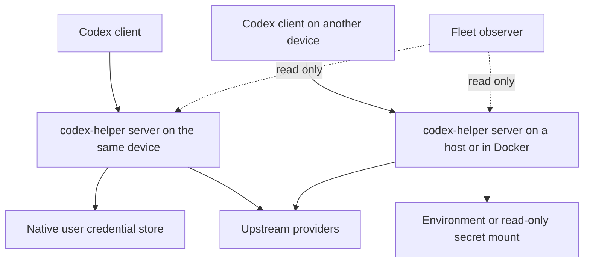
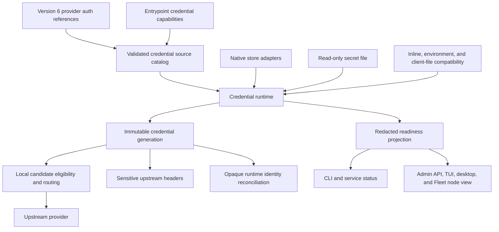
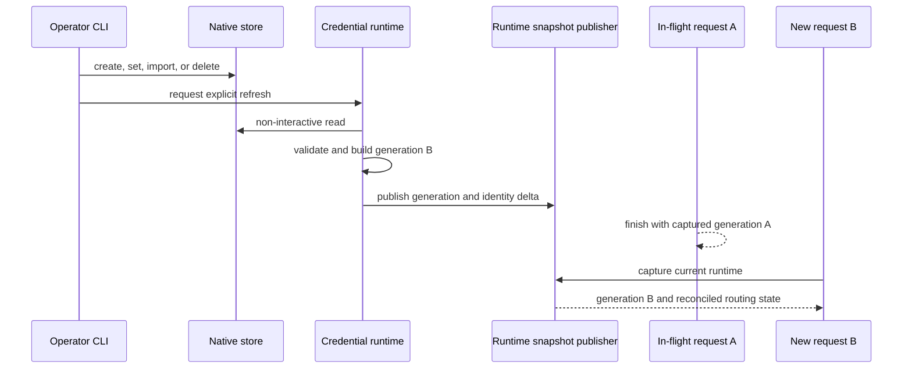
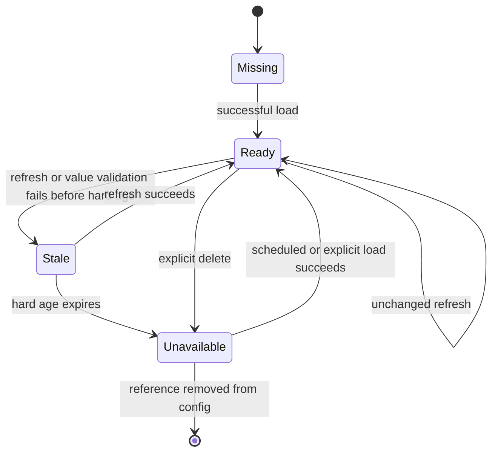

# Native Service Credentials and Server Deployment Boundaries - Plan

## Goal Capsule

- **Objective:** Give local services durable access to upstream credentials through native operating-system stores while keeping one server product model across local, service, host, and Docker deployments.
- **Product authority:** The confirmed deployment and credential boundaries in this contract, the canonical version 6 configuration contract with automatic version 5 migration, and the existing provider-opaque routing model.
- **Open blockers:** None. Platform-native release remains gated on current-candidate service-context evidence; failure of a gate withholds that platform or the whole release rather than reopening product scope.
- **Execution profile:** Deep, security-sensitive, cross-platform work. Implement credential boundaries and characterization coverage before widening user-facing surfaces.
- **Stop conditions:** Stop if a daemon backend cannot guarantee non-interactive reads, a migration can make an older binary silently ignore an auth source, or any credential value reaches helper-owned persistent state outside the selected credential source or reaches an operator/client response.
- **Tail ownership:** Implementation includes configuration migration, runtime and UI contracts, platform service validation, Docker smoke coverage, user documentation, and cleanup of superseded auth-resolution paths.

---

## Product Contract

### Summary

codex-helper will expose one server capability that may run on the client machine, as a user service, on another host, or in Docker. Each server will own its routing state, while local user services gain explicit CLI-managed access to native credential stores and headless servers continue to use deployment-provided secrets.

### Problem Frame

The relay and routing core is already shared by foreground, resident service, and container entrypoints, but credential availability differs by deployment. A Windows per-user Scheduled Task does not inherit temporary PowerShell variables, and equivalent service launches on macOS or Linux cannot rely on the interactive terminal that configured them.

The current upstream credential resolver accepts inline values, process environment variables, and explicit Codex or Claude credential-file fallbacks. It does not read Windows Credential Manager, macOS Keychain, or Linux Secret Service. Docker supports environment injection today, while a mounted-secret credential source is not yet part of the resolver contract.

Routing also needs a precise ownership boundary. Session affinity is durable within one server runtime store, while round-robin cursors and active concurrency counts belong to that server process. Treating Fleet or multiple servers as a distributed capacity authority would create a different product and is not required for local proxy or Docker deployment.

### Key Decisions

- **One server product model** (session-settled: user-directed — chosen over a separate shared-runtime product mode: local execution is the server running on the client machine). Deployment location changes which client-local capabilities are available, not the relay and routing model.
- **Provider-opaque session affinity** (session-settled: user-directed — chosen over reproducing upstream-internal account affinity: codex-helper can control only its own endpoint and key selection). Round-robin distributes new sessions, and an eligible existing binding takes priority for later requests in that session.
- **Per-server scheduling authority** (session-settled: user-approved — chosen over cross-server coordination: each receiving server can remain autonomous and Docker stays a deployment option). Servers do not share affinity, round-robin cursors, active-request counts, or concurrency limits.
- **Native stores for local user services** (session-settled: user-approved — chosen over SQLite or helper plaintext storage: services need durable credentials without turning runtime state into a secret store). Windows uses Credential Manager, macOS uses Keychain, and Linux desktop or user-service environments use Secret Service.
- **Deployment secrets for headless servers** (session-settled: user-approved — chosen over an automatic plaintext-file fallback: headless environments already have environment and mounted-secret mechanisms). Missing native-store support fails with actionable guidance instead of silently writing a helper secret file.
- **Fleet remains observational** (session-settled: user-approved — chosen over making Fleet a routing coordinator: observability and request ownership have different lifecycles). Fleet may read multiple servers but cannot combine their capacity or mutate their routing state.
- **Version 6 credential schema** (session-settled: user-approved — chosen over an additive version 5 extension: older binaries must reject credential references instead of silently treating them as absent). Existing version 5 configuration migrates automatically with a backup; credential values are never migrated.
- **Atomic runtime credential generations** (session-settled: user-approved — chosen over request-time vault reads or restart-only native rotation: requests need a stable credential while native-store changes must converge without blocking Tokio workers). New requests capture a published generation while in-flight requests finish on the generation they started with.
- **Diagnostic service liveness** (session-settled: user-approved — chosen over crashing or hiding the admin surface when credentials are unavailable: operators need to repair a resident service in its real launch context). A service may be ready, degraded, or blocked; blocked routes remain local and fail closed.
- **Cross-surface credential readiness** (session-settled: user-approved — chosen over CLI-only diagnostics: TUI and desktop operators need the same redacted explanation as service and provider commands). Logical references and stable error categories may appear only on trusted local or authenticated operator surfaces.



### Actors

- A1. The operator configures providers, imports credentials, installs services, and chooses which server a client connects to.
- A2. A Codex or compatible client sends requests to one selected codex-helper server.
- A3. The receiving codex-helper server resolves credentials, owns request routing, and publishes a redacted operator view.

### Requirements

**Server deployment and ownership**

- R1. Foreground, resident service, host, and Docker deployments must expose the same relay, routing, affinity, and operator-read behavior through the shared server core.
- R2. The server receiving a request must exclusively own its provider configuration, runtime store, session affinities, scheduling cursor, active-request counts, and concurrency enforcement.
- R3. A container or remote server must not read or mutate a client's local Codex configuration, authentication files, transcript files, model cache, or SQLite data.
- R4. Product surfaces and documentation must describe local and remote placement as server deployments rather than introduce a separate shared-runtime mode.
- R5. Multiple servers may use equivalent provider configuration, but codex-helper must not claim that their affinity or capacity state is coordinated.

**Routing and affinity**

- R6. Round-robin must distribute newly observed sessions across eligible endpoint/key candidates using the capacity information owned by the receiving server.
- R7. An eligible durable session binding must take priority over the round-robin cursor so repeated requests remain friendly to upstream caches and continuity behavior.
- R8. Multiple sessions may bind to one endpoint/key, while configured concurrency limits constrain simultaneous requests rather than the number of stored bindings.
- R9. Routing must remain provider-opaque and must not infer relay-internal account selection, account affinity, or distributed concurrency from upstream branding or error text.

**Native local-service credentials**

- R10. The CLI must let an operator create, import from the current process environment, inspect the readiness of, and delete a named upstream credential without printing its value.
- R11. A provider must opt in to a native credential through an explicit logical reference, so adding native-store support does not silently reinterpret every existing environment-variable reference.
- R12. Windows local services must resolve opted-in credentials from the current user's Credential Manager under the same user identity that owns the service task.
- R13. macOS local services must resolve opted-in credentials from the current user's Keychain under the same user identity that owns the service process.
- R14. Linux desktop and user-service deployments must resolve opted-in credentials from the user's Secret Service session when that service is available.
- R15. Service installation, startup diagnostics, provider probes, and balance refresh must report a missing or inaccessible credential before upstream I/O and identify the unresolved logical reference without exposing its value.

**Headless and container credentials**

- R16. Headless Linux and Docker deployments must support credentials supplied through process environment variables or an explicit read-only mounted-secret reference.
- R17. A missing Secret Service session must not trigger creation of a helper-managed plaintext credential file; diagnostics must direct the operator to environment or mounted-secret configuration.
- R18. Imported upstream credential values must not be written to `config.toml`, service definitions, command history, logs, operator read models, or the helper runtime SQLite database.
- R19. The runtime database may retain non-secret credential references, redacted readiness state, derived fingerprints, and helper-owned installation keys needed for runtime identity.

**Compatibility and Fleet**

- R20. Existing inline, `*_env`, Codex `auth.json`, and Claude settings credential behavior must remain valid until changed through the normal configuration migration policy.
- R21. Native credential import must be explicit and must not move, rewrite, or delete an existing environment variable or client credential-file value.
- R22. Fleet must remain a read-only observer with configuration separate from relay targets and must not coordinate routing, failover, affinity, or concurrency across servers.
- R23. Normal startup must back up and migrate version 5 configuration to version 6 without changing legacy credential semantics; a binary that only understands version 5 must reject version 6 rather than ignore its credential references.
- R24. One request, including retries and streaming, must use one immutable credential generation; a successfully published rotation applies only to later requests and reconciles credential-scoped affinity, health, and quota state.
- R25. Native credential refresh may use a bounded last-known-good generation while reporting degraded readiness, but explicit deletion must invalidate immediately and hard expiry must make the affected candidates unavailable.
- R26. Local CLI, service status, authenticated operator APIs, TUI, and desktop provider views must share a redacted readiness model; untrusted relay HTTP, streaming, and WebSocket responses must continue to expose only generic credential failure.

### Key Flows

- F1. Local service credential setup
  - **Trigger:** A1 wants a local service to use a credential currently available interactively.
  - **Actors:** A1, A3.
  - **Steps:** The operator creates an explicit native reference, imports or enters the value through the CLI, verifies service-context readiness, and starts or restarts the service.
  - **Outcome:** The service resolves the credential from the current user's native store without depending on the original terminal environment.
  - **Covered by:** R10-R15, R18-R21.
- F2. Headless server credential setup
  - **Trigger:** A1 deploys codex-helper on a Linux host or in Docker.
  - **Actors:** A1, A3.
  - **Steps:** The operator supplies a process environment variable or read-only mounted secret, configures the matching explicit reference, and runs readiness diagnostics before serving traffic.
  - **Outcome:** The server resolves deployment-provided credentials without requiring a desktop secret service or helper plaintext fallback.
  - **Covered by:** R16-R21.
- F3. Session-aware request routing
  - **Trigger:** A2 sends a request with a usable session identity.
  - **Actors:** A2, A3.
  - **Steps:** The receiving server reuses an eligible durable binding or assigns a new candidate through its local round-robin and capacity state, then records the successful binding in its own runtime store.
  - **Outcome:** New sessions spread across available candidates while established sessions remain stable until their binding becomes ineligible.
  - **Covered by:** R2, R5-R9.
- F4. Fleet observation
  - **Trigger:** A1 opens Fleet to inspect more than one server.
  - **Actors:** A1, A3.
  - **Steps:** Fleet reads each server's redacted operator state and reports freshness independently.
  - **Outcome:** The operator can compare servers without Fleet changing request ownership or routing state.
  - **Covered by:** R22.

### Acceptance Examples

- AE1. **Covers R10-R12, R15, R18.** Given a credential exists only in a temporary PowerShell variable, when the operator explicitly imports it and restarts the Windows service, then the service can resolve it from Credential Manager and the task definition contains no credential value.
- AE2. **Covers R10, R11, R13, R15.** Given a macOS user imports a named credential, when a user-owned service starts outside the configuring shell, then it resolves the value from Keychain through the explicit reference.
- AE3. **Covers R14, R16, R17.** Given a headless Linux host has no Secret Service session, when readiness is checked, then codex-helper reports that the native reference is unavailable and directs the operator to environment or mounted-secret input without creating a plaintext fallback.
- AE4. **Covers R16, R18.** Given a Docker deployment mounts a secret read-only, when the configured reference is resolved, then the server uses the mounted value without copying it into `config.toml` or `state.sqlite`.
- AE5. **Covers R20, R21.** Given an existing provider uses `auth_token_env` and the value is available from the current environment or supported client credential file, when native credential support is installed, then routing continues unchanged until the operator explicitly chooses to import and reference a native credential.
- AE6. **Covers R5-R9.** Given two eligible endpoint/key candidates and several new session identities, when requests arrive at one server, then new sessions spread according to that server's round-robin capacity while requests from an established session reuse its eligible binding.
- AE7. **Covers R2, R5, R22.** Given two servers use the same upstream key, when both receive traffic, then each reports and enforces only its own affinity and concurrency state, and neither Fleet nor the servers claim a combined limit.
- AE8. **Covers R3, R4.** Given a client connects to a Docker-hosted server, when it sends relay traffic, then the remote server handles routing but does not read or modify files owned by the client's local Codex installation.
- AE9. **Covers R20, R23.** Given an existing version 5 configuration, when a new binary starts, then it writes the normal source backup, produces version 6 with equivalent legacy auth behavior, and an older version 5-only binary rejects the migrated file.
- AE10. **Covers R7, R24, R25.** Given a streaming request is using credential generation A, when the operator publishes generation B, then that request completes with A, later requests use B, and B does not inherit A's credential-scoped affinity or quota identity.
- AE11. **Covers R15, R25, R26.** Given a user service loses access to one native credential, when another candidate remains eligible, then the service stays live and reports degraded readiness; when no candidate remains, it reports blocked and relay requests fail before upstream I/O.

### Scope Boundaries

**Deferred for later**

- Synchronizing credential values or native-store entries between machines.
- Additional headless vault integrations beyond environment variables and read-only mounted secrets.
- Migrating macOS entries from the login Keychain to the Data Protection Keychain after signing, entitlement, and explicit entry-migration requirements are available.

**Outside this product's identity**

- A distributed scheduler, shared concurrency semaphore, or cross-server affinity authority.
- Automatic server failover, leader election, or a separate shared-runtime product mode.
- Inferring or controlling account selection inside an upstream relay.
- Turning Fleet into a routing or mutation control plane.
- Persisting upstream credential values in helper SQLite or an automatically created plaintext secret file.

### Dependencies and Assumptions

- A local service runs under the same operating-system user identity that owns its native credential entry.
- Windows Credential Manager and macOS Keychain remain accessible to their user-owned background service contexts.
- Linux Secret Service availability depends on the user session, so headless deployments cannot assume it exists.
- Mounted-secret resolution is new product work; the current container example supports environment injection but not file-backed secret resolution.
- Native credential support must preserve the current fail-closed validation and redaction boundaries for HTTP, streaming, WebSocket, probes, balance refresh, and operator views.
- Native credential access requires the same logged-in user context as the service; it does not support pre-login, logged-out, system-wide, or cross-user operation.
- The implementation may use the runtime store's existing non-secret store identity and helper-owned derivation key for namespacing and opaque credential-scoped identity, but never for storing upstream values.

### Sources and Research

- `README.md` for the local proxy, service ownership, routing affinity, and concurrency product boundaries.
- `docs/adr/0001-central-relay-container-runtime.md` for container ownership and client-state isolation.
- `docs/CONFIGURATION.md` and `docs/CONFIGURATION.zh.md` for relay targets, Fleet, routing, credential resolution, and Windows service behavior.
- `crates/core/src/auth_resolution.rs` for the current inline, environment, Codex, and Claude credential sources.
- `crates/core/src/runtime_store.rs`, `crates/core/src/state.rs`, and `crates/core/src/routing_ir.rs` for per-server affinity, persistence, and scheduling ownership.
- `src/service_manager.rs` for the SID-scoped Windows Scheduled Task definition.
- `crates/core/src/fleet/` for read-only node polling and snapshot merging.
- `deploy/compose/codex-helper.yml` and `deploy/container/config.toml` for current container credential injection.

---

## Planning Contract

**Product Contract preservation:** changed: R23-R26 and AE9-AE11 were added, and the Goal Capsule plus Key Decisions were updated, to record the user-confirmed version 6 migration, credential-generation, service-readiness, and cross-surface contracts; R1-R22 and the original scope boundaries are unchanged.

### Key Technical Decisions

- KTD1. **Use a version 6 tagged credential-reference schema.** (session-settled: user-approved — chosen over an additive version 5 extension: a version 5-only binary must reject rather than silently ignore a new auth source.) `auth_token_ref` and `api_key_ref` accept either `{ source = "native", name = "..." }` or `{ source = "secret_file", path = "..." }`. Startup performs the existing backup-first migration from version 5 to version 6 without synthesizing references or moving values. Advances R11, R20, R21, R23.
- KTD2. **Keep legacy precedence only when no new reference is selected.** Existing inline-over-environment-over-explicit-client-file behavior remains unchanged. A new reference is mutually exclusive with all legacy fields for the same effective credential kind across nested and flattened provider layers; a flattened reference replaces the base source for that kind rather than merging source fields. Advances R11, R20, R23.
- KTD3. **Namespace native entries by server installation and opaque logical locator.** The public name is lowercase ASCII matching `[a-z0-9][a-z0-9._-]{0,127}`. The OS locator combines the existing runtime-store installation UUID with a domain-separated digest of that name, so multiple helper homes owned by one OS user do not overwrite each other and native metadata does not disclose provider or account labels. A narrow installation-identity resolver reads an existing identity without competing for the runtime-store writer lease; a fresh home initializes it only through the existing exclusive store-initialization path, and a missing or corrupt identity never creates a second namespace while a daemon owns the store. HMAC derivation remains a writer/daemon capability. Advances R2, R9, R18, R19.
- KTD4. **Expose separate management and daemon capabilities behind an application-owned facade.** (session-settled: user-approved — chosen over SQLite or helper plaintext storage: durable local-service credentials belong in the current user's native store.) CLI management may create, update, unlock, or delete. Daemon reads are exact, read-only, bounded, and non-interactive; locked, permission-denied, ambiguous, interaction-required, and unavailable states fail without a prompt. Business code consumes application error codes rather than backend errors. Advances R10-R15, R17-R19.
- KTD5. **Use precise platform dependencies plus an explicit runtime capability boundary.** Enable a `native-credentials` core feature from the root CLI only. Use `keyring-core` plus the Windows native store, the macOS login-Keychain store with a `SecItemCopyMatching` no-UI daemon read, and the low-level `secret-service` API with an encrypted session on Linux. Cargo features decide whether a backend can be constructed, not whether an entrypoint may use it: each binary injects credential-source capabilities, and `codex-helper-server` always forbids native resolution even when a workspace build has unified the core feature. The isolated server artifact contains no native backend and reports native references as unsupported with environment/file guidance. Advances R12-R17.
- KTD6. **Treat secret files as bounded deployment inputs, not helper-owned files.** Require an absolute path; allow a symlink only when its final target is a regular file; verify type and size around a bounded read; cap file input at 64 KiB; remove at most one terminal LF or CRLF; reject empty, extra-line, invalid UTF-8, NUL, and invalid HTTP-header values. Do not require mode `0600`, call `chmod`, write the path, or claim that mode proves a read-only mount. Advances R16-R18.
- KTD7. **Resolve credentials into immutable runtime generations outside request workers.** (session-settled: user-approved — chosen over request-time vault reads or restart-only native rotation: requests need a consistent value while native changes must converge.) A single-flight refresher performs blocking platform work outside Tokio workers, publishes all-or-nothing generations, and lets each request, retry chain, stream, and WebSocket capture one generation. The credential runtime is the only published, long-lived runtime object that holds values: legacy inline/environment/client-file values are ingested into a generation and replaced by handles/scopes before route and operator snapshots are published. Secret and legacy auth containers use redacted formatting, do not serialize values, zeroize on final drop, and produce sensitive HTTP headers. Advances R15, R18, R24, R25.
- KTD8. **Use source-specific refresh policy owned by the proxy runtime.** Native references soft-refresh after 60 seconds and hard-expire after 10 minutes; a failed refresh keeps a stale last-known-good generation only until hard expiry. A runtime-owned driver advances these deadlines even with no requests and participates in normal abort, join, shutdown, and panic propagation. Backend failures update readiness without killing the driver; a driver panic fails the runtime wait path. Explicit create, set, import, delete, runtime reload, and a 401/403 observation bypass the soft interval; deletion invalidates immediately. Explicit secret files, process environment, and service-provided credentials refresh only on runtime reload or restart because their deployment rotation semantics are not portable. An auth failure never automatically replays a non-idempotent request. Advances R15, R16, R24, R25.
- KTD9. **Publish credential identity, policy, routing, and generation as one recoverable revision.** Derive credential scope with a domain-separated HMAC operation owned by `RuntimeStore`; never expose the installation key or persist a raw value digest. The publication coordinator completes every fallible build and validation step first, commits identity and policy changes in one store transaction, then performs only infallible composite in-memory swaps under the publication lock. A crash after durable commit serves no requests; startup reconstructs the matching composite revision before listener bind. A new scope makes old credential-scoped affinity ineligible while already captured requests finish, and no recoverable failure may leave a new scope paired with an old generation. Advances R7-R9, R19, R24.
- KTD10. **Replace `missing_auth` as the diagnostic authority with typed readiness.** Stable states are `ready`, `stale`, `missing`, `invalid`, `locked`, `permission_denied`, `interaction_required`, `backend_unavailable`, and `unsupported`. Trusted local/authenticated operator surfaces may show source kind and logical reference; relay clients receive only the existing generic local 503 category. Backend messages, native metadata, secret prefixes, and fingerprints never enter wire models or logs. Advances R15, R18, R26.
- KTD11. **Keep the service process diagnosable when routing is not ready.** (session-settled: user-approved — chosen over exiting or hiding the admin surface: actual service context is the only authoritative Keychain/Secret Service check.) Service readiness is `ready` when all required references resolve, `degraded` when at least one route remains usable, and `blocked` when none is usable. The admin surface remains live in all three states; install/start/restart returns nonzero after post-start polling when blocked, while relay traffic remains fail-closed. A non-secret, atomically replaced install receipt records the service target needed by `status`. Advances R12-R15, R26.
- KTD12. **Separate credential CRUD from provider binding.** Credential commands accept masked TTY input, explicit stdin, or an environment-variable name; no secret value is accepted in argv. Provider-scoped auth mutation selects or clears one source without replacing unrelated provider configuration. Store mutation commits first, then runtime refresh; refresh failure reports a partial success and never rolls the store back. Advances R10, R11, R18, R21.
- KTD13. **Keep routing and Fleet architecture unchanged.** (session-settled: user-approved — chosen over cross-server coordination: every receiving server remains autonomous.) Credential readiness only changes local candidate eligibility. Existing round-robin, capacity, session-affinity, and per-runtime state remain authoritative; Fleet may render per-node readiness but gains no credential mutation or coordination action. Advances R2, R5-R9, R22.
- KTD14. **Refresh a resident runtime through the existing signed local operator boundary.** Credential mutation remains a root CLI action, while a versioned non-secret service receipt identifies the matching helper home, admin target, and service generation. A signed, replay-protected local-only action requests credential refresh; it is absent from the public read-only control plane. Missing, stale, mismatched, or unreachable targets never undo a committed store mutation and produce the typed partial-success outcome from KTD12. Advances R10, R15, R18, R26.

### High-Level Technical Design

The credential runtime is the only published, long-lived runtime component allowed to retain a configured value. Configuration loading may hold legacy inline values transiently, but route, storage, control-plane, and UI snapshots exchange only handles, opaque scopes, generations, and readiness.



Credential publication is MVCC-like: mutation and refresh build a candidate generation first, then publish it atomically. No attempt can select with one generation and inject headers from another.



Readiness separates temporary refresh failure from hard unavailability. Explicit delete bypasses the stale window.



`Unavailable` is the umbrella runtime state for KTD10's typed unavailable readiness categories; explicit deletion is the only event that bypasses the bounded stale window.

| Configured source | Runtime support | Refresh boundary | Trusted diagnostic reference | Headless suitability |
|---|---|---|---|---|
| Inline legacy value | All binaries | Config reload | `inline` only | Supported but discouraged |
| Environment/client-file legacy reference | All binaries | Runtime reload or existing client-file refresh | Environment or field name | Environment supported |
| Native reference | Root CLI/runtime with native feature | Single-flight soft/hard refresh plus explicit reload | Logical name and native backend | Unsupported |
| Secret-file reference | All server runtimes | Explicit reload or restart | Configured path and file category | Preferred mounted-secret path |
| Unconfigured/anonymous | Existing target rules | Config reload | Generic unconfigured state | Only where existing explicit opt-in permits |

### Implementation Constraints

- Daemon code must never call an OS unlock/prompt API. Linux daemon search must not call `Unlock`; macOS daemon search must set the supported authentication-UI skip behavior; cancellation must not be treated as terminating an already-running blocking OS operation.
- A compile feature is never an authorization boundary. The root CLI enables native backend construction, while each runtime receives an explicit source-capability value; the server entrypoint forbids native use under isolated and feature-unified workspace builds.
- Per-reference mutation and refresh operations are serialized inside the blocking boundary. Windows tests cover its case-insensitive target and 2,560-byte generic-credential limit.
- Native input is capped at 2,560 bytes for portable behavior. Explicit secret files use the 64 KiB bound above; both pass the same empty/newline/header validation after source-specific decoding.
- The runtime store may persist the existing installation UUID, helper-owned derivation key, opaque credential scope, generation number, readiness category, and timestamps. SQLite, WAL, SHM, backups, logs, service definitions, config, and generated contracts must contain no upstream value, prefix, or raw fingerprint.
- Existing downstream relay error redaction is a compatibility contract. Adding logical references to operator models must not weaken HTTP, streaming, WebSocket, evidence, panic, or tracing sanitization.
- Real-store tests must use isolated installation IDs and random logical names and must delete only entries they created. Unit tests use an application-owned fake; production must not enable sample, file, database, or mock keyring stores.

### Sequencing

1. Land the versioned config and credential domain contract before adding platform code.
2. Land injectable store/file backends and fakes before changing request execution.
3. Publish credential generations and recoverable identity reconciliation before exposing mutation.
4. Move every I/O consumer and operator projection to the shared readiness contract, then add the versioned receipt and signed local refresh action.
5. Expose credential CLI mutation only after its cross-process refresh target and partial-success contract exist.
6. Finish with platform lifecycle, mounted-secret smoke, migration, routing/Fleet characterization, and leakage audits.

### Output Structure

```text
crates/core/src/credentials/
  mod.rs
  capabilities.rs
  evaluator.rs
  installation_identity.rs
  model.rs
  runtime.rs
  secret_file.rs
  native/
    mod.rs
    windows.rs
    macos.rs
    linux.rs
crates/server/src/check.rs
src/commands/credential.rs
src/service_receipt.rs
deploy/compose/codex-helper.secrets.yml
```

### System-Wide Impact

- **Configuration:** The public canonical schema advances to version 6. Version 5 migration is automatic and backup-first; no credential source is synthesized.
- **Runtime and persistence:** Credential generations become part of runtime snapshot publication and identity reconciliation. Secret-bearing memory is transient; SQLite retains only opaque identity and readiness facts allowed by R19.
- **Publication and recovery:** Identity, policy, routing, and credential generation advance as one revision. A process cannot continue serving after a post-transaction/pre-swap crash, and startup reconstructs a matching revision before listener bind.
- **Request execution:** Request context, attempts, retries, streams, WebSockets, probes, live smoke, and balance refresh share one captured credential-generation contract and fail before upstream I/O when unavailable.
- **Operations:** Native availability depends on a logged-in user session. A runtime-owned refresh task expires idle credentials, service commands distinguish OS process state from route readiness, and the container binary gains offline env/file checking.
- **Interfaces:** Credential readiness is data inside the authenticated operator model, separate from control-plane transport status. Admin contracts, TUI, desktop, and Fleet node projections gain the same redacted vocabulary; Fleet ownership and mutation boundaries do not change.
- **Local control plane:** Credential CRUD remains in the root CLI. Only the signed local operator surface can request refresh, using a versioned receipt to avoid sending a mutation to the wrong helper home, port, or service generation.

### Risks and Mitigations

| Risk | Consequence | Mitigation |
|---|---|---|
| macOS login Keychain API or ACL triggers UI for a service binary | LaunchAgent blocks or surprises the user | Isolate the backend, use no-UI `SecItem` lookup, test installed/signature/path changes, and stop rollout if zero-UI cannot be proven |
| Linux session bus or Secret Service is absent, locked, or implementation-specific | User service cannot resolve a native reference | Use encrypted low-level Secret Service sessions, never unlock in daemon, distinguish readiness codes, and direct headless users to env/file sources |
| Windows generic-credential limits or target case folding reject/collide | Write fails or one name overwrites another | Enforce portable name/value bounds, derive an opaque lowercase locator, serialize mutations, and test 2,559/2,560/2,561-byte boundaries |
| Last-known-good caching delays revocation | Old credentials remain usable briefly | Bound hard age, mark stale visibly, bypass cache on explicit delete/reload and 401/403, and never replay the failed request |
| Version 6 migration or downgrade changes legacy auth behavior | Existing users lose routing or older binaries run unsafely | Reuse backup-first migration, characterize version 5 fixtures byte-for-behavior, and assert version 5-only binaries reject version 6 |
| New operator detail leaks references or values downstream | Secret or deployment metadata exposure | Use typed redacted DTOs, generic relay errors, sensitive headers, canary scans across all artifacts, and no backend error passthrough |
| Docker Compose secrets are mistaken for encrypted host storage | Operators overestimate protection | Document bind-mount and mode limitations, keep env example working, provide a separate overlay, and verify only the target container receives the mount |
| Native-store behavior cannot be reproduced in generic CI | Platform regressions escape unit tests | Keep fake-backed contract tests mandatory, compile all targets in existing CI, and require dedicated real service-context smoke evidence before release |

### Alternative Approaches Considered

- **Keep version 5 and add optional fields:** Rejected because older binaries can ignore unknown fields and treat a configured credential as absent. Version 6 makes downgrade failure explicit while preserving old users through automatic migration.
- **Use the all-in-one `keyring` facade:** Rejected because its v1/global setup weakens injection and retry behavior, while sample/CLI features can pull insecure file or SQLite stores. Precise platform adapters keep daemon interaction policy enforceable.
- **Read the native store on every attempt:** Rejected because the current resolver is called during selection and header injection, so synchronous OS/DBus work would block Tokio workers and one request could observe two values.
- **Require restart for every native rotation:** Rejected by the confirmed generation contract. Explicit and bounded native refresh improves service usability while preserving request-level consistency; deployment-provided env/file sources retain restart/reload semantics.
- **Store encrypted credentials in helper SQLite:** Rejected by the Product Contract. Key management would recreate a secret-store product and weaken the established runtime database boundary.
- **Add a distributed credential or capacity coordinator:** Rejected because servers and Fleet remain autonomous. Operators import equivalent names independently on each server when desired.

---

## Implementation Units

### U1. Version 6 credential-source contract and migration

- **Goal:** Make native and secret-file references first-class, unambiguous configuration sources while preserving every legacy credential behavior through automatic version 5 migration.
- **Requirements:** R11, R20, R21, R23; F1, F2; AE5, AE9; KTD1, KTD2.
- **Dependencies:** None.
- **Files:** `crates/core/src/config.rs`, `crates/core/src/helper_config.rs`, `crates/core/src/config_storage.rs`, `crates/core/src/routing_ir.rs`, `crates/core/src/config/tests/mod.rs`, `crates/core/src/config/tests/canonical_schema.rs`, `crates/core/src/config/tests/current_v6_contract.rs`, `crates/core/src/config/tests/legacy_v5_migration_contract.rs` (preserved from the current v5 baseline), `crates/core/src/config/tests/storage_migration.rs`, `crates/core/src/config/tests/io_bootstrap.rs`, `crates/core/src/config/tests/fixtures/v0.20.3-typical.toml`, `crates/core/src/config/tests/fixtures/version-5-credential-compat.toml`.
- **Approach:** Add a tagged `CredentialRef` domain type and optional bearer/API-key reference fields to `UpstreamAuth`. Advance `CURRENT_CONFIG_VERSION` to 6 and extend the existing backup-first migration so version 5 becomes version 6 without source inference. Preserve the current v5 suite as a migration baseline rather than renaming it away, and add a frozen v5 version-gate harness that is independent of the v6 parser. Validate effective nested/flattened auth after overrides: a new reference excludes same-kind legacy sources, while legacy inline plus environment remains valid with its current precedence. Include reference kind and locator in default detection, anonymous-auth checks, canonical serialization, route shape digests, and provider mutations. Treat a newer version as unsupported, preserve source permissions and original bytes in the migration backup, and publish neither backup nor replacement when validation or replacement preconditions fail.
- **Patterns to follow:** Existing canonical migration planning and atomic replacement in `crates/core/src/config_storage.rs`; v5 route-graph fixtures and normalized save/reload tests in `crates/core/src/config/tests/`.
- **Test scenarios:**
  1. Parse and round-trip native bearer and secret-file API-key references in version 6 without serializing empty/default fields.
  2. Reject an empty, uppercase, non-ASCII, path-like, or overlength native logical name with a field-specific configuration error.
  3. Reject a relative secret-file path and accept an absolute path without reading it during pure schema parsing.
  4. Reject native/file plus inline or environment fields for the same effective kind, including conflicts split between nested `auth` and flattened overrides.
  5. Preserve the existing inline-over-environment behavior when no new reference exists.
  6. Migrate representative version 5, unversioned, and legacy JSON fixtures to version 6 with the normal backup and no synthesized reference or changed legacy auth fields.
  7. Re-open migrated output and prove it is canonical version 6; present the same output to the frozen version 5 gate and prove it rejects the newer version without creating or changing a backup.
  8. Include reference changes in route/config digests so switching source kind or logical locator changes the runtime input revision without including a secret value.
  9. Restore every unversioned, legacy JSON, and version 5 source backup and prove its original parser/build can start with the same legacy auth behavior and preserved ownership/mode.
- **Verification:** Version 6 is the sole saved contract; all historical fixtures migrate automatically; no old configuration requires a manual edit; mixed new/legacy sources fail before runtime construction.

### U2. Cross-platform credential-store and secret-file backends

- **Goal:** Provide one injectable, testable facade for secure management and non-interactive daemon reads without allowing platform behavior into routing or CLI presentation code.
- **Requirements:** R10-R19; F1, F2; AE1-AE4; KTD3-KTD6.
- **Dependencies:** U1.
- **Files:** `Cargo.toml`, `Cargo.lock`, `crates/core/Cargo.toml`, `crates/server/Cargo.toml`, `crates/core/src/lib.rs`, `crates/core/src/credentials/mod.rs`, `crates/core/src/credentials/model.rs`, `crates/core/src/credentials/capabilities.rs`, `crates/core/src/credentials/installation_identity.rs`, `crates/core/src/credentials/secret_file.rs`, `crates/core/src/credentials/native/mod.rs`, `crates/core/src/credentials/native/windows.rs`, `crates/core/src/credentials/native/macos.rs`, `crates/core/src/credentials/native/linux.rs`, `crates/core/src/credentials/tests.rs`.
- **Approach:** Define application-owned store traits, a secret container, source/readiness errors, source capabilities, installation-identity resolution, locator derivation, and a fake backend. Enable precise target dependencies only behind `native-credentials`; do not enable `keyring`, sample, CLI, file, database, or mock stores in production. The root entrypoint permits native construction, while server options forbid it independently of Cargo feature unification. An existing helper home reads installation identity without taking the writer lease; an absent home uses the exclusive initializer, while missing/corrupt identity under another writer fails without creating a new namespace. Windows uses generic credentials with local-machine persistence under the current user. macOS management writes the login Keychain while daemon reads use a no-authentication-UI `SecItem` query. Linux uses a DH-encrypted low-level Secret Service session; daemon search rejects locked or duplicate results without calling `Unlock`, while an explicit CLI management path may let the OS interact. File reads follow KTD6 and never mutate metadata.
- **Execution note:** Implement backend error mapping and fake-backed contract tests before touching a real store. Treat each real-store smoke as destructive only within its randomized test namespace.
- **Patterns to follow:** Typed, non-exhaustive error mapping in core modules; target-specific dependency sections already used for Windows filesystem identity; bounded reads and sensitive-data sanitization in proxy diagnostics.
- **Test scenarios:**
  1. Run the same fake-backed create, create-existing, set, read, delete, delete-missing, ambiguous-entry, and backend-unavailable contract on every platform build.
  2. Verify two helper installation UUIDs map the same logical name to different opaque locators, while repeated lookup in one installation is stable and case collisions are impossible.
  3. Prove secret values and source payloads cannot be formatted or serialized by the public domain types and are zeroized when the final generation reference drops.
  4. On Windows, accept 2,559 and 2,560 bytes, reject 2,561 bytes, serialize concurrent operations for one locator, and verify logout/login persistence in dedicated smoke coverage.
  5. On macOS, prove the daemon read path uses no authentication UI and classifies locked/ACL-denied items without a prompt; verify a credential written by the installed binary is readable by its LaunchAgent identity.
  6. On Linux, return `locked` for locked search results without invoking Unlock/Prompt, reject duplicate matches, use an encrypted session, and classify missing session bus/Secret Service separately.
  7. For secret files, cover missing, permission-denied, empty, 64 KiB boundary, 64 KiB plus one byte, invalid UTF-8, NUL, embedded newline, one LF, one CRLF, directory, FIFO/device/socket, and symlink-to-regular-file cases.
  8. Assert all backend errors expose only stable code, source kind, and logical reference; a high-entropy canary never appears in error formatting.
  9. Resolve installation identity for a fresh home, a stopped daemon, a running daemon, and missing/corrupt metadata; never contend for the active writer lease or mint a replacement namespace behind it.
  10. Build root and server together with the native core feature unified and prove the server capability still returns `unsupported` without invoking a native adapter.
- **Verification:** Root builds can construct only the three intended native adapters; an isolated server artifact contains none and a feature-unified server still forbids their use; every daemon read is demonstrably non-interactive and every secret-file read is bounded and read-only.

### U3. Atomic credential runtime, refresh, and identity reconciliation

- **Goal:** Publish credentials as immutable generations shared by routing and request execution, with bounded refresh and correct affinity/quota isolation on rotation.
- **Requirements:** R6-R9, R15, R18, R19, R24, R25; F3; AE6, AE10; KTD7-KTD9.
- **Dependencies:** U1, U2.
- **Files:** `crates/core/src/credentials/runtime.rs`, `crates/core/src/auth_resolution.rs`, `crates/core/src/runtime_identity.rs`, `crates/core/src/runtime_store.rs`, `crates/core/src/runtime_store/metadata.rs`, `crates/core/src/routing_ir.rs`, `crates/core/src/runtime_host.rs`, `crates/core/src/proxy/runtime_config.rs`, `crates/core/src/proxy/service_core.rs`, `crates/core/src/proxy/request_preparation.rs`, `crates/core/src/proxy/request_context.rs`, `crates/core/src/proxy/provider_execution.rs`, `crates/core/src/proxy/route_target_selection.rs`, `crates/core/src/proxy/attempt_request.rs`, `crates/core/src/proxy/attempt_execution.rs`, `crates/core/src/proxy/attempt_response.rs`, `crates/core/src/proxy/attempt_failures.rs`, `crates/core/src/proxy/stream.rs`, `crates/core/src/proxy/responses_websocket.rs`, `crates/core/src/proxy/tests/failover/mod.rs`, `crates/core/src/proxy/tests/failover/response_semantics_websocket.rs`.
- **Approach:** Build a source catalog and initial generation before publishing a runtime snapshot. Move platform I/O into a single-flight blocking boundary; the request path performs only in-memory lookup. Ingest every legacy and new source into the secret container, then publish route/config views containing handles and scopes rather than raw auth. Capture a generation in request preparation, carry it through request context, provider execution, attempt execution, retry, HTTP injection, stream finalization, and WebSocket setup, and let attempt response schedule 401/403 refresh without resolving twice. The runtime-owned refresh driver advances soft/hard deadlines while idle and joins the normal runtime lifecycle. The publication coordinator prepares all fallible artifacts, commits identity/policy reconciliation in one transaction, and performs only infallible composite swaps afterward; restart rebuilds the matching revision before bind. Explicit delete clears the cached value before publication, while active requests retain their old `Arc` until completion.
- **Execution note:** Add characterization coverage for the current double-resolution behavior first, then replace it with request-generation assertions so failures identify any path still resolving independently.
- **Patterns to follow:** Prepared/publish ticket ordering and last-known-good config semantics in `crates/core/src/proxy/runtime_config.rs`; captured runtime snapshots across capacity waits and WebSocket lifecycles; installation-local keyed quota identity in `crates/core/src/runtime_store/metadata.rs`.
- **Test scenarios:**
  1. Start two concurrent requests on generation A, publish B, and prove both old requests use only A while a later request uses only B.
  2. Force selection and header-injection timing apart and prove the store is read once per generation, not once per phase or attempt.
  3. Coalesce simultaneous refresh demand for one logical reference into one backend read even when callers are cancelled; do not release the per-reference serialization boundary before blocking work finishes.
  4. On native refresh failure before hard age, keep A routable as `stale`; after hard age, remove it from eligibility and clear its value when no request retains it.
  5. Explicit delete invalidates immediately without a stale window; a later successful create/reload publishes a new generation.
  6. A changed value produces a changed opaque credential scope and runtime revision, reconciles automatic policy/quota membership, and makes old route-graph affinity ineligible; an unchanged value does not churn revision.
  7. A 401/403 schedules one refresh but does not replay the failed request; transport errors and non-auth statuses do not trigger credential refresh.
  8. Any fallible pre-commit config or credential publication failure retains the full previous generation and policy snapshot; an older build ticket cannot overwrite a later successful publication.
  9. HTTP, streaming, and WebSocket headers created from helper credentials are marked sensitive, and canary values do not enter traces or panic output.
  10. Inject failure before durable reconciliation and crash after durable commit but before the composite swap; after restart, serve either the complete old or matching new revision, never a new scope with an old generation.
  11. With no requests, advance past soft and hard deadlines, observe stale then unavailable eligibility, and prove normal shutdown joins the refresher while a refresher panic fails runtime wait.
  12. Serialize/debug every published config, route, request-context, and operator snapshot and prove legacy inline values, native values, prefixes, and reversible fingerprints are absent.
- **Verification:** No request worker performs filesystem, Keychain, Credential Manager, or D-Bus credential I/O; one request cannot mix generations; rotation changes exactly the credential-scoped runtime state and preserves per-server ownership.

### U4. Typed readiness across routing, diagnostics, balance, and operator UIs

- **Goal:** Give every trusted operator surface the same actionable credential state while keeping all relay-facing failures generic and fail-closed.
- **Requirements:** R1, R9, R15, R18, R22, R25, R26; F1-F4; AE3, AE5, AE7, AE11; KTD10, KTD11, KTD13.
- **Dependencies:** U3.
- **Files:** `crates/core/src/routing_ir.rs`, `crates/core/src/routing_explain.rs`, `crates/core/src/doctor.rs`, `crates/core/src/service_status.rs`, `crates/core/src/usage_providers.rs`, `crates/core/src/balance.rs`, `crates/core/src/dashboard_core/types.rs`, `crates/core/src/dashboard_core/operator_options.rs`, `crates/core/src/dashboard_core/operator_summary.rs`, `crates/core/src/fleet/model.rs`, `crates/core/src/fleet/observer.rs`, `crates/core/src/proxy/codex_relay_probe.rs`, `crates/core/src/proxy/codex_relay_live_smoke.rs`, `crates/core/src/proxy/route_unavailability.rs`, `crates/core/src/proxy/providers_api.rs`, `crates/core/src/proxy/api_responses.rs`, `crates/core/src/proxy/tests/api_admin/operator_read_model.rs`, `crates/core/src/proxy/tests/api_admin/routing_explain.rs`, `crates/tui/src/tui/model.rs`, `crates/tui/src/tui/view/pages/routing.rs`, `crates/tui/src/tui/view/modals/provider_info.rs`, `apps/desktop/src/app/App.test.tsx`, `apps/desktop/src/lib/api/admin-types.ts`, `apps/desktop/src/lib/api/types.ts`, `apps/desktop/src/lib/api/mappers.ts`, `apps/desktop/src/lib/api/mappers.test.ts`, `apps/desktop/src/features/providers/ProviderCard.tsx`, `apps/desktop/src/generated/admin-read-model.contract.json`, `tools/desktop-contract-schema/src/main.rs`.
- **Approach:** Promote typed credential readiness into route runtime state and provider data inside the authenticated operator projection. Keep it separate from `OperatorReadStatus`, which continues to describe transport/snapshot connectivity, and derive candidate eligibility from the typed credential state with `missing_auth` retained only as a compatibility summary where necessary. Make doctor, service-status probes, capability probes, live smoke, balance refresh, and usage fallback consume the captured generation and short-circuit locally. Extend TUI and desktop provider details with compact state plus a trusted reference/backend explanation. Generated contract fields remain optional/defaulted for compatibility. Fleet projects the per-node aggregate through its existing read-only model and gains no command.
- **Patterns to follow:** Existing provider capacity projection and generated desktop contract workflow; safe balance/probe error categorization; current generic missing-auth 503 and WebSocket redaction tests.
- **Test scenarios:**
  1. Map every credential-domain error to one stable readiness code and round-trip it through Rust JSON, TypeScript mapping, TUI model, and generated contract.
  2. Show `ready`, `stale`, and each unavailable category in trusted operator/provider detail without exposing a value, prefix, HMAC scope, native raw message, or secret-file contents.
  3. For HTTP, SSE, WebSocket, probe, live smoke, service-status probe, and balance refresh, inject an unavailable reference and assert zero upstream connections or requests occur.
  4. Confirm relay HTTP/stream/WebSocket bodies preserve the generic error category and never include a logical name or secret-file path.
  5. Confirm an authenticated operator response and local doctor output identify the logical reference and remediation class, including native unsupported guidance in a server build.
  6. Mark the service `degraded` when one enabled candidate is unavailable but another is routable, and `blocked` when all active-route candidates are unavailable.
  7. Preserve previous balance data as stale when credential refresh fails, while reporting credential readiness separately from provider transport/rate-limit status.
  8. Render many providers in TUI/desktop without widening Fleet into a credential management surface; each Fleet node retains its own readiness and freshness.
  9. Preserve `OperatorReadStatus` transport semantics while provider and aggregate credential readiness move independently through ready/degraded/blocked; transport disconnection never masquerades as credential blockage or vice versa.
- **Verification:** One typed source governs routing eligibility and all diagnostics; trusted views are actionable; untrusted client and log surfaces remain value- and reference-free.

### U9. Versioned service target receipt and signed local credential refresh

- **Goal:** Give credential mutations an unambiguous resident-runtime target and a replay-protected local refresh action without widening the public control plane.
- **Requirements:** R10, R15, R18, R26; F1; AE1, AE2, AE11; KTD11, KTD12, KTD14.
- **Dependencies:** U3, U4.
- **Files:** `src/service_receipt.rs` (receipt transaction tests), `src/cli_app.rs` (target discovery tests), `crates/core/src/lib.rs`, `crates/core/src/file_replace.rs`, `crates/core/src/service_status.rs`, `crates/core/src/control_plane_client.rs`, `crates/core/src/proxy/control_plane_manifest.rs`, `crates/core/src/proxy/local_operator_routes.rs`, `crates/core/src/proxy/router_setup.rs`, `crates/core/src/proxy/tests/api_admin/local_operator.rs`, `crates/core/src/proxy/tests/api_admin/method_surface.rs`.
- **Approach:** Define a versioned, non-secret receipt carrying service kind, helper/client homes, admin authority, platform backend, and install generation. Expose atomic receipt persistence through a narrow core facade so the root crate does not duplicate private file-replacement logic. Add a typed credential-refresh action to the existing signed local operator manifest/client/router; keep it absent from remote/public routes and require the normal signature, nonce, target generation, and replay defenses. Target discovery is scoped to the selected helper home and verified receipt. An absent, stale, mismatched, or unreachable runtime returns a typed partial outcome after the store commit and never guesses another port or installation.
- **Patterns to follow:** Existing signed `LocalOperatorClient` actions and replay tests; control-plane method-surface inventory; atomic helper-owned replacement in `crates/core/src/file_replace.rs`; service target identity in `src/service_manager.rs`.
- **Test scenarios:**
  1. Create, replace, read, reject corrupt, detect concurrent change, roll back, and remove a receipt without storing credential values, secret paths, native metadata, or fingerprints.
  2. Resolve the intended runtime for default/custom ports and multiple helper homes; reject absent, legacy, stale-generation, foreign-home, and mismatched-service receipts without trying a fallback target.
  3. Accept one correctly signed local refresh for the matching generation and reject missing/invalid signatures, replayed nonces, expired requests, and generation mismatch before refresh.
  4. Prove the public proxy and remote read-only control plane expose no credential-refresh method or route and cannot proxy the local action.
  5. Return success only after the matching runtime publishes the requested generation; return store-committed/runtime-refresh-failed when the daemon is down, unreachable, blocked before publication, or replaced during the request.
  6. A high-entropy credential canary never enters receipt bytes, signed request/response DTOs, manifest output, access logs, or error formatting.
- **Verification:** A CLI mutation can target exactly one verified local runtime and observe its publication result; the public control plane remains read-only and receipt/control-plane artifacts remain non-secret.

### U5. Secure credential CLI and scoped provider binding

- **Goal:** Let operators create, import, inspect, rotate, delete, bind, and unbind credentials without passing values through argv or replacing unrelated provider configuration.
- **Requirements:** R10, R11, R15, R18, R21, R26; F1; AE1, AE2, AE5; KTD12, KTD14.
- **Dependencies:** U1-U4, U9.
- **Files:** `Cargo.toml`, `Cargo.lock`, `src/cli_types.rs` (command-shape tests), `src/cli_app.rs` (dispatch and partial-outcome tests), `src/commands/mod.rs`, `src/commands/credential.rs` (credential contract tests), `src/commands/provider.rs` (scoped mutation tests), `src/commands/doctor.rs`.
- **Approach:** Add `credential create`, `set`, `import`, `status`, and `delete` under the existing top-level noun/subcommand convention. `create` is create-only; `set` is explicit upsert; `import --from-env NAME` upserts without clearing the environment; masked TTY is the default for interactive create/set and `--stdin` is explicit; non-TTY input without one of those sources fails. `status` inspects one name or all configured references and never enumerates unrelated native entries. `delete` reports configured consumers, requires confirmation/`--yes`, supports idempotent `--if-exists`, and never rewrites provider config. Add provider `set-auth`/`clear-auth` operations for bearer or API-key native/file/environment sources. After a committed native mutation, use U9 target discovery and signed refresh; report `store_committed_runtime_refresh_failed` with restart/reload guidance when no matching runtime publishes, without rolling back or trying another installation.
- **Patterns to follow:** Clap top-level command hierarchy in `src/cli_types.rs`; explicit confirmation and JSON/text dual output in existing config commands; provider-scoped mutation and canonical save patterns in `src/commands/provider.rs`.
- **Test scenarios:**
  1. Parse every command/flag combination and reject a secret positional argument, `--value`, conflicting input sources, or ambiguous bearer/API-key mutations.
  2. `create` succeeds once and fails on an existing name; `set` and import upsert; delete missing fails unless `--if-exists` is present.
  3. Interactive create/set use no-echo input and confirmation; non-TTY without `--stdin` or `--from-env` fails before a store call.
  4. Empty, newline-only, embedded CR/LF/NUL, non-header-safe, and over-limit stdin/env values fail without echoing input; exactly one terminal LF/CRLF is removed.
  5. Import reads the named process environment variable, leaves it unchanged, and never reads Codex/Claude files unless the operator selected the legacy provider source.
  6. Status text/JSON reports backend, reference, readiness, configured consumers, and refresh state but contains no value or fingerprint.
  7. Delete of an in-use name warns and requires confirmation, commits only the store deletion, immediately invalidates runtime readiness, and leaves configuration untouched.
  8. Provider auth mutation changes only the selected credential kind; tags, endpoints, limits, mappings, routing, and the other auth kind survive byte-for-semantic round-trip.
  9. A successful store write followed by admin reload failure reports partial success and restart guidance without rolling back or printing the secret.
  10. A canary scan of argv capture, stdout, stderr, config, backups, logs, and runtime database files finds no imported value.
- **Verification:** Every Product Contract management action is possible without manual TOML editing or argv secrets, and partial outcomes are explicit and recoverable.

### U6. Real service-context readiness on Windows, macOS, and Linux

- **Goal:** Connect OS service lifecycle state to credential readiness observed inside the installed service's actual user context.
- **Requirements:** R1, R12-R15, R17-R19, R26; F1; AE1-AE3, AE11; KTD4, KTD11, KTD14.
- **Dependencies:** U4, U9, U5.
- **Files:** `src/service_manager.rs` (platform-definition and lifecycle tests), `src/cli_app.rs` (preflight and post-start polling tests), `crates/core/src/runtime_host.rs`, `docs/CONFIGURATION.md`, `docs/CONFIGURATION.zh.md`.
- **Approach:** Write the U9 receipt only after the platform definition is verified, retaining the previous definition and receipt until replacement is committed. Run an offline preflight before install/start/restart, then poll the authenticated local admin model after launch to verify the real Scheduled Task, LaunchAgent, or user-unit context and matching receipt generation. Keep the admin listener available when route readiness is blocked. Preserve Windows SID-scoped `InteractiveToken`/least privilege, macOS GUI-domain LaunchAgent, and Linux `systemctl --user`; add no secret to XML/plist/unit/receipt. Restart preflights before stopping the current process and report any post-start divergence. Service-definition rollback and configuration downgrade remain explicit operator actions so a blocked new daemon stays available for diagnosis.
- **Execution note:** Add characterization tests for the existing Windows migration transaction and platform service definitions before changing their commit points.
- **Patterns to follow:** Windows verified-install/rollback transaction in `src/service_manager.rs`; atomic helper-owned file replacement in `crates/core/src/file_replace.rs`; current admin polling/client behavior in `src/cli_app.rs`.
- **Test scenarios:**
  1. Install/update verifies the platform definition before committing its matching receipt; definition or receipt failure restores both prior artifacts, uninstall removes both, and neither artifact contains a credential value or disallowed reference payload.
  2. `install --no-start` reports offline readiness as unverified-in-service-context and does not claim the native store is service-readable.
  3. Install/start/restart waits for the matching admin runtime and reports ready/degraded/blocked separately from OS Running/Starting/Stopped.
  4. A degraded runtime returns success with warnings; a blocked runtime returns nonzero but stays locally diagnosable and sends no upstream traffic.
  5. Windows task uses the receipt's current SID-scoped target and resolves a Credential Manager entry after a new logon without storing it in task XML.
  6. macOS LaunchAgent reads an entry written by the installed binary with zero UI; locked Keychain, changed path/signature, sleep lock, and ACL denial produce classified readiness.
  7. Linux user service succeeds with GNOME Keyring and KWallet sessions, while missing session bus, missing Secret Service, and locked collection return guidance for env/secret-file deployment without creating a fallback.
  8. Preflight failure before restart leaves the currently running service untouched; post-start context failure is reported without deleting the installed service or its previous config.
  9. Service status JSON remains usable when the process is down, the receipt is absent/legacy, or the admin endpoint is unreachable.
- **Verification:** Each supported OS proves a value imported by one installed CLI binary is consumed by its real user service without UI or persisted secret material; lifecycle commands distinguish process state from route readiness.

### U7. Headless check mode and Docker mounted-secret deployment

- **Goal:** Make environment and read-only secret mounts a complete, testable deployment path for the native-forbidden server entrypoint.
- **Requirements:** R1-R5, R16-R19, R23-R26; F2; AE3, AE4, AE8, AE9; KTD5, KTD6, KTD8, KTD10.
- **Dependencies:** U1-U4.
- **Files:** `crates/core/src/lib.rs`, `crates/core/src/credentials/evaluator.rs` (no-I/O evaluator tests), `crates/server/Cargo.toml`, `crates/server/src/main.rs`, `crates/server/src/check.rs` (offline-check contract tests), `crates/server/src/config.rs`, `deploy/compose/codex-helper.yml`, `deploy/compose/codex-helper.secrets.yml`, `deploy/container/config.toml`, `Dockerfile`, `.github/workflows/docker-publish.yml`, `docs/DOCKER_COMPOSE.md`.
- **Approach:** Add a narrow public core readiness evaluator that loads and compiles config, resolves only capabilities supplied by its entrypoint, opens no runtime store, binds no listener, and performs no client or upstream I/O. Server `--check` uses it for redacted text/JSON. Keep the current environment Compose example working; add a separate secrets overlay that mounts `/run/secrets/...` only into the server service. Because local Compose file sources are bind mounts and ownership overrides are not portable, document and verify the host ACL/ownership needed for effective UID/GID 10001 rather than claiming the overlay grants readability. The container reads directly from the mount and never copies it into `/data`. The server entrypoint always injects `native = forbidden`, so native references return `unsupported` under both isolated and feature-unified builds. Extend Docker CI from `--help` to check-mode and live operator smoke using a canary mount.
- **Patterns to follow:** Existing container config copy-on-first-run and non-root image ownership; current admin operator-model healthcheck; path-scoped Docker workflow.
- **Test scenarios:**
  1. Server `--check` returns ready for valid env/file sources, degraded when one candidate remains, blocked/nonzero when none remains, and never contacts a configured upstream.
  2. Native references in isolated and feature-unified server builds return `unsupported` with env/secret-file guidance and no native adapter invocation; the isolated artifact contains no native-store dependency.
  3. Compose environment deployment remains backward compatible after version 5-to-6 migration.
  4. On a real Linux Docker Engine, the documented host ACL/ownership lets effective UID/GID 10001 read but not write the mount, no other service receives it, and `docker inspect` environment contains no secret.
  5. The container handles a one-newline secret, rejects empty/oversize/non-regular inputs, and reports only path/reference plus stable category.
  6. Scanning image layers, `/data`, config, SQLite/WAL/SHM, logs, and operator JSON finds no canary secret.
  7. Replace the host source atomically, then test reload, ordinary restart, and container recreation; document only the first operation proven to expose the new inode and generation, and prove the old canary is no longer resolved.
  8. A remote client can use the hosted relay while the server remains unable to inspect or mutate that client's Codex files or local runtime state.
- **Verification:** Docker supports a documented, non-root, read-only mounted-secret workflow without regressing environment deployment, adding native backend weight, or copying secret material into persistent data.

### U8. Compatibility, routing/Fleet characterization, documentation, and release gates

- **Goal:** Prove the new credential layer preserves the established routing product and provide operators with accurate migration, security, and deployment guidance.
- **Requirements:** R1-R26; F1-F4; AE1-AE11; KTD1-KTD14.
- **Dependencies:** U1-U7, U9.
- **Files:** `README.md`, `README_EN.md`, `CHANGELOG.md`, `docs/CONFIGURATION.md`, `docs/CONFIGURATION.zh.md`, `docs/DOCKER_COMPOSE.md`, `docs/adr/0001-central-relay-container-runtime.md`, `crates/core/src/routing_ir.rs`, `crates/core/src/state.rs`, `crates/core/src/fleet/observer.rs`, `crates/core/src/fleet/merge.rs`, `crates/core/src/proxy/tests/failover/mod.rs`, `crates/core/src/proxy/tests/failover/response_semantics.rs`, `crates/core/src/proxy/tests/failover/response_semantics_websocket.rs`, `tools/check-credential-surface.mjs`, `.github/workflows/ci.yml`, `.github/workflows/native-credential-smoke.yml`, `.github/workflows/docker-publish.yml`, `dist-workspace.toml`.
- **Approach:** Add characterization tests around credential eligibility rather than changing round-robin, capacity, affinity, or Fleet algorithms. Document automatic config migration separately from explicit secret import; describe local and Docker placement as one server model; explain native same-user/logged-in constraints, readiness states, rotation windows, secret-file semantics, Compose limitations, and macOS future backend migration. Add a scriptable dependency/source/canary audit and a protected dedicated-runner workflow for real service contexts; integrate release gating through source-owned `dist-workspace.toml` or a protected prerequisite rather than editing generated `release.yml`. Each evidence artifact records the release candidate identity, OS/backend version, SID/UID, service definition identity, redacted readiness, failure matrix, completion time, and responsible release sign-off. Remove old docs or code paths that imply service environment capture, SQLite secrets, a shared runtime, or native fallback.
- **Patterns to follow:** Existing cross-platform `nextest`, release build, generated-contract, and Docker workflow gates; current configuration and ADR ownership language.
- **Test scenarios:**
  1. With two ready candidates, new sessions continue to distribute by local round-robin/capacity and an eligible existing affinity continues to win.
  2. With one unavailable credential, new and bound sessions select only eligible candidates; restoring it re-enters normal local scheduling without changing another server.
  3. Multiple sessions may bind one credential while configured concurrent-request limits, not binding count, enforce capacity.
  4. Two runtimes using the same logical/native value keep distinct store IDs, affinity, cursor, health, and concurrency state; Fleet only displays two node snapshots.
  5. A Fleet node with stale/blocked credentials remains a read-only observation and cannot mutate or fail over another node.
  6. All version 5 user fixtures migrate and retain routing/provider behavior; no migration imports or deletes environment/client-file values.
  7. Run the high-entropy canary through success, missing, invalid, backend failure, 401, panic/backtrace, maximum tracing, service definitions, backups, SQLite sidecars, desktop contract, and container artifacts with zero disclosure.
  8. Cross-platform CI compiles the precise target backend, runs fake-backed contracts, and rejects accidental inclusion of native/sample/database stores in the server dependency graph.
  9. Root and server packages built in one workspace still give the server a forbidden native capability; an isolated server build has no native dependency in its artifact graph.
  10. Dedicated-runner evidence comes from the current release candidate and actual Scheduled Task, LaunchAgent, GNOME Keyring user unit, and KWallet user unit; stale evidence, UI prompts, timeouts, or unknown classifications fail the relevant platform gate.
- **Verification:** Documentation matches executable behavior; all existing routing/Fleet/service compatibility tests pass; native and container release gates have evidence; abandoned resolver branches and experimental dependencies are absent from the final diff.

---

## Documentation / Operational Notes

- `README.md`, `README_EN.md`, `docs/CONFIGURATION.md`, and `docs/CONFIGURATION.zh.md` must distinguish automatic configuration migration from explicit credential import. Startup may migrate version 5 syntax, but it never copies, deletes, or reinterprets a credential value.
- The upgrade guide must state the downgrade boundary: once version 6 is saved, a version 5-only binary refuses it. Rolling back therefore means stopping the new binary and restoring the exact pre-migration source backup before starting the old binary; it never means editing out unknown fields in place. Backups of unversioned, legacy JSON, and version 5 sources retain the source's exact original format, bytes, ownership, and mode.
- Rollback is fully reversible only before operators make version 6-only provider/reference changes. After that point, restoring the pre-migration config discards those config changes and never deletes native-store entries, so the guide must label rollback as partial and require explicit orphan review rather than implying that binary rollback undoes credential CRUD.
- Local-service guidance must require the same logged-in OS user for import and service execution. It must describe `ready`, `degraded`, and `blocked` independently from process state and explain that native stores are unavailable to pre-login, logged-out, system, or cross-user services.
- Rotation guidance must distinguish sources. Native create/set/import/delete triggers a refresh for later requests, with the bounded stale policy in KTD8; environment and mounted-secret changes require explicit runtime reload or restart. A 401/403 may schedule refresh but never causes automatic request replay.
- `docs/DOCKER_COMPOSE.md` must keep the current environment example, add the opt-in secret overlay, and state that local Compose `file:` secrets are read-only bind mounts rather than encrypted host storage. It must name the tested host ACL/ownership prerequisite for UID/GID 10001 and the tested operation required to expose a replaced inode; operators remain responsible for host-file access control and orchestrator-specific secret delivery.
- Release notes must call out the new schema version, automatic migration and backup, native-store session constraints, server feature boundary, and the lack of cross-server credential or capacity coordination.
- Native support is release-ready only after the dedicated Windows, macOS, GNOME Keyring, and KWallet service-context evidence in the Verification Contract exists for the current candidate. A generic fake-backed, foreground-process, or older-candidate test cannot substitute for that evidence.
- Rollout proceeds through migration/restore rehearsal, existing Docker environment compatibility, Docker secret overlay, and then one native platform canary at a time. If artifacts cannot be withheld per platform, any native platform failure blocks the whole release. Secret disclosure, backup failure, unexpected upstream I/O from check mode, or a previously ready canary becoming blocked has a zero-tolerance stop threshold.
- The release owner records migration failures, readiness regressions, unknown backend classifications, service restart failures, and leakage scan results at initial smoke, after one hour, and after 24 hours. The responsible platform owner signs the redacted evidence artifact before promotion.

---

## Sources and Research

The external findings below are load-bearing: they determine KTD3-KTD8, the daemon interaction boundary, input limits, and the release gates.

- `crates/core/src/auth_resolution.rs`, `crates/core/src/runtime_identity.rs`, `crates/core/src/routing_ir.rs`, and `crates/core/src/proxy/runtime_config.rs` establish the current resolver duplication, credential-scoped identity, affinity, and atomic runtime publication patterns used by U1-U4.
- `src/service_manager.rs`, `deploy/compose/codex-helper.yml`, `Dockerfile`, and `.github/workflows/docker-publish.yml` establish the current per-user service identities, environment-only container path, non-root UID, and image smoke baseline used by U6-U8.
- [`keyring-core` 1.0.0](https://docs.rs/keyring-core/1.0.0/keyring_core/), [`windows-native-keyring-store` 1.1.0](https://docs.rs/windows-native-keyring-store/1.1.0/windows_native_keyring_store/), and [`apple-native-keyring-store` 1.0.1](https://docs.rs/apple-native-keyring-store/1.0.1/apple_native_keyring_store/) support precise platform-store dependencies and an application-owned facade rather than the all-in-one sample-oriented `keyring` surface.
- [Microsoft `CREDENTIALW`](https://learn.microsoft.com/en-us/windows/win32/api/wincred/ns-wincred-credentialw) defines the 2,560-byte generic credential blob limit and case-insensitive target behavior; [Task Scheduler logon types](https://learn.microsoft.com/en-us/windows/win32/api/taskschd/ne-taskschd-task_logon_type) constrain the service to a logged-in same-user `InteractiveToken` context.
- [Apple TN3137](https://developer.apple.com/documentation/technotes/tn3137-on-mac-keychains) and [`kSecUseAuthenticationUISkip`](https://developer.apple.com/documentation/security/ksecuseauthenticationuiskip) support using the login Keychain for the current unprovisioned CLI while requiring an isolated, zero-UI daemon query and an explicit future Data Protection Keychain migration.
- [`secret-service` 5.1.0](https://docs.rs/secret-service/5.1.0/secret_service/) and the [Secret Service specification](https://specifications.freedesktop.org/secret-service-spec/latest/) define the session D-Bus dependency, encrypted-session option, locked-item behavior, prompt boundary, and non-secret lookup attributes used by the Linux adapter.
- [Docker Compose secrets](https://docs.docker.com/compose/how-tos/use-secrets/) and the [Compose services specification](https://github.com/compose-spec/compose-spec/blob/main/05-services.md#secrets) establish that a local file source is mounted read-only but is not encrypted host storage and that file-source ownership/mode overrides are not portable.
- [Cargo feature unification](https://doc.rust-lang.org/cargo/reference/features.html#feature-unification) establishes why compile features control backend availability but cannot authorize native use by the server entrypoint.
- [`HeaderValue::set_sensitive`](https://docs.rs/http/latest/http/header/struct.HeaderValue.html#method.set_sensitive) and [`zeroize`](https://docs.rs/zeroize/latest/zeroize/) support the in-memory and header-redaction controls in KTD7 without implying that every transient OS or HTTP-library copy can be erased.

---

## Verification Contract

| Gate | Command or check | Coverage |
|---|---|---|
| Core credential and routing contracts | `cargo nextest run --locked -p codex-helper-core --no-fail-fast` | Version 6 migration, source validation, fake/native adapter contracts, immutable generations, identity reconciliation, readiness, no-upstream failure, HTTP/SSE/WebSocket behavior, routing, and Fleet characterization. |
| Root CLI and service contracts | `cargo nextest run --locked -p codex-helper --no-fail-fast` | Credential CRUD/input safety, provider binding, install receipt, preflight, lifecycle polling, partial outcomes, and platform service definitions. |
| Server feature and capability boundary | `cargo nextest run --locked -p codex-helper-server --no-fail-fast` plus the credential-surface audit under isolated and workspace-unified builds | Offline evaluator behavior, environment/file support, native `unsupported` under feature unification, and an isolated server artifact graph with no native-store implementation. |
| TUI contracts | `cargo nextest run --locked -p codex-helper-tui --no-fail-fast` | Compact provider readiness, reference-safe detail, provider-count scaling, and Fleet read-only behavior. |
| Desktop contract parity | `pnpm --dir apps/desktop check:contracts` | Rust/TypeScript readiness enum, optionality, generated schema, and read-only control-plane parity. |
| Desktop behavior and build | `pnpm --dir apps/desktop test -- --run` and `pnpm --dir apps/desktop build` | Mapper redaction, provider state rendering, many-provider layout behavior, and production TypeScript/Vite build. |
| Workspace quality | `cargo fmt --all -- --check`, `cargo clippy --locked --workspace --all-targets -- -D warnings`, and `cargo nextest run --locked --workspace --no-fail-fast` | Formatting, static analysis, cross-crate integration, and regression coverage. |
| Cross-platform compile and release build | The `ubuntu-24.04`, `macos-15`, and `windows-2025` CI matrix explicitly builds/tests core with native support, runs the workspace suite, builds the isolated server artifact, and runs `cargo build --release --locked --workspace`; Windows retains its early core check. | Target-specific dependency resolution, backend construction, capability enforcement under feature unification, and releasable binaries on every supported desktop OS. |
| Real native-store smoke | On dedicated logged-in runners, import a randomized credential with the current release-candidate CLI and resolve it from the actual Windows Scheduled Task, macOS LaunchAgent, GNOME Keyring user unit, and KWallet user unit; retain the redacted evidence fields defined in U8. | Same-user service access, Windows logon persistence, macOS zero-UI ACL behavior, Linux backend compatibility, failure classification, evidence freshness, and platform sign-off. |
| Docker mounted-secret smoke | On a real Linux Engine, build the runtime image, run server `--check` with the environment example and secrets overlay, then start as UID/GID 10001; verify host ACLs, target-only visibility, read-only access, replacement/reload/restart/recreate behavior, environment, and persistence surfaces. | Backward-compatible environment deployment, supported bind-mount permissions and rotation, no native dependency, no upstream I/O during check, and no copy into `/data`. |
| Migration, restore, and downgrade matrix | Run representative unversioned, legacy JSON, version 5, and version 6 fixtures through load/save/reload; restore each exact source backup into its old parser/build; present saved version 6 to an independent frozen version 5 gate. | Backup immutability and permissions, unchanged legacy auth/routing behavior, old-build recovery, canonical version 6 output, explicit downgrade refusal, and documented partial rollback after v6-only edits. |
| Canary leakage audit | Exercise success, source errors, 401/403, panic/backtrace, maximum tracing, service definitions, backups, SQLite/WAL/SHM, operator contracts, and container artifacts with a high-entropy test value; scan every captured artifact. | Zero credential disclosure across argv, stdout, stderr, logs, persistence, generated contracts, and image layers. |
| Dependency and source-surface audit | `tools/check-credential-surface.mjs` inspects isolated and unified feature trees plus source/contracts for superseded resolver branches, insecure sample/file/database stores, raw credential formatting/serialization, public refresh routes, and obsolete service-environment guidance. | Only selected backends ship where enabled; server runtime capability stays forbidden; public control plane stays read-only; abandoned implementations and legacy claims are absent. |
| Release promotion and observation | Protected release prerequisites run migration/restore, existing Docker env, Docker secret overlay, and current-candidate native canaries in order; evidence is reviewed at smoke, +1 hour, and +24 hours. | Zero-tolerance stop signals remain absent, current candidate evidence is complete, and failed platform gates withhold that platform or the full release when artifacts cannot be isolated. |

---

## Definition of Done

- U1 is done when version 6 is the only canonical save format, all existing configurations migrate backup-first without source inference, mixed source kinds fail validation, and a version 5-only binary rejects the migrated file.
- U2 is done when one application-owned contract passes against the fake and each selected platform adapter, daemon reads are proven non-interactive, secret-file reads satisfy every boundary case, and no production feature enables sample, mock, file, or database keyring stores.
- U3 is done when every request path captures one immutable credential generation, request workers perform no credential I/O, rotation reconciles credential-scoped runtime state atomically, deletion invalidates immediately, and 401/403 never causes automatic replay.
- U4 is done when routing, doctor, service status, probes, balance, authenticated admin models, TUI, desktop, and Fleet node projections derive from one redacted readiness type while relay-facing HTTP/SSE/WebSocket failures remain generic and make zero upstream attempts.
- U9 is done when receipt persistence is atomic and non-secret, a mutation targets exactly one verified helper home/service generation, the signed local refresh action is replay-protected, and no public/remote route can invoke it.
- U5 is done when operators can manage and bind both credential kinds without argv values or manual TOML edits, provider mutations preserve unrelated fields, delete never rewrites configuration, and store-committed/runtime-refresh-failed outcomes are explicit.
- U6 is done when installed Windows, macOS, and Linux user services report process state separately from `ready`/`degraded`/`blocked`, blocked services retain the local admin surface, restart preflight preserves a running service on failure, and real service-context smoke evidence is recorded.
- U7 is done when the server checks env/file/native-reference configurations through a no-store/no-listener/no-upstream evaluator, forbids native use even under feature unification, the existing environment deployment still works, the optional secret overlay's host ACL and replacement behavior are proven, and no mounted value reaches image layers or `/data`.
- U8 is done when routing, affinity, capacity, Fleet, migration/restore, capability, and leakage characterization pass; current-candidate platform evidence is signed; bilingual and Docker documentation describe only executable behavior; and the changelog explains migration, partial rollback, and service constraints.
- Every gate in the Verification Contract passes. A platform gate that cannot run is a release blocker for native support on that platform, not an assumed success.
- No upstream credential value, prefix, reversible fingerprint, native raw error, or unintended logical reference exists in configuration, backups, service definitions, SQLite sidecars, logs, relay responses, generated contracts, or container artifacts.
- The final dependency graph and source tree contain only the chosen credential architecture. Abandoned experiments, duplicate resolver paths, insecure backend features, obsolete configuration switches, and superseded documentation are removed before completion.
