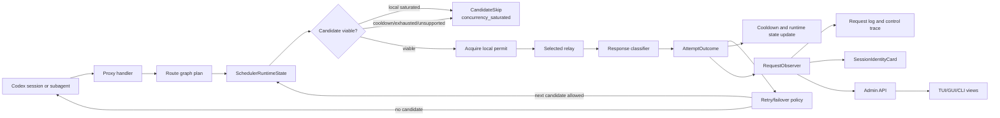
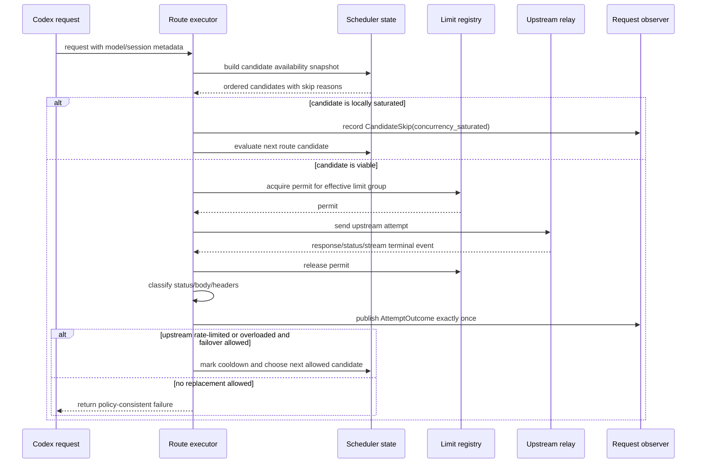

# Codex Routing Scheduler Observability Refactor

**Author**: Codex
**Status**: Proposed
**Created**: 2026-06-15
**Last Updated**: 2026-06-15
**Reviewers**: Maintainers

## Problem

The route graph now preserves user preference and provider endpoint identity,
and provider/endpoint concurrency limits can protect small relays. Recent
upstream response classification also distinguishes provider-side rate limits
and overloads.

The remaining weakness is architectural: selection, permit gating, retry
classification, cooldown updates, request logs, session cards, and TUI/GUI
operator views still form a chain of related behaviors rather than one explicit
runtime contract.

This matters for high-parallel Codex usage:

- one local Codex UI can spawn parallel subagents;
- users may run several Codex sessions against one local helper;
- each upstream relay can have a small account-level concurrency cap;
- upstreams may report throttling as `429`, `503`, `529`, OpenAI-style
  `rate_limit_error`, Anthropic/OpenAI-compatible "too many requests" messages,
  or provider-specific `Retry-After` and reset fields;
- only one or two relays may remain viable after cooldown, usage exhaustion, or
  local saturation.

Operators need a clear answer to three questions:

- Did the route graph choose a fallback because the preferred relay was locally
  full, externally rate-limited, overloaded, exhausted, unsupported, or pinned
  away?
- If a relay is limited, will another relay replace it without violating route
  preference or affinity policy?
- What is the current configured and effective capacity, active request count,
  token usage, and output token throughput for each session and provider?

## Goals

- Keep route graph semantics unchanged: preference groups, pins, affinity, and
  retry policies remain the authority.
- Make runtime availability first-class: local saturation, cooldown, trusted
  usage exhaustion, unsupported model, disabled endpoint, and passive health are
  explicit candidate states.
- Make upstream throttle response handling first-class: response codes and
  bodies produce structured `AttemptOutcome` values that retry and health code
  consume.
- Make observability derive from the same outcome model used by routing.
- Show provider/endpoint configured limits, effective limits, active counts,
  saturation state, token totals, and token-per-second metrics in admin/TUI/GUI
  views.

## Non-Goals

- Do not redesign the v5 route graph or preference group compiler.
- Do not make local concurrency limits distributed across multiple helper
  processes.
- Do not introduce a default queue. Overflow defaults to failover when another
  route candidate is viable.
- Do not expose internal routing details in normal downstream model responses.
  Use logs, admin APIs, explain output, and operator UIs instead.
- Do not treat local saturation as an upstream failure.

## Current References

Internal references:

- `docs/workstreams/codex-routing-preference-runtime-refactor/DESIGN.md`
  establishes that route preference is policy and affinity is optimization.
- `docs/workstreams/codex-provider-concurrency-limits/DESIGN.md` establishes
  provider/endpoint concurrency limits and `concurrency_saturated` skip
  semantics.
- `crates/core/src/proxy/classify.rs` contains upstream throttle and overload
  response classification.
- `crates/core/src/state/session_identity.rs` already computes
  `output_tokens_per_second` at request-observability level.

Reference projects:

- `repo-ref/CLIProxyAPI/internal/runtime/executor/helps/usage_helpers.go`
  uses a single per-request usage reporter with exactly-once publication, TTFT,
  failure status, model, auth, and service tier metadata.
- `repo-ref/CLIProxyAPI/sdk/cliproxy/executor/types.go` carries cross-layer
  selection and execution hints through `Options.Metadata`.
- `repo-ref/CLIProxyAPI/sdk/cliproxy/auth/scheduler.go` separates ready,
  cooldown, blocked, and disabled scheduler states and returns cooldown-aware
  unavailable errors.
- `repo-ref/CLIProxyAPI/sdk/cliproxy/auth/conductor.go` turns execution results,
  status codes, and retry-after hints into auth/model cooldown state.
- `repo-ref/CLIProxyAPI/sdk/cliproxy/auth/selector.go` exposes
  `model_cooldown` as `429` with `Retry-After`.
- `repo-ref/sub2api/backend/internal/config/config.go` exposes explicit
  account concurrency, slot TTL, and `529` overload cooldown configuration.
- `repo-ref/new-api` confirms that AI gateway ecosystems commonly surface
  quota/rate-limit failures as `429` and user-facing rate limit messages.

## Proposed Solution

Introduce a narrow runtime boundary around three objects:

- `SchedulerRuntimeState`: read-only snapshot used by route selection.
- `AttemptOutcome`: normalized result of one selected upstream attempt.
- `RequestObserver`: exactly-once request/session/operator publication sink.

The design is intentionally local and fearless: delete scattered ad hoc
observation paths as each call path adopts these contracts, but do not rewrite
the route graph policy layer.

### Architecture

### Key Flow

## Runtime Semantics

### Local Concurrency Saturation

Local saturation is a pre-attempt scheduler state.

- The selector skips the candidate with `concurrency_saturated`.
- The skip does not increment failure counters.
- The skip does not create cooldown.
- The skip does not invalidate session affinity by itself.
- The route graph can choose another viable candidate only through normal
  preference, affinity, pin, and retry/failover rules.
- If all candidates are saturated, the operator view should show the earliest
  capacity reason and active/limit counts; downstream receives a bounded,
  retryable proxy error rather than an upstream-shaped failure.

This answers the replacement question: a limited relay can be replaced by
another relay, but only when the current route policy already allows that next
candidate.

### Upstream Rate Limit Or Overload

Upstream throttling is a post-attempt health signal.

Candidate responses classify into at least:

- `upstream_rate_limited`
  - strong examples: `429`, `rate_limit_error`, `rate_limit_exceeded`,
    `too many requests`, `usage_limit_reached`, `quota_exhausted`,
    `resource exhausted`;
  - retry hints: `Retry-After`, `retry-after-ms`, `retry_after`,
    `retryAfter`, `retry_after_ms`, `resets_at`, `resets_in_seconds`.
- `upstream_overloaded`
  - strong examples: `503`, `529`, `overloaded`, `no capacity`,
    `selected model is at capacity`, `model_capacity_exhausted`.

The classifier produces an `AttemptOutcome` with class, status, retry hint,
upstream identity, and whether the signal is strong or weak. Retry policy then
decides whether to retry the same candidate, move to another candidate in the
same group, or fail over to a lower preference group.

The classifier must not decide route order. It only describes the result.

### One Or Two Remaining Relays

When only one or two relays remain viable:

- candidate avoidance and provider max-attempt limits prevent loops;
- cooldown and retry-after windows remain endpoint-scoped;
- local saturation remains a skip, not a failure;
- if no replacement candidate exists, the final error should explain the
  dominant route-unavailable reason instead of masking it as generic upstream
  failure.

## Data Contracts

### SchedulerRuntimeState

Fields should be keyed by provider endpoint identity plus optional effective
limit group:

| Field | Meaning |
| --- | --- |
| `provider_id` | Configured provider identity. |
| `endpoint_id` | Configured endpoint identity. |
| `preference_group` | Route graph preference group. |
| `supports_model` | Model compatibility result. |
| `disabled` | Config or runtime disabled flag. |
| `cooldown_until` | Earliest retry time for upstream health cooldown. |
| `cooldown_reason` | `upstream_rate_limited`, `upstream_overloaded`, transport, etc. |
| `usage_exhausted` | Trusted balance/quota exhaustion signal. |
| `passive_health` | Recent success/failure score. |
| `limit_group` | Effective concurrency group key. |
| `configured_limit` | Provider or endpoint configured cap, before overrides. |
| `effective_limit` | Final cap after endpoint override and group sharing. |
| `active` | Current in-flight permit count. |
| `saturated` | `active >= effective_limit` when limited. |
| `affinity_match` | Whether current session affinity points here. |

### AttemptOutcome

Each executed attempt should publish one normalized outcome:

| Field | Meaning |
| --- | --- |
| `request_id` | Request ledger identity. |
| `session_key` | Downstream session identity when available. |
| `attempt_index` | Attempt order within request. |
| `provider_endpoint_key` | Canonical upstream identity. |
| `route_path` | Selected route path. |
| `preference_group` | Selected group. |
| `permit_group` | Acquired concurrency limit group if any. |
| `status_code` | Upstream or synthesized status. |
| `class` | Normalized error/success class. |
| `retry_after_ms` | Parsed provider retry hint. |
| `ttfb_ms` | Time to first byte when available. |
| `duration_ms` | Attempt duration. |
| `input_tokens` | Prompt/input tokens. |
| `output_tokens` | Completion/output tokens. |
| `reasoning_tokens` | Reasoning tokens when available. |
| `cached_tokens` | Cache read/creation tokens when available. |
| `output_tokens_per_second` | Output token throughput after first byte. |
| `terminal` | Whether this outcome ends the request. |

### RequestObserver

`RequestObserver` should be the only write path for:

- request ledger rows;
- route attempt logs;
- control trace attempt records;
- active/finished request snapshots;
- session card usage and throughput;
- admin/TUI/GUI session summaries.

Like CLIProxyAPI's `UsageReporter.EnsurePublished`, it should guarantee
exactly-once request publication even when a stream has no usage block or exits
with a terminal error.

## Operator Surfaces

### Provider And Endpoint Views

Show both configured and live fields:

- configured provider limit;
- endpoint override;
- effective limit;
- limit group;
- active/limit;
- saturated flag;
- cooldown reason and remaining time;
- last throttle class and retry-after source.

These fields are safe to show in admin/TUI/GUI because they are configuration
and runtime counters, not secrets.

### TUI Session Overview

Session rows should show compact request health and usage:

- last provider endpoint;
- last route path and preference group;
- active/finished state;
- last input/output/total tokens;
- cumulative total tokens;
- last output tokens per second;
- average output tokens per second across turns with output usage;
- last TTFB and duration when space allows.

The TUI should read these from core session snapshots, not recompute them from
raw request logs. This keeps CLI/TUI/GUI consistent.

## Alternatives Considered

### Option A: Minimal UI Patch

Add configured limits and token-per-second fields directly to TUI structs while
leaving routing and logs unchanged.

**Pros**:

- fastest implementation;
- low risk to request execution;
- gives immediate operator visibility.

**Cons**:

- keeps duplicate metric calculation in UI code;
- does not solve stream/non-stream outcome drift;
- does not make failover reasons easier to test;
- future GUI/API surfaces would repeat the same work.

**Decision**: Rejected as the primary plan. Acceptable only as a temporary
bridge if a release needs quick visibility.

### Option B: Full Route Graph Rewrite

Redesign route graph compilation, preference groups, affinity, retry policy,
concurrency, and observability together.

**Pros**:

- cleanest theoretical model;
- opportunity to remove old compatibility code in one pass.

**Cons**:

- high regression risk;
- repeats work already completed in the preference runtime refactor;
- mixes policy changes with observability cleanup;
- hard to review and hard to bisect.

**Decision**: Rejected. Route graph semantics are not the current bottleneck.

### Option C: Scheduler State And Observer Boundary (Recommended)

Keep route policy intact, but refactor the execution boundary so all selection
state and outcomes flow through `SchedulerRuntimeState`, `AttemptOutcome`, and
`RequestObserver`.

**Pros**:

- fixes the real architectural gap;
- preserves existing route preference behavior;
- makes local saturation and upstream throttling visibly different;
- gives TUI/GUI/API one source of truth;
- allows incremental deletion of scattered logging and metric code.

**Cons**:

- touches both stream and non-stream execution paths;
- requires careful parity tests around retry/failover;
- may expose old inconsistencies in request ledgers.

**Decision**: Recommended.

### Option D: Queue On Saturation

When a local limit group is full, queue requests until a permit is available
instead of failing over.

**Pros**:

- maximizes cache locality;
- avoids paid fallback when the preferred relay is merely busy;
- useful for users who prefer waiting over fallback cost.

**Cons**:

- can make Codex subagents look hung;
- requires queue limits, cancellation, timeout, and SSE keepalive behavior;
- interacts with client timeouts and long-running streams;
- not a safe default.

**Decision**: Deferred as an explicit overflow policy after the scheduler
boundary exists.

## Success Metrics

| Metric | Current | Target | Measurement |
| --- | --- | --- | --- |
| Attempt outcome coverage | Split across paths | 100% of non-stream, SSE, and websocket terminal paths emit `AttemptOutcome` | Targeted unit/integration tests |
| Local saturation penalties | Should be no penalty | 0 failure/cooldown increments from `concurrency_saturated` | Route executor tests |
| Upstream throttle failover clarity | Classified in proxy code | 429/503/529/body cases produce class, retry hint, cooldown, and route attempt log | Classifier and proxy failover tests |
| Loop prevention | Existing max attempts | Single-relay and two-relay tests terminate with clear error | Integration tests |
| TUI metric consistency | Partial session usage | TUI reads token/s and active/limit from core snapshots only | TUI snapshot tests |
| Operator explanation | Split across explain/logs | Every fallback has skipped higher group reasons plus candidate availability states | `routing explain` snapshot tests |

## Risks And Mitigations

| Risk | Severity | Likelihood | Mitigation |
| --- | --- | --- | --- |
| Stream path misses terminal outcome | High | Medium | Add stream tests for success, upstream 429/529, client cancel, and no-usage completion. |
| Failover semantics drift | High | Medium | Keep route graph untouched; add before/after behavior tests for monthly-first, fallback-sticky, pins, and max attempts. |
| UI exposes too much internal detail | Medium | Low | Show detailed scheduler fields only in operator/admin surfaces; keep downstream responses compact. |
| Metrics double count retries | High | Medium | Publish request-level and attempt-level records separately; session totals consume terminal request usage only. |
| Concurrency permits leak on stream cancellation | High | Medium | Use RAII/drop guard tests and cancellation tests. |
| Retry-After over-cools weak signals | Medium | Medium | Track strong/weak classification; require status/body evidence for long cooldowns. |
| Refactor grows into route rewrite | High | Medium | Make route graph changes out of scope; split any policy change into a new workstream. |

## Implementation Plan

### Phase 1: Outcome Contract

- Define `AttemptOutcome`, `CandidateSkip`, and `RequestObserver` in core.
- Adapt non-stream attempts to publish outcomes through the observer.
- Adapt SSE stream terminal handling to publish the same outcome shape.
- Preserve existing log fields while adding endpoint-first structured fields.

### Phase 2: Scheduler Runtime Snapshot

- Consolidate candidate availability into `SchedulerRuntimeState`.
- Include configured/effective limit, limit group, active count, saturation,
  cooldown, usage exhaustion, unsupported model, and affinity match.
- Ensure local saturation skip does not touch health penalty state.
- Add route-unavailable summaries that preserve the dominant reason.

### Phase 3: Session Metrics

- Promote `last_output_tokens_per_second` and
  `avg_output_tokens_per_second` into core session cards.
- Keep total input/output/reasoning/cached tokens in the same snapshot.
- Add TUI session overview/detail fields backed by core snapshots.
- Reuse the same fields in GUI and admin APIs.

### Phase 4: Cleanup

- Delete duplicate UI-side token/s calculations.
- Delete ad hoc stream/non-stream route attempt log code replaced by the
  observer.
- Keep compatibility readers for historical logs.
- Update `docs/CONFIGURATION.md` and `docs/CONFIGURATION.zh.md` with operator
  examples.

## Test Plan

- Classifier tests:
  - `429` with `Retry-After`;
  - OpenAI-compatible `rate_limit_error`;
  - `503` overload body;
  - `529` overload status;
  - success body containing "rate limit" is ignored.
- Route executor tests:
  - local saturation selects fallback without penalty;
  - all candidates saturated returns clear unavailable reason;
  - one candidate remaining does not loop;
  - two candidates with alternating 429 terminate under max attempts;
  - upstream 429 with retry-after cools only the selected endpoint.
- Observer tests:
  - non-stream success publishes once;
  - stream success with usage publishes once;
  - stream terminal error publishes once;
  - no-usage stream still publishes a request record.
- TUI tests:
  - session rows show token totals and output tok/s when present;
  - provider/endpoint views show configured/effective active/limit;
  - saturated candidate renders as `concurrency_saturated(active=N/limit=M)`.

## Open Questions

1. Should local saturation overflow policy remain hardcoded to failover, or
   should provider/endpoint config support `overflow = "failover" | "queue" |
   "reject"` later?
2. Should average output tok/s be request-weighted, token-weighted, or an
   exponentially weighted moving average? Recommendation: token-weighted for
   session summaries and last-request value for live rows.
3. Should weak throttle classification ever create cooldown without a retry
   hint? Recommendation: only short default cooldown for weak signals, long
   cooldown only for strong status/body evidence or provider retry hint.
4. Should active/limit counts include queued requests if queueing is added?
   Recommendation: keep `active`, `waiting`, and `limit` separate.

## Traceability

| Requirement | Design Element | Tests |
| --- | --- | --- |
| Limited relays can be replaced without route conflict | Local saturation skip plus route-policy-controlled next candidate | Route executor saturation failover tests |
| Upstream 429/503/529 are classified consistently | `AttemptOutcome.class` and retry hints | Classifier and failover tests |
| One or two relays do not loop forever | Candidate avoidance plus max attempts | Single/two-candidate integration tests |
| Provider limits are visible | Scheduler snapshot fields | Admin/TUI/GUI snapshot tests |
| Token/s appears in TUI sessions | Core session card throughput fields | TUI session metrics tests |
